# NVIDIA RAG Certification Learning Package

A comprehensive learning package for the **NVIDIA-Certified Professional: Agentic AI (NCP-AAI)** certification exam, focused on building RAG (Retrieval-Augmented Generation) agents with LLMs.

## 🎯 Quick Start

**New to this package?** Follow these steps:

1. **[Setup Guide](#setup-instructions)** - Install dependencies and configure environment
2. **[Study Plan](STUDY_PLAN.md)** - Choose your learning path (10-12 weeks comprehensive, 6-8 weeks accelerated, or 4-5 weeks intensive)
3. **[Exam Coverage Matrix](course-notes/exam-coverage-matrix.md)** - Verify 100% coverage of exam objectives
4. **[Start Learning](#recommended-learning-path)** - Begin with Module 01 or jump to specific topics

## Overview

This learning package transforms the NVIDIA "Building RAG Agents with LLMs" course into certification-ready materials. It provides a complete learning path from foundational concepts to advanced implementations through hands-on practice.

### Target Audience

Intermediate AI practitioners with 2-3 years of experience in machine learning, comfortable with Python and PyTorch, seeking to master RAG agent development and earn NCP-AAI certification.

### Learning Objectives

By completing this learning package, you will be able to:

1. **Design and Architect** agentic AI systems using reactive, deliberative, and hybrid patterns
2. **Implement RAG Pipelines** with optimized retrieval, embedding, and generation components
3. **Develop Multi-Agent Systems** with proper coordination, memory management, and task decomposition
4. **Integrate NVIDIA Platform** tools including NIM, NeMo Guardrails, TensorRT-LLM, and Triton
5. **Evaluate and Optimize** agent performance using metrics, A/B testing, and parameter tuning
6. **Deploy to Production** with containerization, Kubernetes, monitoring, and scaling strategies
7. **Ensure Safety and Compliance** through guardrails, bias detection, and audit trails
8. **Build Human-AI Interfaces** with user-in-the-loop interaction and feedback mechanisms
9. **Troubleshoot Issues** systematically using decision trees and diagnostic flowcharts
10. **Pass the NCP-AAI Exam** with 80%+ accuracy on scenario-based questions

### Success Metrics

- ✅ Design and implement production-grade RAG systems
- ✅ Answer scenario-based certification questions with 80%+ accuracy
- ✅ Troubleshoot RAG issues systematically
- ✅ Optimize RAG systems for performance, cost, and accuracy
- ✅ Pass the NCP-AAI certification exam

## Learning Path

```mermaid
graph LR
    A[Setup] --> B[Module 1-2]
    B --> C[Lab 1]
    C --> D[Module 3-4]
    D --> E[Lab 2]
    E --> F[Module 5-6]
    F --> G[Lab 3]
    G --> H[Module 7-8]
    H --> I[Lab 4]
    I --> J[Module 9-10]
    J --> K[Lab 5]
    K --> L[Practice Exam]
    L --> M[Certification]
    
    style A fill:#90EE90
    style M fill:#FFD700
```



## 📚 Package Components

### 1. Course Notes (`course-notes/`)

**[📖 View All Course Notes](course-notes/README.md)** | **[📊 Exam Coverage Matrix](course-notes/exam-coverage-matrix.md)**

Comprehensive theoretical foundation organized by 10 exam domains:

| Module | Topic | Exam Weight | Estimated Time | Quick Link |
|--------|-------|-------------|----------------|------------|
| 01 | Agent Architecture and Design | 15% | 4-5 hours | [📄](course-notes/module-01-agent-architecture-design.md) |
| 02 | Agent Development | 15% | 4-5 hours | [📄](course-notes/module-02-agent-development.md) |
| 03 | Evaluation and Tuning | 13% | 3-4 hours | [📄](course-notes/module-03-evaluation-tuning.md) |
| 04 | Knowledge Integration | 10% | 3-4 hours | [📄](course-notes/module-04-knowledge-integration.md) |
| 05 | Cognition, Planning, and Memory | 10% | 3-4 hours | [📄](course-notes/module-05-cognition-planning-memory.md) |
| 06 | NVIDIA Platform | 7% | 2-3 hours | [📄](course-notes/module-06-nvidia-platform.md) |
| 07 | Monitoring and Maintenance | 7% | 2-3 hours | [📄](course-notes/module-07-monitoring-maintenance.md) |
| 08 | Deployment and Scaling | 5% | 2-3 hours | [📄](course-notes/module-08-deployment-scaling.md) |
| 09 | Safety, Ethics, and Compliance | 5% | 2-3 hours | [📄](course-notes/module-09-safety-ethics-compliance.md) |
| 10 | Human-AI Interaction | 5% | 2-3 hours | [📄](course-notes/module-10-human-ai-interaction.md) |

**Total Study Time:** 28-37 hours

### 2. Interactive Jupyter Notebooks (`notebooks/`)

**[💻 View All Notebooks](notebooks/README.md)**

Hands-on practice with executable code organized by module:

- **Setup Notebooks (2):** Environment and NVIDIA platform configuration
- **Module Notebooks (30):** Covering all exam domains with executable examples
- **Each Notebook Includes:**
  - Theory and concepts
  - Step-by-step implementations
  - Real-world scenarios
  - Hands-on exercises with validation
  - Troubleshooting examples
  - Performance profiling and optimization

**Quick Access:**
- [Setup](notebooks/setup/) | [Module 01](notebooks/module-01/) | [Module 02](notebooks/module-02/) | [Module 03](notebooks/module-03/) | [Module 04](notebooks/module-04/) | [Module 05](notebooks/module-05/)
- [Module 06](notebooks/module-06/) | [Module 07](notebooks/module-07/) | [Module 08](notebooks/module-08/) | [Module 09](notebooks/module-09/) | [Module 10](notebooks/module-10/)

### 3. Scenario-Based Exam Questions (`exam-questions/`)

**[❓ View All Questions](exam-questions/README.md)**

112 practice questions matching the certification exam format:

- Realistic business scenarios requiring analysis
- 4 answer options with detailed explanations
- Trade-off analysis and best practices
- Mapped to specific exam objectives
- Covers all 10 exam domains + mixed scenarios

**Quick Access by Domain:**
- [Domain 01 (15Q)](exam-questions/domain-01-architecture.md) | [Domain 02 (15Q)](exam-questions/domain-02-development.md) | [Domain 03 (13Q)](exam-questions/domain-03-evaluation.md) | [Domain 04 (10Q)](exam-questions/domain-04-knowledge-integration.md) | [Domain 05 (10Q)](exam-questions/domain-05-cognition-memory.md)
- [Domain 06 (7Q)](exam-questions/domain-06-nvidia-platform.md) | [Domain 07 (7Q)](exam-questions/domain-07-monitoring.md) | [Domain 08 (5Q)](exam-questions/domain-08-deployment.md) | [Domain 09 (5Q)](exam-questions/domain-09-safety-ethics.md) | [Domain 10 (5Q)](exam-questions/domain-10-human-interaction.md)
- [Mixed Scenarios (20Q)](exam-questions/mixed-scenarios.md)

### 4. Quick Reference Guide (`quick-reference/`)

**[⚡ View Quick Reference](quick-reference/README.md)**

Rapid review resource for exam preparation:

- [📐 Formulas and Metrics](quick-reference/formulas-metrics.md) - Evaluation metrics, performance calculations
- [⌨️ Command Cheatsheet](quick-reference/command-cheatsheet.md) - NVIDIA tools, LangChain, Docker, K8s
- [🎯 Patterns and Anti-Patterns](quick-reference/patterns-antipatterns.md) - When to use what
- [🌳 Decision Trees](quick-reference/decision-trees.md) - Architecture selection, vector stores, chunking
- [🔧 Troubleshooting Flowcharts](quick-reference/troubleshooting-flowcharts.md) - Diagnose latency, accuracy, memory issues
- [💡 Exam Tips](quick-reference/exam-tips.md) - Time management, scenario analysis, elimination strategies

### 5. Practice Lab Exercises (`labs/`)

**[🔬 View All Labs](labs/README.md)**

5 comprehensive hands-on projects simulating certification scenarios:

| Lab | Title | Complexity | Time | Modules | Quick Link |
|-----|-------|------------|------|---------|------------|
| 01 | Basic RAG Agent | Beginner | 3-4h | 1-2, 4 | [🔗](labs/lab-01-basic-rag-agent/) |
| 02 | Multi-Agent Research System | Intermediate | 4-5h | 1-2, 5 | [🔗](labs/lab-02-multi-agent-research/) |
| 03 | Production Deployment | Intermediate-Advanced | 5-6h | 6-8 | [🔗](labs/lab-03-production-deployment/) |
| 04 | Evaluation and Optimization | Intermediate | 4-5h | 3 | [🔗](labs/lab-04-evaluation-optimization/) |
| 05 | Safe and Compliant Agent | Advanced | 5-6h | 9-10 | [🔗](labs/lab-05-safe-compliant-agent/) |

**Total Lab Time:** 21-26 hours

## Prerequisites

### Knowledge Prerequisites

- Python programming (intermediate level)
- Basic machine learning concepts
- Familiarity with PyTorch or TensorFlow
- Understanding of REST APIs
- Basic command-line proficiency

### Hardware Requirements

- **Recommended:** NVIDIA GPU with 8GB+ VRAM
- **Minimum:** CPU-only (some examples will run slower)
- 16GB+ RAM
- 50GB+ free disk space

### Software Prerequisites

- Python 3.10 or higher
- Git
- Docker (for deployment labs)
- Jupyter Lab or VS Code with Jupyter extension

## 🚀 Setup Instructions

### 1. Clone or Download This Repository

```bash
git clone <repository-url>
cd nvidia-rag-certification-learning-package
```

### 2. Create Python Virtual Environment

```bash
# Create virtual environment
python -m venv venv

# Activate virtual environment
# On macOS/Linux:
source venv/bin/activate

# On Windows:
venv\Scripts\activate
```

### 3. Install Dependencies

```bash
# Install all required packages
pip install -r requirements.txt

# Verify installation
pip list | grep -E "langchain|gradio|jupyter"
```

### 4. Configure Environment Variables

Create a `.env` file in the root directory (use `.env.example` as template):

```bash
# Copy example file
cp .env.example .env

# Edit with your API keys
nano .env  # or use your preferred editor
```

Required environment variables:

```bash
# OpenAI API Key (for LLM access)
OPENAI_API_KEY=your_api_key_here

# LangSmith (optional, for tracing and monitoring)
LANGCHAIN_API_KEY=your_langsmith_key
LANGCHAIN_TRACING_V2=true
LANGCHAIN_PROJECT=nvidia-rag-certification

# NVIDIA API Keys (if using NVIDIA NIM)
NVIDIA_API_KEY=your_nvidia_key

# Hugging Face (optional, for embedding models)
HUGGINGFACE_API_KEY=your_hf_key
```

### 5. Verify Installation

Run validation scripts to ensure everything is set up correctly:

```bash
# Validate directory structure
python tests/validate_structure.py

# Validate Markdown syntax
python tests/validate_markdown.py

# Validate notebook structure
python tests/validate_notebooks.py

# Run all validations
python tests/run_all_validations.py
```

Expected output: All checks should pass ✅

### 6. Launch Jupyter Lab

```bash
# Start Jupyter Lab
jupyter lab

# Or use Jupyter Notebook
jupyter notebook
```

Navigate to `notebooks/setup/00-environment-setup.ipynb` to complete setup verification.

### 7. Test NVIDIA Platform Access (Optional)

If you plan to use NVIDIA-specific tools:

```bash
# Test NVIDIA NIM access
python -c "import os; print('NVIDIA_API_KEY:', 'Set' if os.getenv('NVIDIA_API_KEY') else 'Not Set')"

# Test GPU availability
python -c "import torch; print('CUDA Available:', torch.cuda.is_available())"
```

### Troubleshooting Setup Issues

**Issue: Package installation fails**
```bash
# Upgrade pip first
pip install --upgrade pip setuptools wheel

# Try installing again
pip install -r requirements.txt
```

**Issue: Jupyter kernel not found**
```bash
# Install IPython kernel
python -m ipykernel install --user --name=venv --display-name="Python (NVIDIA RAG)"
```

**Issue: GPU not detected**
```bash
# Check NVIDIA drivers
nvidia-smi

# Install CUDA toolkit if needed (see NVIDIA documentation)
```

**Issue: API key errors**
```bash
# Verify .env file exists and has correct format
cat .env

# Ensure no extra spaces or quotes around keys
```

For more setup help, see `notebooks/setup/00-environment-setup.ipynb`.

## 📖 Recommended Learning Path

**Choose your path based on experience and time availability:**

- **[Path 1: Comprehensive (10-12 weeks)](STUDY_PLAN.md#path-1-comprehensive-study-plan-10-12-weeks)** - Recommended for beginners
- **[Path 2: Accelerated (6-8 weeks)](STUDY_PLAN.md#path-2-accelerated-study-plan-6-8-weeks)** - For experienced practitioners
- **[Path 3: Intensive (4-5 weeks)](STUDY_PLAN.md#path-3-intensive-study-plan-4-5-weeks)** - For experts needing quick certification

### Path 1: Comprehensive (Recommended for Most Learners)

**Total Time:** 100-120 hours over 10-12 weeks

#### Phase 1: Foundations (Weeks 1-2) - 20 hours

**Focus:** Agent Architecture and Design (15% of exam)

- [ ] Complete environment setup notebooks
- [ ] Read Module 01 course notes
- [ ] Complete all Module 01 notebooks (3)
- [ ] Answer Domain 01 practice questions (15)
- [ ] **Checkpoint:** Can you explain ReAct pattern and design multi-agent systems?

#### Phase 2: Development (Weeks 3-4) - 20 hours

**Focus:** Agent Development (15% of exam)

- [ ] Read Module 02 course notes
- [ ] Complete all Module 02 notebooks (4)
- [ ] Answer Domain 02 practice questions (15)
- [ ] Start Lab 01: Basic RAG Agent
- [ ] **Checkpoint:** Can you implement error handling and tool integration?

#### Phase 3: Knowledge Integration (Week 5) - 10 hours

**Focus:** RAG Pipelines and Vector Stores (10% of exam)

- [ ] Read Module 04 course notes
- [ ] Complete all Module 04 notebooks (4)
- [ ] Answer Domain 04 practice questions (10)
- [ ] **Checkpoint:** Can you build end-to-end RAG pipelines?

#### Phase 4: Lab 01 Completion (Week 6) - 10 hours

**Focus:** Hands-on RAG Implementation

- [ ] Complete Lab 01: Basic RAG Agent
- [ ] Test with provided data
- [ ] Evaluate against rubric (target: 70%+)
- [ ] Compare with reference solution
- [ ] **Checkpoint:** Can you build production-ready RAG agents?

#### Phase 5: Evaluation and Cognition (Week 7) - 10 hours

**Focus:** Evaluation (13%) and Memory/Planning (10%)

- [ ] Read Module 03 and Module 05 course notes
- [ ] Complete Module 03 notebooks (3)
- [ ] Complete Module 05 notebooks (3)
- [ ] Answer Domain 03 and Domain 05 questions (23 total)
- [ ] **Checkpoint:** Can you evaluate agents and implement memory mechanisms?

#### Phase 6: Multi-Agent Lab (Week 8) - 10 hours

**Focus:** Multi-Agent Orchestration

- [ ] Complete Lab 02: Multi-Agent Research System
- [ ] Implement agent coordination
- [ ] Test multi-agent workflows
- [ ] Evaluate against rubric (target: 70%+)
- [ ] **Checkpoint:** Can you design and coordinate multi-agent systems?

#### Phase 7: NVIDIA Platform (Week 9) - 10 hours

**Focus:** NVIDIA Tools (7%) and Deployment (5%)

- [ ] Read Module 06 and Module 08 course notes
- [ ] Complete all Module 06 notebooks (4)
- [ ] Complete all Module 08 notebooks (2)
- [ ] Answer Domain 06 and Domain 08 questions (12 total)
- [ ] **Checkpoint:** Can you deploy NVIDIA NIM and configure guardrails?

#### Phase 8: Monitoring and Safety (Week 10) - 10 hours

**Focus:** Monitoring (7%), Safety (5%), Human Interaction (5%)

- [ ] Read Module 07, Module 09, Module 10 course notes
- [ ] Complete Module 07, 09, 10 notebooks (7 total)
- [ ] Answer Domain 07, 09, 10 questions (17 total)
- [ ] **Checkpoint:** Can you implement monitoring and safety guardrails?

#### Phase 9: Advanced Labs (Week 11) - 10 hours

**Focus:** Production Deployment and Evaluation

- [ ] Complete Lab 03: Production Deployment
- [ ] Complete Lab 04: Evaluation and Optimization
- [ ] Evaluate against rubrics (target: 70%+ each)
- [ ] **Checkpoint:** Can you deploy and optimize production systems?

#### Phase 10: Final Preparation (Week 12) - 10 hours

**Focus:** Integration and Exam Readiness

- [ ] Complete Lab 05: Safe and Compliant Agent
- [ ] Answer all mixed scenario questions (20)
- [ ] Review quick reference guide
- [ ] Retake all practice questions (target: 85%+ overall)
- [ ] **Final Checkpoint:** Ready for certification exam?

**See [STUDY_PLAN.md](STUDY_PLAN.md) for detailed daily breakdowns and alternative paths.**

## 🎓 Exam Preparation Guidance

### Understanding the NCP-AAI Exam

**Exam Format:**
- **Type:** Scenario-based questions (not multiple choice trivia)
- **Duration:** Approximately 2-3 hours
- **Questions:** 50-100 questions (varies by exam version)
- **Passing Score:** Typically 70-75%
- **Delivery:** Online proctored or testing center

**What Makes This Exam Different:**
- Questions present realistic business scenarios
- You must analyze requirements and constraints
- Multiple answers may be "correct" - you choose the "best" one
- Trade-offs matter: performance vs cost, accuracy vs latency
- NVIDIA platform knowledge is essential

### Exam Domains and Weights

| Domain | Weight | Focus Areas | Study Priority |
|--------|--------|-------------|----------------|
| 1. Agent Architecture and Design | 15% | ReAct, multi-agent, memory | 🔴 High |
| 2. Agent Development | 15% | Prompts, tools, error handling | 🔴 High |
| 3. Evaluation and Tuning | 13% | Metrics, A/B testing, optimization | 🟡 High-Medium |
| 4. Knowledge Integration | 10% | RAG, vector stores, retrieval | 🟡 Medium |
| 5. Cognition, Planning, Memory | 10% | Chain-of-thought, task decomposition | 🟡 Medium |
| 6. NVIDIA Platform | 7% | NIM, Guardrails, TensorRT-LLM | 🟢 Medium-Low |
| 7. Monitoring and Maintenance | 7% | Logging, dashboards, troubleshooting | 🟢 Medium-Low |
| 8. Deployment and Scaling | 5% | Docker, Kubernetes, MLOps | 🟢 Low |
| 9. Safety, Ethics, Compliance | 5% | Guardrails, bias, privacy | 🟢 Low |
| 10. Human-AI Interaction | 5% | UI, feedback, explainability | 🟢 Low |

**Strategy:** Focus 60% of study time on domains 1-3 (43% of exam), 30% on domains 4-5 (20% of exam), 10% on domains 6-10 (37% of exam).

### Scenario Analysis Framework

When answering scenario questions, use this systematic approach:

#### 1. Read Carefully (30 seconds)
- Identify the business context
- Note specific requirements and constraints
- Look for keywords: "best", "most", "least", "always", "never"

#### 2. Analyze Requirements (30 seconds)
- What are the must-haves vs nice-to-haves?
- What are the constraints (latency, cost, accuracy, scale)?
- What are the risks (safety, compliance, reliability)?

#### 3. Evaluate Options (45 seconds)
- Eliminate obviously wrong answers
- Consider trade-offs for remaining options
- Think about production implications
- Consider NVIDIA platform integration

#### 4. Select Best Answer (15 seconds)
- Choose the option that best balances all requirements
- Don't overthink - trust your preparation
- Flag for review if uncertain

**Total Time per Question:** ~2 minutes average

### Key Concepts to Master

#### Architecture Patterns
- ✅ When to use reactive vs deliberative vs hybrid architectures
- ✅ ReAct pattern implementation and use cases
- ✅ Multi-agent coordination strategies
- ✅ Memory management (short-term vs long-term)

#### RAG Fundamentals
- ✅ Retrieval pipeline design (semantic, keyword, hybrid)
- ✅ Vector store selection (FAISS, Milvus, Chroma)
- ✅ Embedding model trade-offs
- ✅ Chunking strategies for different document types

#### Error Handling
- ✅ Retry logic with exponential backoff
- ✅ Circuit breaker patterns
- ✅ Graceful degradation strategies
- ✅ Timeout and rate limiting

#### NVIDIA Platform
- ✅ NVIDIA NIM deployment and configuration
- ✅ NeMo Guardrails for safety and compliance
- ✅ TensorRT-LLM optimization techniques
- ✅ Triton Inference Server batching strategies

#### Evaluation and Optimization
- ✅ Evaluation metrics (precision, recall, faithfulness, relevance)
- ✅ A/B testing frameworks
- ✅ Parameter tuning for accuracy-latency trade-offs
- ✅ Cost optimization strategies

### Common Exam Traps

**Trap 1: Over-Engineering**
- ❌ Choosing complex multi-agent when simple RAG suffices
- ✅ Match solution complexity to problem complexity

**Trap 2: Ignoring Constraints**
- ❌ Selecting high-accuracy solution that violates latency requirements
- ✅ Always consider all stated constraints

**Trap 3: Missing NVIDIA Integration**
- ❌ Generic solutions when NVIDIA tools are available
- ✅ Leverage NVIDIA platform when appropriate

**Trap 4: Forgetting Production Concerns**
- ❌ Solutions that work in dev but fail in production
- ✅ Consider monitoring, scaling, error handling

**Trap 5: Ignoring Safety**
- ❌ Optimizing only for performance
- ✅ Balance performance with safety and compliance

### Study Resources

**Primary Resources (This Package):**
- 📚 [Course Notes](course-notes/) - Comprehensive theory
- 💻 [Jupyter Notebooks](notebooks/) - Hands-on practice
- ❓ [Practice Questions](exam-questions/) - Exam simulation
- ⚡ [Quick Reference](quick-reference/) - Rapid review
- 🔬 [Practice Labs](labs/) - Real-world projects

**Official NVIDIA Resources:**
- [NVIDIA NCP-AAI Exam Study Guide](https://www.nvidia.com/en-us/training/certification/)
- [NVIDIA NeMo Documentation](https://docs.nvidia.com/nemo-framework/)
- [NVIDIA NIM Documentation](https://docs.nvidia.com/nim/)
- [NVIDIA AI Enterprise](https://www.nvidia.com/en-us/data-center/products/ai-enterprise/)

**Community Resources:**
- [LangChain Documentation](https://python.langchain.com/)
- [Gradio Documentation](https://www.gradio.app/docs)
- [Hugging Face Transformers](https://huggingface.co/docs/transformers/)

### Exam Day Checklist

**One Week Before:**
- [ ] Complete all practice questions (target: 85%+ accuracy)
- [ ] Review quick reference guide daily
- [ ] Practice scenario analysis with timer
- [ ] Get adequate sleep (8 hours/night)

**One Day Before:**
- [ ] Light review only (no new material)
- [ ] Review quick reference guide one final time
- [ ] Prepare exam environment (quiet space, stable internet)
- [ ] Relax and rest

**Exam Day:**
- [ ] Arrive/log in 15 minutes early
- [ ] Have water and snacks nearby
- [ ] Read each scenario carefully (don't rush)
- [ ] Manage time: 2 minutes per question average
- [ ] Flag difficult questions for review
- [ ] Stay calm and confident

### After the Exam

**If You Pass:**
- 🎉 Celebrate your achievement!
- 📝 Update LinkedIn and resume with certification
- 🤝 Share knowledge with community
- 📚 Continue learning and practicing

**If You Don't Pass:**
- 📊 Review exam feedback (if provided)
- 🎯 Identify weak areas from feedback
- 📖 Focus additional study on those domains
- 🔄 Retake after 2-4 weeks of targeted preparation
- 💪 Don't be discouraged - many pass on second attempt

### Readiness Self-Assessment

Before scheduling your exam, verify you can answer "yes" to all:

- [ ] I scored 85%+ on all practice questions
- [ ] I completed all 5 labs with 70%+ rubric scores
- [ ] I can explain the ReAct pattern and when to use it
- [ ] I can design multi-agent systems with proper coordination
- [ ] I can build end-to-end RAG pipelines
- [ ] I can implement error handling patterns (retry, circuit breaker)
- [ ] I know when to use FAISS vs Milvus vs Chroma
- [ ] I can deploy NVIDIA NIM microservices
- [ ] I can configure NeMo Guardrails
- [ ] I can optimize with TensorRT-LLM
- [ ] I can implement evaluation metrics
- [ ] I can troubleshoot common agent issues
- [ ] I understand trade-offs (performance, cost, accuracy)
- [ ] I can analyze scenarios systematically in 2 minutes

**If you answered "no" to any:** Review those topics before scheduling exam.

**See [STUDY_PLAN.md](STUDY_PLAN.md) for detailed preparation timelines.**

## Technology Stack

### Core Frameworks

- **LangChain:** Agent orchestration and RAG pipelines
- **Gradio:** Interactive UI development
- **LangServe:** API deployment

### NVIDIA Platform

- **NVIDIA NIM:** High-performance inference microservices
- **NVIDIA NeMo Guardrails:** Safety and compliance
- **NVIDIA NeMo Agent Toolkit:** Agent workflow optimization
- **TensorRT-LLM:** Inference optimization
- **Triton Inference Server:** Model serving
- **NVIDIA Agent Intelligence Toolkit:** Evaluation and monitoring

### Supporting Libraries

- **Vector Stores:** FAISS, Milvus, Chroma
- **Embedding Models:** sentence-transformers, NVIDIA NeMo
- **Evaluation:** Ragas, LangSmith
- **Testing:** pytest, Hypothesis

## 📁 Project Structure

```
nvidia-rag-certification-learning-package/
│
├── 📄 README.md                          # This file - start here!
├── 📄 STUDY_PLAN.md                      # Detailed study plans (3 paths)
├── 📄 PROJECT_SETUP.md                   # Detailed setup instructions
├── 📄 requirements.txt                   # Python dependencies
├── 📄 .env.example                       # Environment variables template
│
├── 📚 course-notes/                      # Comprehensive course notes
│   ├── README.md                         # Course notes navigation
│   ├── exam-coverage-matrix.md           # Maps content to exam objectives
│   ├── module-01-agent-architecture-design.md
│   ├── module-02-agent-development.md
│   ├── module-03-evaluation-tuning.md
│   ├── module-04-knowledge-integration.md
│   ├── module-05-cognition-planning-memory.md
│   ├── module-06-nvidia-platform.md
│   ├── module-07-monitoring-maintenance.md
│   ├── module-08-deployment-scaling.md
│   ├── module-09-safety-ethics-compliance.md
│   └── module-10-human-ai-interaction.md
│
├── 💻 notebooks/                         # Interactive Jupyter notebooks
│   ├── README.md                         # Notebooks navigation
│   ├── setup/                            # Environment setup (2 notebooks)
│   │   ├── 00-environment-setup.ipynb
│   │   └── 01-nvidia-platform-setup.ipynb
│   ├── module-01/                        # Agent Architecture (3 notebooks)
│   ├── module-02/                        # Agent Development (4 notebooks)
│   ├── module-03/                        # Evaluation and Tuning (3 notebooks)
│   ├── module-04/                        # Knowledge Integration (4 notebooks)
│   ├── module-05/                        # Cognition and Memory (3 notebooks)
│   ├── module-06/                        # NVIDIA Platform (4 notebooks)
│   ├── module-07/                        # Monitoring (3 notebooks)
│   ├── module-08/                        # Deployment (2 notebooks)
│   ├── module-09/                        # Safety and Ethics (2 notebooks)
│   └── module-10/                        # Human-AI Interaction (2 notebooks)
│
├── ❓ exam-questions/                    # Scenario-based practice questions
│   ├── README.md                         # Questions navigation
│   ├── domain-01-architecture.md         # 15 questions
│   ├── domain-02-development.md          # 15 questions
│   ├── domain-03-evaluation.md           # 13 questions
│   ├── domain-04-knowledge-integration.md # 10 questions
│   ├── domain-05-cognition-memory.md     # 10 questions
│   ├── domain-06-nvidia-platform.md      # 7 questions
│   ├── domain-07-monitoring.md           # 7 questions
│   ├── domain-08-deployment.md           # 5 questions
│   ├── domain-09-safety-ethics.md        # 5 questions
│   ├── domain-10-human-interaction.md    # 5 questions
│   └── mixed-scenarios.md                # 20 questions
│
├── ⚡ quick-reference/                   # Quick reference guide
│   ├── README.md                         # Quick reference navigation
│   ├── formulas-metrics.md               # Evaluation metrics, calculations
│   ├── command-cheatsheet.md             # NVIDIA tools, Docker, K8s commands
│   ├── patterns-antipatterns.md          # When to use what
│   ├── decision-trees.md                 # Architecture selection guides
│   ├── troubleshooting-flowcharts.md     # Diagnostic flowcharts
│   └── exam-tips.md                      # Time management, strategies
│
├── 🔬 labs/                              # Practice lab exercises
│   ├── README.md                         # Labs navigation
│   ├── lab-01-basic-rag-agent/           # Beginner (3-4h)
│   │   ├── README.md
│   │   ├── requirements.txt
│   │   ├── starter-code/
│   │   ├── solution/
│   │   ├── test-data/
│   │   └── rubric.md
│   ├── lab-02-multi-agent-research/      # Intermediate (4-5h)
│   ├── lab-03-production-deployment/     # Intermediate-Advanced (5-6h)
│   ├── lab-04-evaluation-optimization/   # Intermediate (4-5h)
│   └── lab-05-safe-compliant-agent/      # Advanced (5-6h)
│
└── 🧪 tests/                             # Validation scripts
    ├── README.md                         # Testing documentation
    ├── unit/                             # Unit tests
    ├── property/                         # Property-based tests
    ├── integration/                      # Integration tests
    ├── validate_structure.py            # Validate directory structure
    ├── validate_markdown.py             # Validate Markdown syntax
    ├── validate_notebooks.py            # Validate notebook structure
    └── run_all_validations.py           # Run all validation tests
```

### Key Files

- **[README.md](README.md)** - You are here! Overview and quick start
- **[STUDY_PLAN.md](STUDY_PLAN.md)** - Detailed study plans with 3 paths (comprehensive, accelerated, intensive)
- **[exam-coverage-matrix.md](course-notes/exam-coverage-matrix.md)** - Maps all content to exam objectives, verifies 100% coverage
- **[requirements.txt](requirements.txt)** - All Python dependencies with versions
- **[.env.example](.env.example)** - Template for environment variables (copy to `.env`)

### Navigation Tips

1. **Start with Setup:** `notebooks/setup/00-environment-setup.ipynb`
2. **Follow Study Plan:** Choose path in `STUDY_PLAN.md`
3. **Check Coverage:** Review `course-notes/exam-coverage-matrix.md`
4. **Quick Review:** Use `quick-reference/` before exam
5. **Track Progress:** Use checklists in `STUDY_PLAN.md`

## ✅ Validation and Testing

Ensure package integrity with comprehensive validation:

### Quick Validation

```bash
# Run all validations at once
python tests/run_all_validations.py
```

### Individual Validations

```bash
# Validate directory structure
python tests/validate_structure.py

# Validate Markdown syntax
python tests/validate_markdown.py

# Validate notebook structure
python tests/validate_notebooks.py

# Run unit tests
python tests/run_unit_tests.py

# Run property-based tests
python tests/run_property_tests.py

# Run integration tests
python tests/run_integration_tests.py
```

### Test Coverage

The package includes comprehensive testing:

- **Unit Tests:** Validate specific content presence and structure
- **Property Tests:** Verify universal properties across all content (100+ iterations per property)
- **Integration Tests:** Test notebook execution and lab solutions
- **Validation Scripts:** Check syntax, links, and file structure

**Expected Results:** All tests should pass ✅

See [tests/README.md](tests/README.md) for detailed testing documentation.

## 🤝 Contributing

This learning package is designed for self-study. If you find errors or have suggestions:

1. **Document the Issue:**
   - Specify file path and line number
   - Describe the error or improvement
   - Provide context (what you expected vs what you found)

2. **Propose Corrections:**
   - Suggest specific changes with rationale
   - Reference official NVIDIA documentation if applicable
   - Consider impact on related materials

3. **Test Your Changes:**
   - Run validation scripts to ensure no breakage
   - Verify links and references still work
   - Check that changes align with exam objectives

4. **Submit Feedback:**
   - Create detailed issue report
   - Include screenshots if helpful
   - Tag with appropriate labels (bug, enhancement, documentation)

### Contribution Guidelines

- Maintain alignment with NCP-AAI exam objectives
- Follow existing formatting and style conventions
- Ensure all code examples are executable and tested
- Update exam coverage matrix if adding new content
- Keep explanations clear and concise

## 📚 Additional Resources

### Official NVIDIA Resources

- **[NVIDIA NCP-AAI Certification](https://www.nvidia.com/en-us/training/certification/)** - Official certification page
- **[NVIDIA NCP-AAI Exam Study Guide](https://www.nvidia.com/en-us/training/certification/)** - Official exam objectives
- **[NVIDIA NeMo Framework](https://docs.nvidia.com/nemo-framework/)** - NeMo documentation
- **[NVIDIA NIM](https://docs.nvidia.com/nim/)** - NVIDIA Inference Microservices
- **[NVIDIA AI Enterprise](https://www.nvidia.com/en-us/data-center/products/ai-enterprise/)** - Enterprise AI platform
- **[NVIDIA Deep Learning Institute](https://www.nvidia.com/en-us/training/)** - Additional courses
- **[NVIDIA Developer Blog](https://developer.nvidia.com/blog/)** - Technical articles and updates

### Framework Documentation

- **[LangChain](https://python.langchain.com/)** - Agent orchestration framework
- **[LangGraph](https://langchain-ai.github.io/langgraph/)** - Multi-agent workflows
- **[LangServe](https://python.langchain.com/docs/langserve)** - API deployment
- **[Gradio](https://www.gradio.app/docs)** - Interactive UI development
- **[LangSmith](https://docs.smith.langchain.com/)** - Monitoring and tracing

### Vector Stores and Embeddings

- **[FAISS](https://github.com/facebookresearch/faiss)** - Facebook AI Similarity Search
- **[Milvus](https://milvus.io/docs)** - Open-source vector database
- **[Chroma](https://docs.trychroma.com/)** - AI-native embedding database
- **[Sentence Transformers](https://www.sbert.net/)** - Embedding models

### Evaluation and Testing

- **[Ragas](https://docs.ragas.io/)** - RAG evaluation framework
- **[Hypothesis](https://hypothesis.readthedocs.io/)** - Property-based testing
- **[pytest](https://docs.pytest.org/)** - Testing framework

### Community and Support

- **[NVIDIA Developer Forums](https://forums.developer.nvidia.com/)** - Ask questions and get help
- **[LangChain Discord](https://discord.gg/langchain)** - Community support
- **[Hugging Face Forums](https://discuss.huggingface.co/)** - Model and dataset discussions
- **[Stack Overflow](https://stackoverflow.com/questions/tagged/nvidia)** - Technical Q&A

### Recommended Reading

- **"Building LLM Applications"** (O'Reilly) - Practical LLM development
- **"Designing Data-Intensive Applications"** (Martin Kleppmann) - System design principles
- **"Reliable Machine Learning"** (O'Reilly) - Production ML systems
- **"Prompt Engineering Guide"** (DAIR.AI) - Prompt design patterns
- **NVIDIA Technical Papers** - Research and best practices

### Video Resources

- **[NVIDIA GTC Sessions](https://www.nvidia.com/gtc/)** - Conference talks on AI
- **[NVIDIA Developer YouTube](https://www.youtube.com/c/NVIDIADeveloper)** - Tutorials and demos
- **[LangChain YouTube](https://www.youtube.com/@LangChain)** - Framework tutorials

## 📄 License

This learning package is for educational purposes. Please respect NVIDIA's certification policies and do not share exam content.

**Important Notes:**
- This is an unofficial study guide, not endorsed by NVIDIA
- Exam content and format may change - always refer to official NVIDIA resources
- Practice questions are for preparation only, not actual exam questions
- Respect intellectual property and licensing terms

## 🙏 Acknowledgments

This learning package is based on:
- **NVIDIA "Building RAG Agents with LLMs" Course** - Foundation content
- **NVIDIA NCP-AAI Certification Exam** - Exam objectives and structure
- **NVIDIA Platform Documentation** - Technical specifications and best practices
- **LangChain Framework** - Agent orchestration patterns
- **Open Source Community** - Tools, libraries, and examples

Special thanks to:
- NVIDIA for creating the certification program
- LangChain team for the agent framework
- Open source contributors for tools and libraries
- AI community for sharing knowledge and best practices

---

## 🚀 Ready to Start?

1. **[Complete Setup](#setup-instructions)** - Install dependencies and configure environment
2. **[Choose Your Path](STUDY_PLAN.md)** - Select comprehensive, accelerated, or intensive track
3. **[Start Learning](#recommended-learning-path)** - Begin with Module 01 or setup notebooks
4. **[Track Progress](STUDY_PLAN.md#tracking-your-progress)** - Use checklists to monitor completion
5. **[Prepare for Exam](#exam-preparation-guidance)** - Review guidance and take practice questions

**First Step:** Navigate to `notebooks/setup/00-environment-setup.ipynb` to verify your setup!

---

**Questions or Issues?** Check the [troubleshooting section](#troubleshooting-setup-issues) or review [PROJECT_SETUP.md](PROJECT_SETUP.md) for detailed setup help.

**Good luck with your NVIDIA NCP-AAI certification journey! 🎓**

*Last Updated: January 2026*  
*Aligned with: NVIDIA NCP-AAI Certification Exam v1.0*
