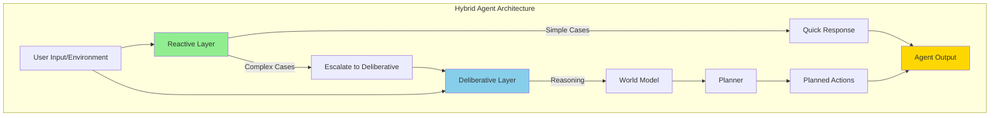
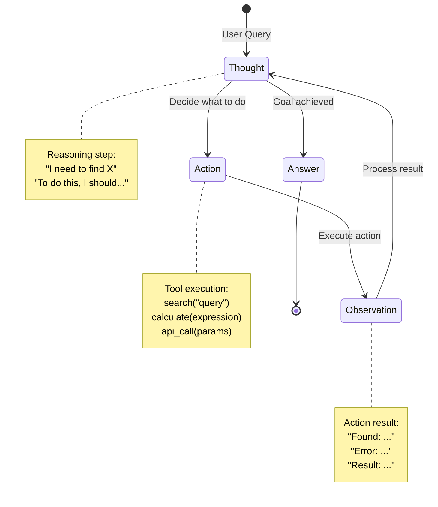
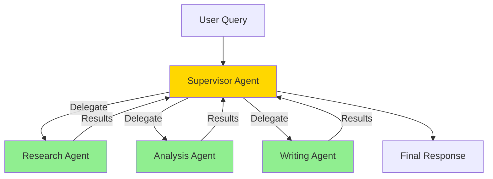
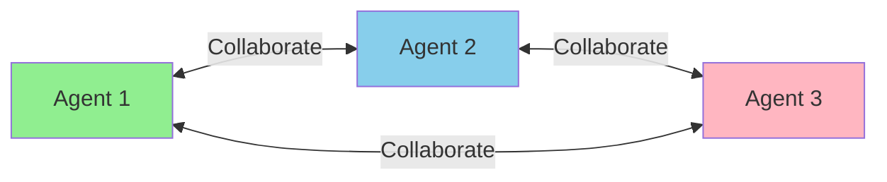
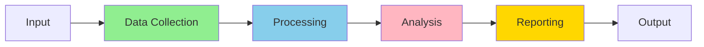
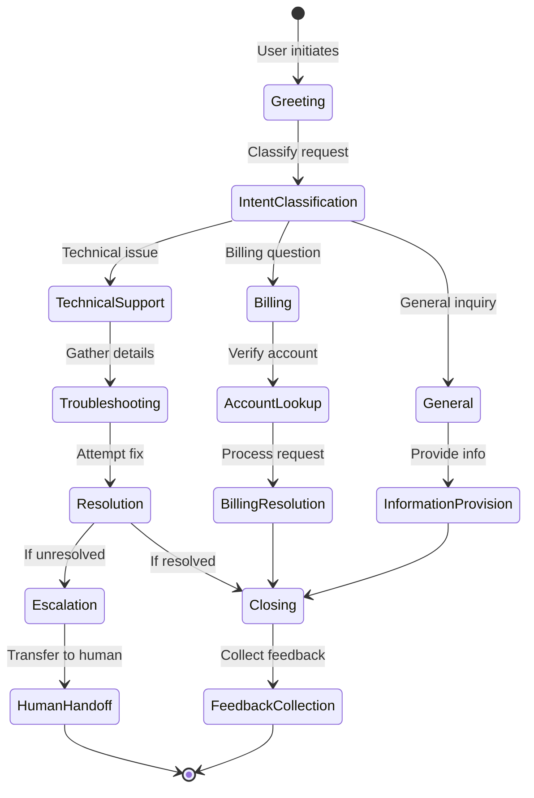
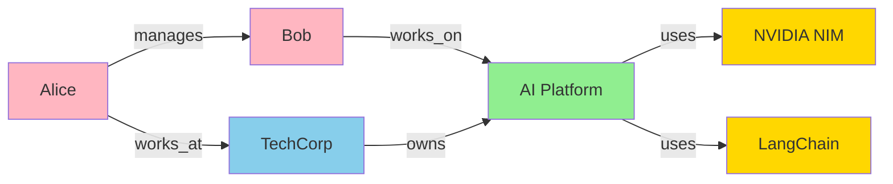
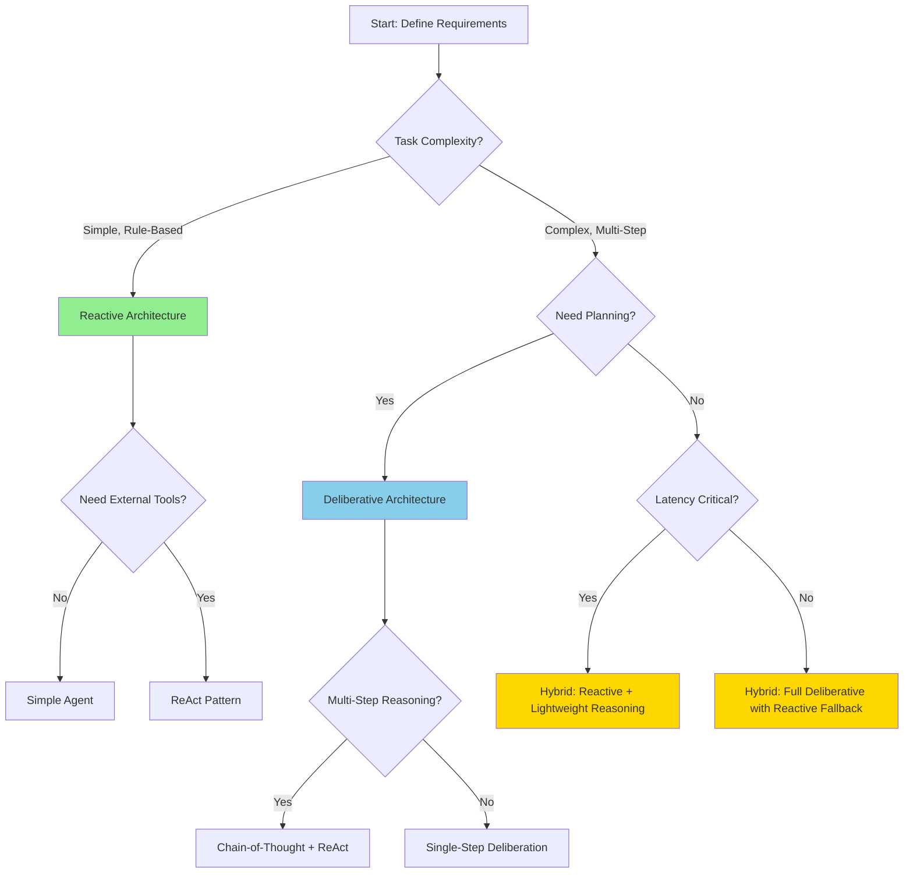
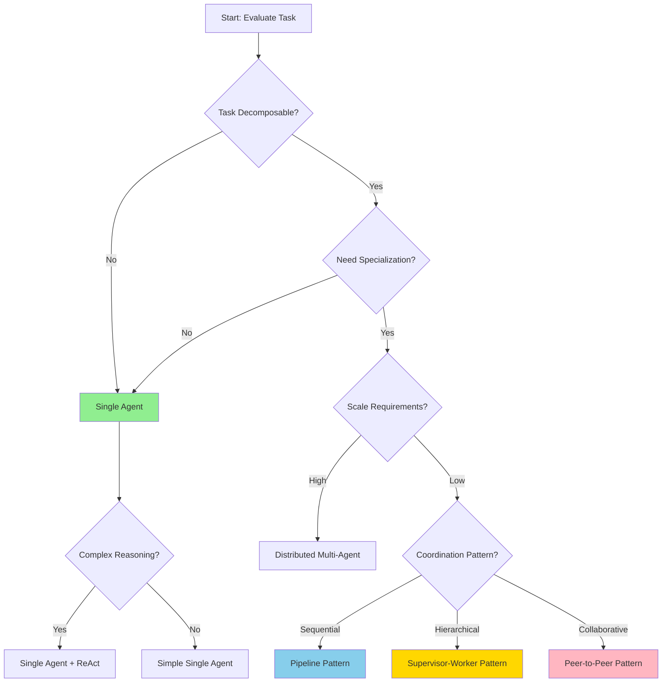

# Module 1: Agent Architecture and Design

**Exam Weight:** 15%  
**Estimated Study Time:** 8-10 hours  
**Prerequisites:** Basic understanding of LLMs, Python programming, API concepts

## Learning Objectives

By the end of this module, you will be able to:

1. **Design intuitive human-agent interaction interfaces** that balance automation with user control
2. **Implement reasoning and action frameworks** (e.g., ReAct pattern) for goal-oriented behavior
3. **Configure agent-to-agent communication protocols** for multi-agent collaboration
4. **Manage short-term and long-term memory** for context retention across conversations
5. **Orchestrate multi-agent workflows** with proper coordination and task delegation
6. **Apply logic trees, prompt chains, and stateful orchestration** for complex decision-making
7. **Integrate knowledge graphs** for relational reasoning and structured knowledge access
8. **Ensure adaptability and scalability** in agent system design

## Exam Objective Mapping

This module directly addresses the following NCP-AAI exam objectives:

- **1.1** - Design intuitive human-agent interaction interfaces
- **1.2** - Implement reasoning and action frameworks (ReAct)
- **1.3** - Configure agent-to-agent communication protocols
- **1.4** - Manage short-term and long-term memory for context retention
- **1.5** - Orchestrate multi-agent workflows and coordination
- **1.6** - Apply logic trees, prompt chains, and stateful orchestration
- **1.7** - Integrate knowledge graphs for relational reasoning
- **1.8** - Ensure adaptability and scalability

---

## 1. Introduction to Agentic AI Systems

### What is an Agentic AI System?

An **agentic AI system** is an autonomous software entity that:
- Perceives its environment through sensors or data inputs
- Reasons about goals and plans actions to achieve them
- Acts upon the environment through tools, APIs, or interfaces
- Learns and adapts from feedback and experience

Unlike traditional AI models that simply respond to prompts, agents exhibit **goal-oriented behavior**, **autonomy**, and **adaptability**.

### Key Characteristics of Agents

| Characteristic | Description | Example |
|----------------|-------------|---------|
| **Autonomy** | Operates without constant human intervention | Customer service agent handling routine inquiries |
| **Reactivity** | Responds to environmental changes in real-time | Trading agent reacting to market fluctuations |
| **Proactivity** | Takes initiative to achieve goals | Research agent proactively gathering information |
| **Social Ability** | Interacts with other agents and humans | Multi-agent system coordinating task execution |
| **Learning** | Improves performance through experience | Agent refining responses based on user feedback |

> 📝 **EXAM TIP**
> 
> Understand the distinction between reactive (stimulus-response) and proactive (goal-driven) agent behavior. Scenario questions often test your ability to choose the right balance.

---

## 2. Agent Architecture Patterns

### 2.1 Reactive Architectures

**Reactive agents** respond directly to environmental stimuli without internal state or complex reasoning.

**Characteristics:**
- Simple stimulus-response mapping
- No internal world model
- Fast response times
- Limited to predefined behaviors

**Use Cases:**
- Simple chatbots with rule-based responses
- Alert systems triggering on specific conditions
- Basic automation workflows

**Trade-offs:**
✅ **Advantages:** Fast, predictable, easy to debug  
❌ **Disadvantages:** Limited flexibility, cannot handle complex scenarios, no learning

```python
# Example: Simple reactive agent
class ReactiveAgent:
    def __init__(self, rules):
        self.rules = rules  # Dict mapping conditions to actions
    
    def perceive(self, environment):
        """Observe current state"""
        return environment.get_state()
    
    def act(self, state):
        """React based on rules"""
        for condition, action in self.rules.items():
            if condition(state):
                return action(state)
        return None  # Default: no action
```

### 2.2 Deliberative Architectures

**Deliberative agents** maintain an internal model of the world and use symbolic reasoning to plan actions.

**Characteristics:**
- Internal world representation
- Explicit reasoning and planning
- Goal-oriented behavior
- Can handle complex, multi-step tasks

**Use Cases:**
- Strategic planning agents
- Complex problem-solving systems
- Research and analysis agents

**Trade-offs:**
✅ **Advantages:** Handles complexity, explainable reasoning, goal-oriented  
❌ **Disadvantages:** Slower response, computationally expensive, brittle to unexpected situations

```python
# Example: Deliberative agent with planning
class DeliberativeAgent:
    def __init__(self, world_model, planner):
        self.world_model = world_model
        self.planner = planner
        self.goals = []
    
    def perceive(self, environment):
        """Update internal world model"""
        observations = environment.get_state()
        self.world_model.update(observations)
    
    def deliberate(self):
        """Reason about goals and create plan"""
        current_state = self.world_model.get_state()
        plan = self.planner.create_plan(current_state, self.goals)
        return plan
    
    def act(self, plan):
        """Execute next action in plan"""
        if plan:
            return plan.next_action()
        return None
```

### 2.3 Hybrid Architectures (Recommended for Most Use Cases)

**Hybrid agents** combine reactive and deliberative components, balancing speed and sophistication.

**Characteristics:**
- Layered architecture with reactive and deliberative layers
- Fast reactive responses for routine situations
- Deliberative planning for complex scenarios
- Best of both worlds

**Use Cases:**
- Production customer service agents
- Autonomous assistants
- Enterprise productivity tools

**Trade-offs:**
✅ **Advantages:** Flexible, handles both simple and complex tasks, production-ready  
❌ **Disadvantages:** More complex to implement, requires careful layer coordination



**NVIDIA Integration:** Use **NVIDIA NeMo Agent Toolkit** to implement hybrid architectures with optimized inference for both reactive and deliberative components.

```python
# Example: Hybrid agent with NVIDIA NeMo Agent Toolkit
from nemo_agent_toolkit import HybridAgent, ReactiveLayer, DeliberativeLayer

class ProductionAgent(HybridAgent):
    def __init__(self):
        # Reactive layer for fast responses
        self.reactive = ReactiveLayer(
            model="nvidia/llama-3.1-8b-instruct",
            response_threshold=0.8  # Confidence threshold
        )
        
        # Deliberative layer for complex reasoning
        self.deliberative = DeliberativeLayer(
            model="nvidia/llama-3.1-70b-instruct",
            planning_enabled=True
        )
    
    def process(self, user_input):
        # Try reactive layer first
        response, confidence = self.reactive.respond(user_input)
        
        if confidence >= 0.8:
            return response  # Fast path
        else:
            # Escalate to deliberative layer
            return self.deliberative.reason_and_respond(user_input)
```

> 📝 **EXAM TIP**
> 
> Scenario questions often present situations where you must choose between reactive, deliberative, or hybrid architectures. Consider latency requirements, task complexity, and explainability needs.

---

## 3. The ReAct Pattern: Reasoning + Acting

### 3.1 What is ReAct?

**ReAct** (Reasoning and Acting) is a paradigm where agents alternate between:
1. **Reasoning** - Thinking through the problem step-by-step
2. **Acting** - Taking actions based on reasoning (e.g., calling tools, querying databases)
3. **Observing** - Receiving feedback from actions
4. **Repeating** - Iterating until the goal is achieved

This pattern enables agents to solve complex problems that require multiple steps and external information.

### 3.2 ReAct Loop Structure



### 3.3 ReAct Implementation Example

```python
from langchain.agents import AgentExecutor, create_react_agent
from langchain.tools import Tool
from langchain_nvidia_ai_endpoints import ChatNVIDIA

# Define tools the agent can use
def search_tool(query: str) -> str:
    """Search for information"""
    # Implementation using search API
    return f"Search results for: {query}"

def calculator_tool(expression: str) -> str:
    """Perform calculations"""
    try:
        result = eval(expression)  # In production, use safe evaluation
        return f"Result: {result}"
    except Exception as e:
        return f"Error: {e}"

tools = [
    Tool(
        name="Search",
        func=search_tool,
        description="Useful for finding information. Input should be a search query."
    ),
    Tool(
        name="Calculator",
        func=calculator_tool,
        description="Useful for math calculations. Input should be a mathematical expression."
    )
]

# Initialize NVIDIA LLM
llm = ChatNVIDIA(
    model="meta/llama-3.1-70b-instruct",
    nvidia_api_key="your-api-key"
)

# Create ReAct agent
agent = create_react_agent(llm, tools, prompt_template)
agent_executor = AgentExecutor(
    agent=agent,
    tools=tools,
    verbose=True,
    max_iterations=5,  # Prevent infinite loops
    handle_parsing_errors=True
)

# Execute agent
response = agent_executor.invoke({
    "input": "What is the population of Tokyo multiplied by 2?"
})
```

### 3.4 ReAct Execution Trace Example

```
Thought: I need to find the population of Tokyo first.
Action: Search("population of Tokyo")
Observation: Tokyo has a population of approximately 14 million people.

Thought: Now I need to multiply this by 2.
Action: Calculator("14000000 * 2")
Observation: Result: 28000000

Thought: I now have the final answer.
Answer: The population of Tokyo multiplied by 2 is 28,000,000.
```

### 3.5 When to Use ReAct

**Use ReAct when:**
- Tasks require multiple steps with external information
- You need explainable reasoning traces
- Actions depend on previous observations
- Tool orchestration is required

**Avoid ReAct when:**
- Simple single-step queries suffice
- Latency is critical (ReAct adds overhead)
- No external tools are needed

**Trade-offs:**

| Aspect | Benefit | Cost |
|--------|---------|------|
| **Explainability** | Clear reasoning traces | Verbose output |
| **Flexibility** | Handles complex tasks | Higher latency |
| **Tool Use** | Seamless integration | Requires tool definitions |
| **Reliability** | Can recover from errors | May loop indefinitely |

> 📝 **EXAM TIP**
> 
> ReAct is one of the most commonly tested patterns. Understand when it's appropriate vs. when simpler approaches suffice. Watch for scenarios involving multi-step reasoning with tool calls.

---

## 4. Multi-Agent Systems

### 4.1 Why Multi-Agent Systems?

**Multi-agent systems** decompose complex problems into specialized agents that collaborate to achieve goals.

**Benefits:**
- **Specialization** - Each agent focuses on specific expertise
- **Scalability** - Distribute workload across agents
- **Modularity** - Easier to develop, test, and maintain
- **Robustness** - Failure of one agent doesn't crash the system

**Challenges:**
- **Coordination** - Agents must communicate effectively
- **Conflict Resolution** - Handling disagreements between agents
- **Overhead** - Communication and orchestration costs

### 4.2 Multi-Agent Architecture Patterns

#### Pattern 1: Hierarchical (Supervisor-Worker)

A supervisor agent coordinates multiple worker agents.



**Use Cases:**
- Research assistants with specialized researchers
- Customer service with routing to specialized agents
- Content creation pipelines

**Implementation with LangGraph:**

```python
from langgraph.graph import StateGraph, END
from langchain_nvidia_ai_endpoints import ChatNVIDIA

# Define agent state
class AgentState(TypedDict):
    messages: List[str]
    next_agent: str
    final_response: str

# Create supervisor agent
def supervisor_node(state: AgentState):
    """Supervisor decides which worker to call"""
    llm = ChatNVIDIA(model="meta/llama-3.1-70b-instruct")
    
    # Analyze task and route
    prompt = f"Given this task: {state['messages'][-1]}, which agent should handle it?"
    response = llm.invoke(prompt)
    
    # Parse response to determine next agent
    if "research" in response.content.lower():
        state["next_agent"] = "research"
    elif "analysis" in response.content.lower():
        state["next_agent"] = "analysis"
    else:
        state["next_agent"] = "writing"
    
    return state

# Create worker agents
def research_agent(state: AgentState):
    """Specialized research agent"""
    llm = ChatNVIDIA(model="meta/llama-3.1-8b-instruct")
    # Perform research
    result = llm.invoke(f"Research: {state['messages'][-1]}")
    state["messages"].append(f"Research: {result.content}")
    state["next_agent"] = "supervisor"
    return state

# Build graph
workflow = StateGraph(AgentState)
workflow.add_node("supervisor", supervisor_node)
workflow.add_node("research", research_agent)
workflow.add_node("analysis", analysis_agent)
workflow.add_node("writing", writing_agent)

# Define edges
workflow.set_entry_point("supervisor")
workflow.add_conditional_edges(
    "supervisor",
    lambda x: x["next_agent"],
    {
        "research": "research",
        "analysis": "analysis",
        "writing": "writing",
        END: END
    }
)

app = workflow.compile()
```

#### Pattern 2: Peer-to-Peer (Collaborative)

Agents communicate directly without a central coordinator.



**Use Cases:**
- Consensus-building systems
- Distributed problem-solving
- Peer review and validation

**Trade-offs:**
✅ No single point of failure, flexible collaboration  
❌ Complex coordination, potential for conflicts

#### Pattern 3: Pipeline (Sequential)

Agents process tasks in a fixed sequence.



**Use Cases:**
- ETL pipelines
- Content generation workflows
- Multi-stage analysis

**Trade-offs:**
✅ Simple, predictable, easy to debug  
❌ Inflexible, bottlenecks at slow stages

### 4.3 Agent Communication Protocols

**Message Passing:**
```python
class Message:
    def __init__(self, sender, receiver, content, message_type):
        self.sender = sender
        self.receiver = receiver
        self.content = content
        self.type = message_type  # "request", "response", "inform"
        self.timestamp = datetime.now()

class Agent:
    def __init__(self, name):
        self.name = name
        self.inbox = []
    
    def send_message(self, receiver, content, msg_type):
        message = Message(self.name, receiver, content, msg_type)
        receiver.receive_message(message)
    
    def receive_message(self, message):
        self.inbox.append(message)
    
    def process_messages(self):
        for message in self.inbox:
            self.handle_message(message)
        self.inbox.clear()
```
**Message Passing, second example:**
```python
from datetime import datetime
from enum import Enum, auto
from typing import Optional
import uuid

class MessageType(Enum):
    REQUEST = auto()
    RESPONSE = auto()
    INFORM = auto()

class Message:
    def __init__(self, sender: str, receiver: str, content: str, 
                 msg_type: MessageType, reply_to: Optional[str] = None):
        self.id = str(uuid.uuid4())
        self.sender = sender
        self.receiver = receiver
        self.content = content
        self.type = msg_type
        self.reply_to = reply_to  # ID of message this responds to
        self.timestamp = datetime.now()
    
    def __repr__(self):
        return f"Message({self.type.name}: {self.sender} -> {self.receiver})"

class Agent:
    def __init__(self, name: str):
        self.name = name
        self.inbox: list[Message] = []
        self.outbox: list[Message] = []  # Decouples send from delivery
    
    def send_message(self, receiver_name: str, content: str, 
                     msg_type: MessageType, reply_to: Optional[str] = None):
        msg = Message(self.name, receiver_name, content, msg_type, reply_to)
        self.outbox.append(msg)
        return msg.id  # Return ID so caller can track the conversation
    
    def receive_message(self, message: Message):
        if message.receiver != self.name:
            raise ValueError(f"Message misdelivered: {message.receiver} != {self.name}")
        self.inbox.append(message)
    
    def process_messages(self, registry: dict[str, 'Agent']):
        """Process inbox and route outbox through a central registry."""
        # Handle incoming
        for msg in self.inbox:
            self.handle_message(msg)
        self.inbox.clear()
        
        # Deliver outgoing
        for msg in self.outbox:
            if msg.receiver in registry:
                registry[msg.receiver].receive_message(msg)
            else:
                print(f"Undeliverable: {msg}")
        self.outbox.clear()
    
    def handle_message(self, message: Message):
        if message.type == MessageType.REQUEST:
            response = Message(
                self.name, message.sender,
                f"Acknowledged: {message.content}",
                MessageType.RESPONSE,
                reply_to=message.id
            )
            self.outbox.append(response)
        elif message.type == MessageType.INFORM:
            print(f"[{self.name}] Noted: {message.content}")
        # ... etc

# --- Usage ---
if __name__ == "__main__":
    alice = Agent("Alice")
    bob = Agent("Bob")
    registry = {"Alice": alice, "Bob": bob}
    
    alice.send_message("Bob", "Need status update", MessageType.REQUEST)
    
    # Simulate message delivery cycle
    for agent in registry.values():
        agent.process_messages(registry)
    
    # Bob's response is now in Alice's inbox
    alice.process_messages(registry)
```

**Shared State:**
```python
from typing import TypedDict, Annotated
from langgraph.graph import StateGraph

class SharedState(TypedDict):
    """Shared state accessible by all agents"""
    user_query: str
    research_results: List[str]
    analysis: str
    final_output: str
    metadata: dict

# Agents read and write to shared state
def agent_1(state: SharedState) -> SharedState:
    # Read from state
    query = state["user_query"]
    
    # Perform work
    results = perform_research(query)
    
    # Write to state
    state["research_results"] = results
    return state
```
**Shared state, enhance to first example above:**
- Immutability (Pure Functions): Agents do not mutate, they return a dictionary containing only the changes.
LangGraph uses this return value to update state under the hood.
- List State Reducers (Annotated): We added Annotated[List[str], operator.add] to research_results. 
Without this, if multiple agents try to write to research_results, the final agent's write would overwrite everything previous. 
Using operator.add makes LangGraph append items safely.
- Partial Returns: The agents return partial state objects (e.g., just {"analysis": ...}), 
keeping agents loosely coupled and ensuring they do not overwrite other fields unintentionally.
- Ready-to-run Architecture: Included mock functions and a __main__ section so you can 
copy, run, and experiment with the state propagation immediately.

```python
import operator
from typing import Annotated, Any, Dict, List, TypedDict
from langgraph.graph import START, END, StateGraph


# =====================================================================
# Best Practice 1: Define a robust, type-safe Shared State
# =====================================================================
class SharedState(TypedDict):
    """The unified state schema shared among all agents in our graph."""

    user_query: str

    # Industry standard: Use 'Annotated' with 'operator.add' for lists.
    # This acts as a "reducer". When an agent returns a list of results,
    # LangGraph will automatically APPEND them to the existing list,
    # rather than overwriting previous agents' discoveries.
    research_results: Annotated[List[str], operator.add]

    # For standard string updates where we want the last agent's write to win,
    # we don't need a custom reducer; LangGraph's default behavior is to overwrite.
    analysis: str
    final_output: str
    metadata: Dict[str, Any]


# =====================================================================
# Mock helper functions (simulating external APIs/LLMs)
# =====================================================================
def perform_research(query: str) -> List[str]:
    """Mock helper to simulate API or web search retrieval."""
    return [
        f"Document A: Best practices for state management in LangGraph ({query})",
        f"Document B: Multi-agent design patterns overview for ({query})",
    ]


# =====================================================================
# Best Practice 2: Functional Updates & Partial State Returns
# =====================================================================


def research_agent(state: SharedState) -> Dict[str, Any]:
    """Agent 1: Reads user query, fetches research material, and updates state.

    Notice that we do NOT mutate `state` in place, and we only return the keys
    we want to change or append to.
    """
    # Safe retrieval using .get()
    query = state.get("user_query", "")

    print(f"\n[Agent 1 - Research] Processing query: '{query}'")
    results = perform_research(query)

    # Return ONLY the slice of the state we updated.
    # Because 'research_results' is annotated with operator.add, these will
    # be appended to any pre-existing results in the state.
    return {"research_results": results}


def analysis_agent(state: SharedState) -> Dict[str, Any]:
    """Agent 2: Reads research results from shared state, generates analysis.

    This node demonstrates state sharing by leveraging the output of Agent 1.
    """
    # Access accumulated state from previous agents
    results = state.get("research_results", [])

    print(f"[Agent 2 - Analysis] Reading {len(results)} shared research documents...")

    # Summarize/Analyze
    analysis_summary = (
        f"Synthesized Analysis:\n"
        f"Our agents discovered {len(results)} source items. "
        f"Key takeaway: {results[0] if results else 'No data found.'}"
    )

    # Return only the new analysis field
    return {"analysis": analysis_summary}


def writer_agent(state: SharedState) -> Dict[str, Any]:
    """Agent 3: Reads analysis, formats the final presentation output."""
    query = state.get("user_query", "")
    analysis = state.get("analysis", "")

    print("[Agent 3 - Writer] Preparing final draft...")

    final_report = (
        f"================ REPORT ================\n"
        f"Topic: {query}\n"
        f"----------------------------------------\n"
        f"{analysis}\n"
        f"========================================"
    )

    return {"final_output": final_report}


# =====================================================================
# Best Practice 3: Graph Construction
# =====================================================================
def build_and_run_graph():
    # 1. Initialize StateGraph with our SharedState schema
    workflow = StateGraph(SharedState)

    # 2. Add nodes (agents)
    workflow.add_node("researcher", research_agent)
    workflow.add_node("analyzer", analysis_agent)
    workflow.add_node("writer", writer_agent)

    # 3. Establish the execution flow
    workflow.add_edge(START, "researcher")
    workflow.add_edge("researcher", "analyzer")
    workflow.add_edge("analyzer", "writer")
    workflow.add_edge("writer", END)

    # 4. Compile workflow into a runnable app
    compiled_graph = workflow.compile()

    # 5. Execute with an initial state
    initial_input = {
        "user_query": "Agentic Workflows",
        "research_results": [],  # Initial empty accumulator
        "analysis": "",
        "final_output": "",
        "metadata": {},
    }

    print("Executing Multi-Agent Workflow...")
    output_state = compiled_graph.invoke(initial_input)

    print("\n--- Execution Complete ---")
    print(output_state["final_output"])


if __name__ == "__main__":
    build_and_run_graph()
```

> 📝 **EXAM TIP**
> 
> Understand the trade-offs between different multi-agent patterns. Hierarchical is most common in production, but peer-to-peer and pipeline have specific use cases.

---

## 5. Memory Management in Agents

### 5.1 Short-Term Memory (Conversation Context)

**Short-term memory** maintains context within a single conversation session.

**Implementation Strategies:**

**1. Sliding Window:**
```python
class SlidingWindowMemory:
    def __init__(self, window_size=10):
        self.messages = []
        self.window_size = window_size
    
    def add_message(self, role, content):
        self.messages.append({"role": role, "content": content})
        # Keep only last N messages
        if len(self.messages) > self.window_size:
            self.messages = self.messages[-self.window_size:]
    
    def get_context(self):
        return self.messages
```

**2. Token-Based Truncation:**
```python
class TokenBudgetMemory:
    def __init__(self, max_tokens=4096):
        self.messages = []
        self.max_tokens = max_tokens
    
    def add_message(self, role, content):
        self.messages.append({"role": role, "content": content})
        self._truncate_to_budget()
    
    def _truncate_to_budget(self):
        total_tokens = sum(count_tokens(m["content"]) for m in self.messages)
        while total_tokens > self.max_tokens and len(self.messages) > 1:
            self.messages.pop(0)  # Remove oldest
            total_tokens = sum(count_tokens(m["content"]) for m in self.messages)
```

**3. Summarization:**
```python
class SummarizationMemory:
    def __init__(self, llm, summary_threshold=10):
        self.messages = []
        self.summary = ""
        self.llm = llm
        self.threshold = summary_threshold
    
    def add_message(self, role, content):
        self.messages.append({"role": role, "content": content})
        
        if len(self.messages) >= self.threshold:
            self._summarize_and_compress()
    
    def _summarize_and_compress(self):
        # Summarize old messages
        old_messages = self.messages[:-3]  # Keep last 3
        summary_prompt = f"Summarize this conversation: {old_messages}"
        self.summary = self.llm.invoke(summary_prompt).content
        self.messages = self.messages[-3:]  # Keep recent messages
    
    def get_context(self):
        if self.summary:
            return [{"role": "system", "content": f"Previous context: {self.summary}"}] + self.messages
        return self.messages
```

### 5.2 Long-Term Memory (Persistent Knowledge)

**Long-term memory** stores information across sessions for personalization and learning.

**Implementation with Vector Stores:**

```python
from langchain.vectorstores import FAISS
from langchain.embeddings import NVIDIAEmbeddings
from langchain.memory import VectorStoreRetrieverMemory

# Initialize NVIDIA embeddings
embeddings = NVIDIAEmbeddings(
    model="nvidia/nv-embed-v1",
    nvidia_api_key="your-api-key"
)

# Create vector store for long-term memory
vectorstore = FAISS.from_texts(
    texts=[],  # Start empty
    embedding=embeddings
)

# Create memory with retrieval
memory = VectorStoreRetrieverMemory(
    retriever=vectorstore.as_retriever(search_kwargs={"k": 5}),
    memory_key="history"
)

# Store information
memory.save_context(
    {"input": "My name is Alice and I work in healthcare"},
    {"output": "Nice to meet you, Alice! How can I help you today?"}
)

# Retrieve relevant memories
relevant_memories = memory.load_memory_variables(
    {"input": "What do you know about me?"}
)
```

**Memory Architecture Comparison:**

| Memory Type | Persistence | Retrieval | Use Case | NVIDIA Tool |
|-------------|-------------|-----------|----------|-------------|
| **Sliding Window** | Session only | Sequential | Short conversations | N/A |
| **Summarization** | Session only | Compressed | Long conversations | NIM for summarization |
| **Vector Store** | Persistent | Semantic search | Personalization | NeMo Embeddings + Milvus |
| **Knowledge Graph** | Persistent | Relational queries | Complex relationships | NeMo + Graph DBs |

> 📝 **EXAM TIP**
> 
> Memory management is critical for production agents. Understand when to use short-term vs. long-term memory, and how to handle context window limitations.

---

## 6. Stateful Orchestration and Logic Trees

### 6.1 Stateful Orchestration

**Stateful orchestration** maintains state across multiple agent interactions to handle complex, multi-turn workflows.

**Example: Customer Support Workflow**



**Implementation with LangGraph:**

```python
from langgraph.graph import StateGraph, END
from typing import TypedDict, Literal

class SupportState(TypedDict):
    user_input: str
    intent: str
    issue_details: dict
    resolution_status: str
    conversation_history: List[str]

def classify_intent(state: SupportState) -> SupportState:
    """Classify user intent"""
    llm = ChatNVIDIA(model="meta/llama-3.1-8b-instruct")
    prompt = f"Classify this support request: {state['user_input']}"
    response = llm.invoke(prompt)
    
    if "technical" in response.content.lower():
        state["intent"] = "technical"
    elif "billing" in response.content.lower():
        state["intent"] = "billing"
    else:
        state["intent"] = "general"
    
    return state

def route_intent(state: SupportState) -> Literal["technical", "billing", "general"]:
    """Route based on intent"""
    return state["intent"]

# Build stateful workflow
workflow = StateGraph(SupportState)

# Add nodes
workflow.add_node("classify", classify_intent)
workflow.add_node("technical", handle_technical)
workflow.add_node("billing", handle_billing)
workflow.add_node("general", handle_general)

# Set entry point
workflow.set_entry_point("classify")

# Add conditional routing
workflow.add_conditional_edges(
    "classify",
    route_intent,
    {
        "technical": "technical",
        "billing": "billing",
        "general": "general"
    }
)

# Compile
app = workflow.compile()

# Execute with state persistence
result = app.invoke({"user_input": "My account is locked"})
```

### 6.2 Logic Trees and Decision Making

**Logic trees** provide structured decision-making for agents.

```python
class DecisionNode:
    def __init__(self, condition, true_branch, false_branch):
        self.condition = condition
        self.true_branch = true_branch
        self.false_branch = false_branch
    
    def evaluate(self, context):
        if self.condition(context):
            return self.true_branch.evaluate(context) if self.true_branch else "TRUE"
        else:
            return self.false_branch.evaluate(context) if self.false_branch else "FALSE"

# Example: Customer eligibility decision tree
def build_eligibility_tree():
    # Leaf nodes (actions)
    approve = lambda ctx: "APPROVED"
    reject = lambda ctx: "REJECTED"
    manual_review = lambda ctx: "MANUAL_REVIEW"
    
    # Decision nodes
    credit_check = DecisionNode(
        condition=lambda ctx: ctx["credit_score"] >= 700,
        true_branch=DecisionNode(
            condition=lambda ctx: ctx["income"] >= 50000,
            true_branch=approve,
            false_branch=manual_review
        ),
        false_branch=reject
    )
    
    return credit_check

# Use the tree
tree = build_eligibility_tree()
result = tree.evaluate({"credit_score": 750, "income": 60000})
```

### 6.3 Prompt Chains

**Prompt chains** decompose complex tasks into sequential prompts.

```python
class PromptChain:
    def __init__(self, llm):
        self.llm = llm
        self.steps = []
    
    def add_step(self, name, prompt_template):
        self.steps.append({"name": name, "template": prompt_template})
    
    def execute(self, initial_input):
        context = {"input": initial_input}
        
        for step in self.steps:
            prompt = step["template"].format(**context)
            response = self.llm.invoke(prompt)
            context[step["name"]] = response.content
        
        return context

# Example: Research report generation chain
llm = ChatNVIDIA(model="meta/llama-3.1-70b-instruct")
chain = PromptChain(llm)

chain.add_step("outline", "Create an outline for a report on: {input}")
chain.add_step("research", "Based on this outline: {outline}, what key points should be researched?")
chain.add_step("draft", "Write a draft report with outline: {outline} and research points: {research}")
chain.add_step("refine", "Refine this draft for clarity and conciseness: {draft}")

result = chain.execute("The impact of AI on healthcare")
final_report = result["refine"]
```

> 📝 **EXAM TIP**
> 
> Stateful orchestration is essential for production agents. Understand how to maintain state across interactions and implement conditional routing based on conversation context.

---

## 7. Knowledge Graph Integration

### 7.1 Why Knowledge Graphs?

**Knowledge graphs** provide structured, relational knowledge that agents can query and reason over.

**Benefits:**
- **Structured Relationships** - Explicit connections between entities
- **Reasoning** - Infer new knowledge from existing relationships
- **Explainability** - Clear provenance for information
- **Consistency** - Avoid contradictions in knowledge base

**Use Cases:**
- Enterprise knowledge management
- Medical diagnosis systems
- Financial analysis and compliance
- Scientific research assistants

### 7.2 Knowledge Graph Structure



### 7.3 Integrating Knowledge Graphs with Agents

```python
from langchain.graphs import Neo4jGraph
from langchain.chains import GraphCypherQAChain
from langchain_nvidia_ai_endpoints import ChatNVIDIA

# Connect to knowledge graph
graph = Neo4jGraph(
    url="bolt://localhost:7687",
    username="neo4j",
    password="password"
)

# Create agent with graph access
llm = ChatNVIDIA(model="meta/llama-3.1-70b-instruct")

graph_chain = GraphCypherQAChain.from_llm(
    llm=llm,
    graph=graph,
    verbose=True
)

# Agent can now query the knowledge graph
response = graph_chain.invoke({
    "query": "Who does Alice manage and what projects are they working on?"
})

# The agent generates Cypher queries like:
# MATCH (p:Person {name: 'Alice'})-[:manages]->(m:Person)-[:works_on]->(proj:Project)
# RETURN m.name, proj.name
```

**Hybrid Approach: Vector Store + Knowledge Graph**

```python
class HybridKnowledgeAgent:
    def __init__(self, vector_store, knowledge_graph, llm):
        self.vector_store = vector_store
        self.knowledge_graph = knowledge_graph
        self.llm = llm
    
    def query(self, user_question):
        # Step 1: Semantic search in vector store
        relevant_docs = self.vector_store.similarity_search(user_question, k=5)
        
        # Step 2: Extract entities from question
        entities = self._extract_entities(user_question)
        
        # Step 3: Query knowledge graph for relationships
        graph_results = self._query_graph(entities)
        
        # Step 4: Combine both sources
        context = {
            "documents": relevant_docs,
            "relationships": graph_results
        }
        
        # Step 5: Generate answer with full context
        prompt = f"""
        Based on these documents: {relevant_docs}
        And these relationships: {graph_results}
        Answer: {user_question}
        """
        
        return self.llm.invoke(prompt)
```

> 📝 **EXAM TIP**
> 
> Knowledge graphs are particularly useful for domains with complex relationships (healthcare, finance, enterprise). Understand when to use knowledge graphs vs. vector stores vs. hybrid approaches.

---

## 8. Scalability and Adaptability

### 8.1 Designing for Scale

**Horizontal Scaling:**
- Deploy multiple agent instances behind load balancer
- Use stateless agents with external state management
- Implement request queuing for burst handling

**Vertical Scaling:**
- Optimize model inference with TensorRT-LLM
- Use model quantization for faster inference
- Implement caching for repeated queries

**NVIDIA Platform for Scale:**

```python
# Deploy with NVIDIA NIM for high-performance inference
from nvidia_nim import NIMClient

client = NIMClient(
    model="meta/llama-3.1-70b-instruct",
    endpoint="https://your-nim-endpoint.nvidia.com"
)

# NIM handles:
# - Automatic batching
# - GPU optimization
# - Load balancing
# - Caching
response = client.generate(
    prompt="Your prompt here",
    max_tokens=512,
    temperature=0.7
)
```

### 8.2 Adaptability Patterns

**1. Dynamic Tool Loading:**
```python
class AdaptiveAgent:
    def __init__(self, llm):
        self.llm = llm
        self.tools = {}
    
    def register_tool(self, name, function, description):
        """Dynamically add tools at runtime"""
        self.tools[name] = {
            "function": function,
            "description": description
        }
    
    def adapt_to_domain(self, domain):
        """Load domain-specific tools"""
        if domain == "finance":
            self.register_tool("stock_price", get_stock_price, "Get stock prices")
            self.register_tool("calculate_roi", calculate_roi, "Calculate ROI")
        elif domain == "healthcare":
            self.register_tool("drug_interaction", check_interactions, "Check drug interactions")
            self.register_tool("diagnosis_lookup", lookup_diagnosis, "Look up diagnoses")
```

**2. Learning from Feedback:**
```python
class LearningAgent:
    def __init__(self, llm):
        self.llm = llm
        self.feedback_store = []
    
    def process_feedback(self, query, response, user_rating, user_correction):
        """Store feedback for improvement"""
        self.feedback_store.append({
            "query": query,
            "response": response,
            "rating": user_rating,
            "correction": user_correction,
            "timestamp": datetime.now()
        })
        
        # Periodically fine-tune or update prompts based on feedback
        if len(self.feedback_store) >= 100:
            self._update_from_feedback()
    
    def _update_from_feedback(self):
        """Adapt behavior based on accumulated feedback"""
        # Analyze patterns in low-rated responses
        low_rated = [f for f in self.feedback_store if f["rating"] < 3]
        
        # Update system prompt with common corrections
        common_issues = self._analyze_issues(low_rated)
        self._update_system_prompt(common_issues)
```

---

## 9. Architecture Selection Decision Trees

### 9.1 Choosing Agent Architecture



### 9.2 Choosing Multi-Agent vs. Single-Agent



### 9.3 Memory Strategy Selection

| Scenario | Short-Term Strategy | Long-Term Strategy | Rationale |
|----------|---------------------|-------------------|-----------|
| **Customer Support** | Sliding Window (10 msgs) | Vector Store (user history) | Need recent context + personalization |
| **Research Assistant** | Summarization | Knowledge Graph | Long conversations + structured knowledge |
| **Quick Q&A** | Token Budget (4K) | None | Short interactions, no persistence needed |
| **Personal Assistant** | Summarization | Vector Store + Graph | Complex context + relationships |
| **Code Assistant** | Sliding Window (20 msgs) | Vector Store (codebase) | Recent edits + code search |

---

## 10. Best Practices and Anti-Patterns

### 10.1 Best Practices

✅ **DO:**
1. **Start Simple** - Begin with single agent, add complexity only when needed
2. **Implement Error Handling** - Agents will fail; handle gracefully
3. **Set Iteration Limits** - Prevent infinite loops in ReAct patterns
4. **Monitor Performance** - Track latency, cost, and accuracy
5. **Use Hybrid Architectures** - Balance speed and sophistication
6. **Implement Guardrails** - Safety checks on inputs and outputs
7. **Version Your Agents** - Track changes and enable rollback
8. **Test with Real Scenarios** - Use production-like data for testing

### 10.2 Anti-Patterns

❌ **DON'T:**
1. **Over-Engineer** - Don't use multi-agent when single agent suffices
2. **Ignore Context Limits** - Monitor token usage and implement truncation
3. **Skip Error Handling** - Unhandled errors crash production systems
4. **Hardcode Prompts** - Use templates and make prompts configurable
5. **Neglect Monitoring** - You can't improve what you don't measure
6. **Forget Human Oversight** - Critical decisions need human review
7. **Ignore Costs** - LLM calls are expensive; optimize aggressively
8. **Skip Testing** - Test agents thoroughly before production

### 10.3 Common Pitfalls

**Pitfall 1: Infinite Loops in ReAct**
```python
# BAD: No iteration limit
while not goal_achieved:
    action = agent.decide_action()
    result = execute_action(action)

# GOOD: Set max iterations
max_iterations = 10
for i in range(max_iterations):
    if goal_achieved:
        break
    action = agent.decide_action()
    result = execute_action(action)
else:
    # Handle max iterations reached
    return fallback_response()
```

**Pitfall 2: Context Window Overflow**
```python
# BAD: Unbounded context growth
conversation_history.append(user_message)
conversation_history.append(agent_response)

# GOOD: Implement memory management
if count_tokens(conversation_history) > max_tokens:
    conversation_history = summarize_or_truncate(conversation_history)
```

**Pitfall 3: Poor Error Messages**
```python
# BAD: Generic error
except Exception as e:
    return "An error occurred"

# GOOD: Specific, actionable error
except APIError as e:
    logger.error(f"API call failed: {e}")
    return "I'm having trouble accessing external data. Please try again in a moment."
except ValidationError as e:
    return f"I couldn't process your request: {e.message}. Could you rephrase?"
```

---

## 11. NVIDIA Platform Integration

### 11.1 NVIDIA NeMo Agent Toolkit

**Purpose:** Optimize agent workflows with NVIDIA-accelerated inference and orchestration.

**Key Features:**
- Pre-built agent templates
- Optimized inference pipelines
- Multi-agent orchestration
- Integration with NIM and Guardrails

**Example Usage:**
```python
from nemo_agent_toolkit import Agent, Tool, Workflow

# Define agent with NVIDIA optimization
agent = Agent(
    name="research_assistant",
    model="meta/llama-3.1-70b-instruct",
    inference_backend="nvidia-nim",  # Use NIM for inference
    optimization_level="high"  # Enable TensorRT-LLM optimizations
)

# Add tools
agent.add_tool(Tool(
    name="search",
    function=search_function,
    description="Search for information"
))

# Create workflow
workflow = Workflow()
workflow.add_agent(agent)
workflow.set_orchestration_pattern("react")

# Execute
result = workflow.run("Research the latest in quantum computing")
```

### 11.2 Integration with NIM (NVIDIA Inference Microservices)

**Benefits:**
- 10-100x faster inference vs. standard deployments
- Automatic batching and optimization
- Production-ready scaling
- Multi-GPU support

```python
# Deploy agent with NIM backend
from langchain_nvidia_ai_endpoints import ChatNVIDIA

llm = ChatNVIDIA(
    model="meta/llama-3.1-70b-instruct",
    nvidia_api_key="your-api-key",
    base_url="https://integrate.api.nvidia.com/v1",  # NIM endpoint
    temperature=0.7,
    max_tokens=1024
)

# Use in agent
from langchain.agents import create_react_agent, AgentExecutor

agent = create_react_agent(llm, tools, prompt)
agent_executor = AgentExecutor(
    agent=agent,
    tools=tools,
    max_iterations=10,
    handle_parsing_errors=True
)
```

### 11.3 Integration with NeMo Guardrails

**Purpose:** Add safety and compliance checks to agent outputs.

```python
from nemoguardrails import RailsConfig, LLMRails

# Define guardrails configuration
config = RailsConfig.from_content(
    yaml_content="""
    models:
      - type: main
        engine: nvidia_ai_endpoints
        model: meta/llama-3.1-70b-instruct
    
    rails:
      input:
        flows:
          - check for jailbreak attempts
          - check for sensitive data
      output:
        flows:
          - check for harmful content
          - check for hallucinations
          - check for policy violations
    """
)

# Create agent with guardrails
rails = LLMRails(config)

# Agent responses are automatically filtered
response = rails.generate(
    messages=[{"role": "user", "content": "How do I build a bomb?"}]
)
# Guardrails will block this request
```

---

## 12. Exam Focus Areas

### 12.1 High-Priority Topics for Exam

Based on the 15% exam weight for this domain, focus on:

1. **Architecture Selection** (Most Common)
   - When to use reactive vs. deliberative vs. hybrid
   - Trade-offs between architectures
   - Matching architecture to requirements

2. **ReAct Pattern** (Very Common)
   - Understanding the reasoning-action loop
   - Implementing ReAct with tools
   - Handling errors and iteration limits

3. **Multi-Agent Systems** (Common)
   - Choosing between single and multi-agent
   - Supervisor-worker vs. peer-to-peer patterns
   - Agent communication protocols

4. **Memory Management** (Common)
   - Short-term vs. long-term memory
   - Context window management
   - Memory retrieval strategies

5. **Stateful Orchestration** (Moderate)
   - Maintaining state across interactions
   - Conditional routing based on state
   - Workflow design

### 12.2 Sample Exam Scenarios

**Scenario 1: Architecture Selection**
> "A company needs an AI assistant for customer support. The assistant must handle 10,000 requests/day, respond within 2 seconds, and escalate complex issues to humans. Most queries (80%) are routine FAQs. Which architecture is most appropriate?"

**Answer:** Hybrid architecture with reactive layer for FAQs (fast path) and deliberative layer for complex queries (slow path with escalation).

**Scenario 2: ReAct Implementation**
> "An agent needs to answer questions requiring web search and calculations. The agent sometimes gets stuck in loops, repeatedly searching for the same information. How should you prevent this?"

**Answer:** Implement max_iterations limit, track previously executed actions, and add loop detection logic to break cycles.

**Scenario 3: Multi-Agent Design**
> "A research assistant needs to gather information from multiple sources, analyze findings, and generate a report. The process is sequential and each step requires different expertise. Which multi-agent pattern is best?"

**Answer:** Pipeline pattern with specialized agents for gathering, analysis, and reporting in sequence.

### 12.3 Key Formulas and Metrics

**Agent Performance Metrics:**

1. **Task Success Rate** = (Successful Completions / Total Attempts) × 100%

2. **Average Response Time** = Σ(Response Times) / Number of Requests

3. **Tool Call Efficiency** = Successful Tool Calls / Total Tool Calls

4. **Memory Utilization** = Used Context Tokens / Max Context Tokens

5. **Escalation Rate** = Human Escalations / Total Requests

**Scalability Metrics:**

1. **Throughput** = Requests Processed / Time Period

2. **Concurrent Capacity** = Max Simultaneous Requests Without Degradation

3. **Cost per Request** = (Inference Cost + Infrastructure Cost) / Total Requests

---

## 13. Summary and Key Takeaways

### Core Concepts to Remember

1. **Agent Architectures:**
   - Reactive: Fast, simple, rule-based
   - Deliberative: Complex, planning-based, slower
   - Hybrid: Best for production (combines both)

2. **ReAct Pattern:**
   - Alternates between reasoning and acting
   - Requires tools and iteration limits
   - Provides explainable traces

3. **Multi-Agent Systems:**
   - Hierarchical (supervisor-worker): Most common
   - Peer-to-peer: Collaborative tasks
   - Pipeline: Sequential processing

4. **Memory Management:**
   - Short-term: Conversation context (sliding window, summarization)
   - Long-term: Persistent knowledge (vector stores, knowledge graphs)

5. **Stateful Orchestration:**
   - Maintain state across interactions
   - Use state machines for complex workflows
   - Implement conditional routing

6. **NVIDIA Tools:**
   - NeMo Agent Toolkit: Agent optimization
   - NIM: High-performance inference
   - NeMo Guardrails: Safety and compliance

### Decision Framework

When designing an agent system, ask:

1. **Complexity:** Simple rules or complex reasoning?
2. **Latency:** How fast must responses be?
3. **Tools:** Does the agent need external tools?
4. **Scale:** How many requests per second?
5. **Memory:** Does it need to remember across sessions?
6. **Safety:** What guardrails are required?
7. **Cost:** What's the budget per request?

---

## 14. Practice Questions

### Question 1
A financial services company needs an agent to process loan applications. The agent must verify documents, check credit scores, calculate risk, and make approval decisions. The process must be explainable for regulatory compliance. Which architecture and pattern should you use?

**Answer:** Deliberative architecture with ReAct pattern. The multi-step verification process requires reasoning and tool calls (credit check API, document verification), and ReAct provides explainable traces for compliance.

### Question 2
An e-commerce chatbot handles 50,000 queries daily. 90% are simple questions about order status, shipping, and returns. 10% require complex problem-solving. Response time must be under 1 second for simple queries. What architecture is optimal?

**Answer:** Hybrid architecture with reactive layer for simple queries (fast path using rule-based responses or small model) and deliberative layer for complex queries (larger model with reasoning). This balances speed and capability.

### Question 3
You're building a research assistant that needs to search papers, extract key findings, analyze trends, and generate reports. Each step requires different expertise. Should you use single-agent or multi-agent, and which pattern?

**Answer:** Multi-agent with pipeline pattern. Each step (search, extraction, analysis, reporting) is sequential and requires specialized capabilities, making pipeline ideal.

---

## 15. Additional Resources

### Official NVIDIA Documentation
- [NVIDIA NeMo Agent Toolkit](https://docs.nvidia.com/nemo/agent-toolkit)
- [NVIDIA NIM Documentation](https://docs.nvidia.com/nim)
- [NVIDIA NeMo Guardrails](https://docs.nvidia.com/nemo/guardrails)

### Related Modules
- **Module 2:** Agent Development (prompt engineering, tool integration)
- **Module 5:** Cognition, Planning, and Memory (advanced reasoning)
- **Module 6:** NVIDIA Platform (deep dive on NVIDIA tools)

### Recommended Reading
- "ReAct: Synergizing Reasoning and Acting in Language Models" (Yao et al., 2022)
- "Multi-Agent Systems: A Modern Approach" (Wooldridge, 2009)
- LangChain Documentation on Agents
- LangGraph Documentation on Stateful Workflows

---

## 16. Self-Assessment Checklist

Before moving to the next module, ensure you can:

- [ ] Explain the differences between reactive, deliberative, and hybrid architectures
- [ ] Implement a basic ReAct agent with tools
- [ ] Design a multi-agent system with appropriate coordination pattern
- [ ] Implement short-term and long-term memory strategies
- [ ] Create stateful workflows with conditional routing
- [ ] Integrate NVIDIA NeMo Agent Toolkit in agent implementations
- [ ] Choose appropriate architecture based on requirements
- [ ] Identify and avoid common agent design anti-patterns

**Next Steps:** Proceed to **Module 2: Agent Development** to learn about prompt engineering, tool integration, and error handling patterns.

---

*This module covers 15% of the NCP-AAI exam content. Master these concepts through hands-on practice in the accompanying Jupyter notebooks.*


---

## Related Materials

### Hands-On Practice

**Interactive Notebooks:**
- [01-agent-architectures.ipynb](../../notebooks/module-01/01-agent-architectures.ipynb)
- [02-react-pattern.ipynb](../../notebooks/module-01/02-react-pattern.ipynb)
- [03-multi-agent-systems.ipynb](../../notebooks/module-01/03-multi-agent-systems.ipynb)

**Practice Labs:**
- [Lab: Lab 01 Basic Rag Agent](../../labs/lab-01-basic-rag-agent/README.md)
- [Lab: Lab 02 Multi Agent Research](../../labs/lab-02-multi-agent-research/README.md)

### Assessment

**Exam Questions:**
- [Domain 01 Architecture](../../exam-questions/domain-01-architecture.md)
