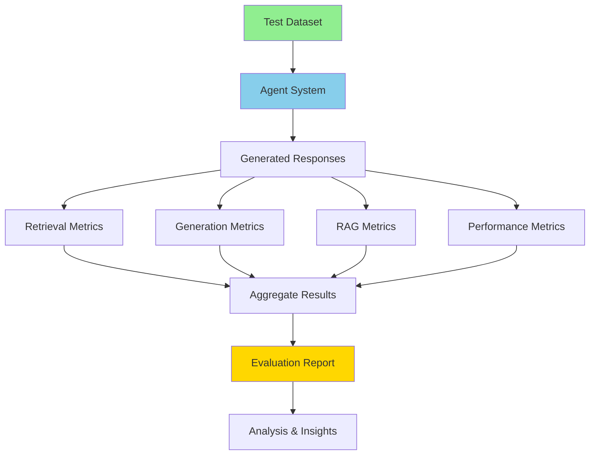
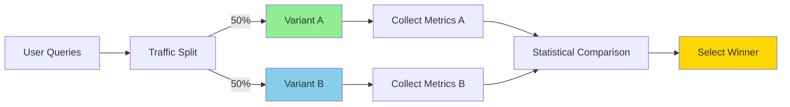
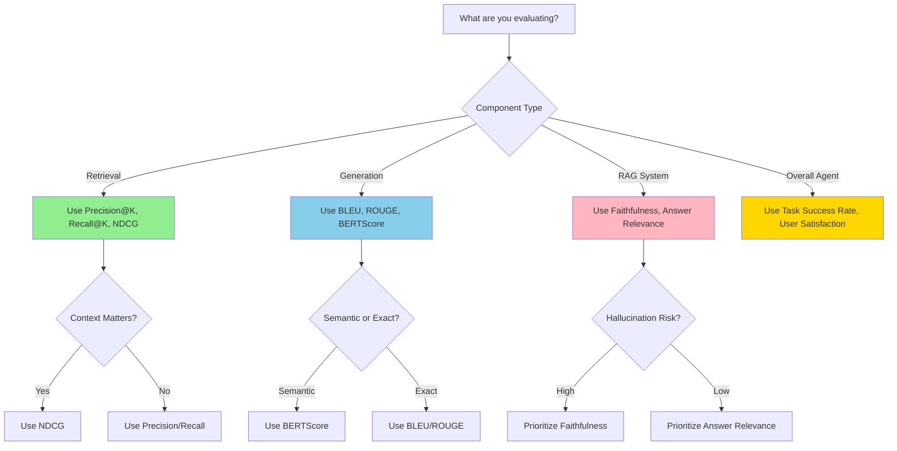

# Module 3: Evaluation and Tuning

**Exam Weight:** 13%  
**Estimated Study Time:** 7-9 hours  
**Prerequisites:** Module 1 (Agent Architecture), Module 2 (Agent Development), Basic statistics

## Learning Objectives

By the end of this module, you will be able to:

1. **Implement evaluation pipelines** for measuring agent performance across multiple dimensions
2. **Compare agent performance** across different tasks, datasets, and configurations
3. **Collect and integrate structured user feedback** into evaluation workflows
4. **Tune model parameters** to optimize accuracy-latency-cost trade-offs
5. **Analyze evaluation results** to identify bottlenecks and optimization opportunities
6. **Design A/B testing frameworks** for comparing agent variants

## Exam Objective Mapping

This module directly addresses the following NCP-AAI exam objectives:

- **3.1** - Implement evaluation pipelines and task benchmarks
- **3.2** - Compare agent performance across tasks and datasets
- **3.3** - Collect and integrate structured user feedback
- **3.4** - Tune model parameters (accuracy vs latency trade-offs)
- **3.5** - Analyze evaluation results for targeted optimization

---

## 1. Introduction to Agent Evaluation

### 1.1 Why Evaluate Agents?

**Agent evaluation** is critical for:
- **Quality Assurance** - Ensure agents meet performance standards
- **Optimization** - Identify areas for improvement
- **Comparison** - Choose between different architectures or models
- **Monitoring** - Detect degradation in production
- **Trust** - Build confidence in agent reliability

### 1.2 Evaluation Dimensions

| Dimension | What It Measures | Example Metrics |
|-----------|------------------|-----------------|
| **Accuracy** | Correctness of responses | Precision, recall, F1, exact match |
| **Relevance** | Appropriateness to query | Semantic similarity, relevance score |
| **Faithfulness** | Grounding in source data | Hallucination rate, citation accuracy |
| **Latency** | Response time | P50, P95, P99 latency |
| **Cost** | Resource consumption | Tokens used, API costs, compute time |
| **Robustness** | Handling edge cases | Error rate, recovery success |
| **Safety** | Avoiding harmful outputs | Toxicity score, guardrail triggers |
| **User Satisfaction** | Human perception | Ratings, thumbs up/down, NPS |

> 📝 **EXAM TIP**
> 
> Understand the trade-offs between dimensions. Improving accuracy often increases latency and cost. Scenario questions test your ability to balance these trade-offs.


---

## 2. Evaluation Metrics for RAG Agents

### 2.1 Retrieval Metrics

**Retrieval quality** determines how well the agent finds relevant information.

**Key Metrics:**

**1. Precision@K**
- Measures: Proportion of retrieved documents that are relevant
- Formula: `Precision@K = (Relevant docs in top K) / K`
- Use when: You want high-quality results, even if incomplete

**2. Recall@K**
- Measures: Proportion of all relevant documents that were retrieved
- Formula: `Recall@K = (Relevant docs in top K) / (Total relevant docs)`
- Use when: Completeness is more important than precision

**3. Mean Reciprocal Rank (MRR)**
- Measures: How quickly the first relevant result appears
- Formula: `MRR = 1 / (Rank of first relevant result)`
- Use when: Users typically look at top results only

**4. Normalized Discounted Cumulative Gain (NDCG)**
- Measures: Quality of ranking with position weighting
- Formula: `NDCG = DCG / IDCG` (where IDCG is ideal DCG)
- Use when: Ranking order matters significantly

```python
from typing import List, Set

def precision_at_k(retrieved: List[str], relevant: Set[str], k: int) -> float:
    """Calculate Precision@K"""
    retrieved_k = retrieved[:k]
    relevant_retrieved = len([doc for doc in retrieved_k if doc in relevant])
    return relevant_retrieved / k if k > 0 else 0.0

def recall_at_k(retrieved: List[str], relevant: Set[str], k: int) -> float:
    """Calculate Recall@K"""
    retrieved_k = retrieved[:k]
    relevant_retrieved = len([doc for doc in retrieved_k if doc in relevant])
    return relevant_retrieved / len(relevant) if len(relevant) > 0 else 0.0

def mean_reciprocal_rank(retrieved: List[str], relevant: Set[str]) -> float:
    """Calculate MRR"""
    for i, doc in enumerate(retrieved, 1):
        if doc in relevant:
            return 1.0 / i
    return 0.0

def f1_score(precision: float, recall: float) -> float:
    """Calculate F1 score from precision and recall"""
    if precision + recall == 0:
        return 0.0
    return 2 * (precision * recall) / (precision + recall)

# Example usage
retrieved_docs = ["doc1", "doc3", "doc5", "doc2", "doc7"]
relevant_docs = {"doc1", "doc2", "doc4", "doc6"}

p_at_3 = precision_at_k(retrieved_docs, relevant_docs, k=3)
r_at_3 = recall_at_k(retrieved_docs, relevant_docs, k=3)
mrr = mean_reciprocal_rank(retrieved_docs, relevant_docs)
f1 = f1_score(p_at_3, r_at_3)

print(f"Precision@3: {p_at_3:.2f}")  # 0.67 (2 out of 3 relevant)
print(f"Recall@3: {r_at_3:.2f}")     # 0.50 (2 out of 4 found)
print(f"MRR: {mrr:.2f}")              # 1.00 (first result relevant)
print(f"F1@3: {f1:.2f}")              # 0.57
```

### 2.2 Generation Metrics

**Generation quality** measures how well the agent produces responses.

**1. BLEU (Bilingual Evaluation Understudy)**
- Measures: N-gram overlap with reference answers
- Range: 0-1 (higher is better)
- Use when: Exact wording matters (translations, code)

**2. ROUGE (Recall-Oriented Understudy for Gisting Evaluation)**
- Measures: Recall of n-grams from reference
- Variants: ROUGE-1 (unigrams), ROUGE-2 (bigrams), ROUGE-L (longest common subsequence)
- Use when: Summarization quality matters

**3. BERTScore**
- Measures: Semantic similarity using embeddings
- Range: 0-1 (higher is better)
- Use when: Meaning matters more than exact words

```python
from nltk.translate.bleu_score import sentence_bleu, SmoothingFunction
from rouge_score import rouge_scorer
from bert_score import score as bert_score

def calculate_bleu(reference: str, candidate: str) -> float:
    """Calculate BLEU score"""
    reference_tokens = [reference.split()]
    candidate_tokens = candidate.split()
    
    smoothing = SmoothingFunction().method1
    return sentence_bleu(reference_tokens, candidate_tokens, smoothing_function=smoothing)

def calculate_rouge(reference: str, candidate: str) -> dict:
    """Calculate ROUGE scores"""
    scorer = rouge_scorer.RougeScorer(['rouge1', 'rouge2', 'rougeL'], use_stemmer=True)
    scores = scorer.score(reference, candidate)
    
    return {
        'rouge1': scores['rouge1'].fmeasure,
        'rouge2': scores['rouge2'].fmeasure,
        'rougeL': scores['rougeL'].fmeasure
    }

def calculate_bertscore(references: List[str], candidates: List[str]) -> dict:
    """Calculate BERTScore"""
    P, R, F1 = bert_score(candidates, references, lang='en', verbose=False)
    
    return {
        'precision': P.mean().item(),
        'recall': R.mean().item(),
        'f1': F1.mean().item()
    }

# Example usage
reference = "The capital of France is Paris, known for the Eiffel Tower."
candidate = "Paris is the capital of France and home to the Eiffel Tower."

bleu = calculate_bleu(reference, candidate)
rouge = calculate_rouge(reference, candidate)
bert = calculate_bertscore([reference], [candidate])

print(f"BLEU: {bleu:.3f}")
print(f"ROUGE-1: {rouge['rouge1']:.3f}")
print(f"ROUGE-L: {rouge['rougeL']:.3f}")
print(f"BERTScore F1: {bert['f1']:.3f}")
```

### 2.3 RAG-Specific Metrics

**Faithfulness (Groundedness)**
- Measures: Whether response is supported by retrieved context
- Critical for: Avoiding hallucinations

**Answer Relevance**
- Measures: Whether response addresses the question
- Critical for: User satisfaction

**Context Relevance**
- Measures: Whether retrieved context is useful
- Critical for: Retrieval optimization

```python
from ragas import evaluate
from ragas.metrics import (
    faithfulness,
    answer_relevancy,
    context_relevancy,
    context_recall,
    context_precision
)
from datasets import Dataset

# Prepare evaluation data
eval_data = {
    "question": [
        "What is the capital of France?",
        "Who wrote Romeo and Juliet?"
    ],
    "answer": [
        "The capital of France is Paris.",
        "William Shakespeare wrote Romeo and Juliet."
    ],
    "contexts": [
        ["Paris is the capital and largest city of France."],
        ["Romeo and Juliet is a tragedy written by William Shakespeare."]
    ],
    "ground_truth": [
        "Paris",
        "William Shakespeare"
    ]
}

dataset = Dataset.from_dict(eval_data)

# Evaluate with RAGAS
result = evaluate(
    dataset,
    metrics=[
        faithfulness,
        answer_relevancy,
        context_relevancy,
        context_recall,
        context_precision
    ]
)

print(result)
# Output:
# {'faithfulness': 0.95, 'answer_relevancy': 0.92, 'context_relevancy': 0.88, ...}
```

**NVIDIA Agent Intelligence Toolkit Integration:**

```python
from nvidia_agent_toolkit.evaluation import RAGEvaluator
from langchain_nvidia_ai_endpoints import ChatNVIDIA

# Initialize evaluator with NVIDIA models
evaluator = RAGEvaluator(
    llm=ChatNVIDIA(model="meta/llama-3.1-70b-instruct"),
    embedding_model="nvidia/nv-embed-v1"
)

# Evaluate RAG pipeline
results = evaluator.evaluate_pipeline(
    questions=["What is RAG?", "How does vector search work?"],
    contexts=[
        ["RAG combines retrieval with generation..."],
        ["Vector search uses embeddings to find similar documents..."]
    ],
    answers=[
        "RAG is Retrieval-Augmented Generation...",
        "Vector search works by comparing embeddings..."
    ],
    ground_truths=["RAG combines retrieval and generation", "Vector search uses embeddings"]
)

print(f"Faithfulness: {results['faithfulness']:.2f}")
print(f"Answer Relevance: {results['answer_relevance']:.2f}")
print(f"Context Precision: {results['context_precision']:.2f}")
```

> 📝 **EXAM TIP**
> 
> Know the difference between retrieval metrics (Precision@K, Recall@K) and generation metrics (BLEU, ROUGE, BERTScore). RAG systems need both. Faithfulness is critical for production RAG systems.


---

## 3. Building Evaluation Pipelines

### 3.1 Evaluation Pipeline Architecture



### 3.2 Implementing an Evaluation Pipeline

```python
from typing import List, Dict, Any
from dataclasses import dataclass
import time
import json
from datetime import datetime

@dataclass
class EvaluationResult:
    """Single evaluation result"""
    question: str
    answer: str
    contexts: List[str]
    ground_truth: str
    metrics: Dict[str, float]
    latency_ms: float
    tokens_used: int
    timestamp: str

class AgentEvaluationPipeline:
    """Comprehensive evaluation pipeline for RAG agents"""
    
    def __init__(self, agent, metrics_config: Dict[str, bool]):
        self.agent = agent
        self.metrics_config = metrics_config
        self.results = []
    
    def evaluate_single(
        self,
        question: str,
        ground_truth: str,
        contexts: List[str] = None
    ) -> EvaluationResult:
        """Evaluate agent on a single question"""
        
        # Measure latency
        start_time = time.time()
        
        # Get agent response
        response = self.agent.invoke({"input": question})
        answer = response["output"]
        
        latency_ms = (time.time() - start_time) * 1000
        
        # Extract contexts if not provided
        if contexts is None and "intermediate_steps" in response:
            contexts = self._extract_contexts(response["intermediate_steps"])
        
        # Calculate metrics
        metrics = {}
        
        if self.metrics_config.get("retrieval", True):
            metrics.update(self._calculate_retrieval_metrics(contexts, ground_truth))
        
        if self.metrics_config.get("generation", True):
            metrics.update(self._calculate_generation_metrics(answer, ground_truth))
        
        if self.metrics_config.get("rag", True):
            metrics.update(self._calculate_rag_metrics(question, answer, contexts, ground_truth))
        
        # Count tokens (approximate)
        tokens_used = len(answer.split()) + len(question.split())
        
        return EvaluationResult(
            question=question,
            answer=answer,
            contexts=contexts or [],
            ground_truth=ground_truth,
            metrics=metrics,
            latency_ms=latency_ms,
            tokens_used=tokens_used,
            timestamp=datetime.now().isoformat()
        )
    
    def evaluate_dataset(
        self,
        questions: List[str],
        ground_truths: List[str],
        contexts_list: List[List[str]] = None
    ) -> Dict[str, Any]:
        """Evaluate agent on entire dataset"""
        
        if contexts_list is None:
            contexts_list = [None] * len(questions)
        
        self.results = []
        
        for i, (question, ground_truth, contexts) in enumerate(
            zip(questions, ground_truths, contexts_list)
        ):
            print(f"Evaluating {i+1}/{len(questions)}: {question[:50]}...")
            
            try:
                result = self.evaluate_single(question, ground_truth, contexts)
                self.results.append(result)
            except Exception as e:
                print(f"Error evaluating question {i+1}: {str(e)}")
                continue
        
        # Aggregate results
        return self._aggregate_results()
    
    def _calculate_retrieval_metrics(self, contexts: List[str], ground_truth: str) -> Dict[str, float]:
        """Calculate retrieval metrics"""
        if not contexts:
            return {"context_recall": 0.0}
        
        # Simple context recall: does any context contain ground truth?
        recall = any(ground_truth.lower() in ctx.lower() for ctx in contexts)
        
        return {
            "context_recall": 1.0 if recall else 0.0,
            "num_contexts": len(contexts)
        }
    
    def _calculate_generation_metrics(self, answer: str, ground_truth: str) -> Dict[str, float]:
        """Calculate generation metrics"""
        # Exact match
        exact_match = answer.strip().lower() == ground_truth.strip().lower()
        
        # Contains ground truth
        contains = ground_truth.lower() in answer.lower()
        
        # BLEU score
        bleu = calculate_bleu(ground_truth, answer)
        
        return {
            "exact_match": 1.0 if exact_match else 0.0,
            "contains_answer": 1.0 if contains else 0.0,
            "bleu": bleu
        }
    
    def _calculate_rag_metrics(
        self,
        question: str,
        answer: str,
        contexts: List[str],
        ground_truth: str
    ) -> Dict[str, float]:
        """Calculate RAG-specific metrics"""
        # Faithfulness: is answer supported by contexts?
        faithfulness = self._check_faithfulness(answer, contexts)
        
        # Answer relevance: does answer address question?
        relevance = self._check_relevance(question, answer)
        
        return {
            "faithfulness": faithfulness,
            "answer_relevance": relevance
        }
    
    def _check_faithfulness(self, answer: str, contexts: List[str]) -> float:
        """Check if answer is grounded in contexts"""
        if not contexts:
            return 0.0
        
        # Simple heuristic: check if answer phrases appear in contexts
        answer_phrases = answer.split('. ')
        supported = sum(
            any(phrase.lower() in ctx.lower() for ctx in contexts)
            for phrase in answer_phrases
        )
        
        return supported / len(answer_phrases) if answer_phrases else 0.0
    
    def _check_relevance(self, question: str, answer: str) -> float:
        """Check if answer is relevant to question"""
        # Simple heuristic: check for keyword overlap
        question_words = set(question.lower().split())
        answer_words = set(answer.lower().split())
        
        overlap = len(question_words & answer_words)
        return min(overlap / len(question_words), 1.0) if question_words else 0.0
    
    def _extract_contexts(self, intermediate_steps: List) -> List[str]:
        """Extract contexts from agent intermediate steps"""
        contexts = []
        for step in intermediate_steps:
            if isinstance(step, tuple) and len(step) > 1:
                observation = step[1]
                if isinstance(observation, str):
                    contexts.append(observation)
        return contexts
    
    def _aggregate_results(self) -> Dict[str, Any]:
        """Aggregate evaluation results"""
        if not self.results:
            return {"error": "No results to aggregate"}
        
        # Aggregate metrics
        all_metrics = {}
        for result in self.results:
            for metric, value in result.metrics.items():
                if metric not in all_metrics:
                    all_metrics[metric] = []
                all_metrics[metric].append(value)
        
        aggregated = {
            metric: {
                "mean": sum(values) / len(values),
                "min": min(values),
                "max": max(values)
            }
            for metric, values in all_metrics.items()
        }
        
        # Aggregate performance
        latencies = [r.latency_ms for r in self.results]
        tokens = [r.tokens_used for r in self.results]
        
        aggregated["performance"] = {
            "latency_ms": {
                "mean": sum(latencies) / len(latencies),
                "p50": sorted(latencies)[len(latencies) // 2],
                "p95": sorted(latencies)[int(len(latencies) * 0.95)],
                "p99": sorted(latencies)[int(len(latencies) * 0.99)]
            },
            "tokens_per_response": {
                "mean": sum(tokens) / len(tokens),
                "total": sum(tokens)
            }
        }
        
        aggregated["summary"] = {
            "total_questions": len(self.results),
            "timestamp": datetime.now().isoformat()
        }
        
        return aggregated
    
    def save_results(self, filepath: str):
        """Save evaluation results to file"""
        output = {
            "results": [
                {
                    "question": r.question,
                    "answer": r.answer,
                    "ground_truth": r.ground_truth,
                    "metrics": r.metrics,
                    "latency_ms": r.latency_ms,
                    "tokens_used": r.tokens_used
                }
                for r in self.results
            ],
            "aggregated": self._aggregate_results()
        }
        
        with open(filepath, 'w') as f:
            json.dump(output, f, indent=2)
        
        print(f"Results saved to {filepath}")

# Usage example
from langchain.agents import create_react_agent, AgentExecutor
from langchain_nvidia_ai_endpoints import ChatNVIDIA

# Create agent
llm = ChatNVIDIA(model="meta/llama-3.1-70b-instruct")
agent = create_react_agent(llm, tools, react_prompt)
agent_executor = AgentExecutor(agent=agent, tools=tools)

# Create evaluation pipeline
pipeline = AgentEvaluationPipeline(
    agent=agent_executor,
    metrics_config={
        "retrieval": True,
        "generation": True,
        "rag": True
    }
)

# Evaluate
test_questions = [
    "What is the capital of France?",
    "Who wrote Romeo and Juliet?",
    "What is the speed of light?"
]

test_answers = [
    "Paris",
    "William Shakespeare",
    "299,792,458 meters per second"
]

results = pipeline.evaluate_dataset(test_questions, test_answers)

# Print summary
print("\n=== Evaluation Summary ===")
print(f"Total Questions: {results['summary']['total_questions']}")
print(f"\nMetrics:")
for metric, stats in results.items():
    if metric not in ["performance", "summary"]:
        print(f"  {metric}: {stats['mean']:.3f} (min: {stats['min']:.3f}, max: {stats['max']:.3f})")

print(f"\nPerformance:")
print(f"  Mean Latency: {results['performance']['latency_ms']['mean']:.1f}ms")
print(f"  P95 Latency: {results['performance']['latency_ms']['p95']:.1f}ms")
print(f"  Tokens/Response: {results['performance']['tokens_per_response']['mean']:.1f}")

# Save results
pipeline.save_results("evaluation_results.json")
```

> 📝 **EXAM TIP**
> 
> Evaluation pipelines should measure multiple dimensions: accuracy, latency, cost, and safety. Understand how to aggregate metrics across test sets and identify performance bottlenecks.


---

## 4. A/B Testing and Comparison

### 4.1 A/B Testing Framework

**A/B testing** compares two agent variants to determine which performs better.

**Common Comparisons:**
- Different models (Llama 3.1 70B vs 8B)
- Different prompts (verbose vs concise)
- Different architectures (ReAct vs simple chain)
- Different retrieval strategies (semantic vs hybrid)



### 4.2 Implementing A/B Testing

```python
import random
from typing import Dict, List, Any
from dataclasses import dataclass
from scipy import stats
import numpy as np

@dataclass
class ABTestResult:
    """Results from A/B test"""
    variant_a_metrics: Dict[str, List[float]]
    variant_b_metrics: Dict[str, List[float]]
    statistical_significance: Dict[str, Dict[str, Any]]
    winner: str
    confidence: float

class ABTestFramework:
    """Framework for A/B testing agent variants"""
    
    def __init__(self, variant_a, variant_b, split_ratio: float = 0.5):
        self.variant_a = variant_a
        self.variant_b = variant_b
        self.split_ratio = split_ratio
        
        self.variant_a_results = []
        self.variant_b_results = []
    
    def run_test(
        self,
        questions: List[str],
        ground_truths: List[str],
        min_samples: int = 30
    ) -> ABTestResult:
        """Run A/B test on both variants"""
        
        if len(questions) < min_samples:
            raise ValueError(f"Need at least {min_samples} samples for statistical significance")
        
        # Randomly assign questions to variants
        for question, ground_truth in zip(questions, ground_truths):
            if random.random() < self.split_ratio:
                # Variant A
                result = self._evaluate_variant(self.variant_a, question, ground_truth)
                self.variant_a_results.append(result)
            else:
                # Variant B
                result = self._evaluate_variant(self.variant_b, question, ground_truth)
                self.variant_b_results.append(result)
        
        # Analyze results
        return self._analyze_results()
    
    def _evaluate_variant(self, variant, question: str, ground_truth: str) -> Dict[str, float]:
        """Evaluate single variant on one question"""
        import time
        
        start_time = time.time()
        response = variant.invoke({"input": question})
        latency = (time.time() - start_time) * 1000
        
        answer = response["output"]
        
        # Calculate metrics
        exact_match = answer.strip().lower() == ground_truth.strip().lower()
        contains = ground_truth.lower() in answer.lower()
        tokens = len(answer.split())
        
        return {
            "exact_match": 1.0 if exact_match else 0.0,
            "contains_answer": 1.0 if contains else 0.0,
            "latency_ms": latency,
            "tokens": tokens
        }
    
    def _analyze_results(self) -> ABTestResult:
        """Analyze A/B test results with statistical tests"""
        
        # Aggregate metrics
        variant_a_metrics = self._aggregate_metrics(self.variant_a_results)
        variant_b_metrics = self._aggregate_metrics(self.variant_b_results)
        
        # Statistical significance tests
        significance = {}
        
        for metric in variant_a_metrics.keys():
            a_values = variant_a_metrics[metric]
            b_values = variant_b_metrics[metric]
            
            # T-test for continuous metrics
            if metric in ["latency_ms", "tokens"]:
                t_stat, p_value = stats.ttest_ind(a_values, b_values)
                
                significance[metric] = {
                    "p_value": p_value,
                    "significant": p_value < 0.05,
                    "a_mean": np.mean(a_values),
                    "b_mean": np.mean(b_values),
                    "difference": np.mean(b_values) - np.mean(a_values),
                    "percent_change": ((np.mean(b_values) - np.mean(a_values)) / np.mean(a_values) * 100) if np.mean(a_values) > 0 else 0
                }
            
            # Proportion test for binary metrics
            else:
                a_success = sum(a_values)
                b_success = sum(b_values)
                a_total = len(a_values)
                b_total = len(b_values)
                
                # Z-test for proportions
                p_a = a_success / a_total
                p_b = b_success / b_total
                p_pooled = (a_success + b_success) / (a_total + b_total)
                
                se = np.sqrt(p_pooled * (1 - p_pooled) * (1/a_total + 1/b_total))
                z_stat = (p_b - p_a) / se if se > 0 else 0
                p_value = 2 * (1 - stats.norm.cdf(abs(z_stat)))
                
                significance[metric] = {
                    "p_value": p_value,
                    "significant": p_value < 0.05,
                    "a_rate": p_a,
                    "b_rate": p_b,
                    "difference": p_b - p_a,
                    "percent_change": ((p_b - p_a) / p_a * 100) if p_a > 0 else 0
                }
        
        # Determine winner
        winner, confidence = self._determine_winner(significance)
        
        return ABTestResult(
            variant_a_metrics=variant_a_metrics,
            variant_b_metrics=variant_b_metrics,
            statistical_significance=significance,
            winner=winner,
            confidence=confidence
        )
    
    def _aggregate_metrics(self, results: List[Dict[str, float]]) -> Dict[str, List[float]]:
        """Aggregate metrics from results"""
        aggregated = {}
        
        for result in results:
            for metric, value in result.items():
                if metric not in aggregated:
                    aggregated[metric] = []
                aggregated[metric].append(value)
        
        return aggregated
    
    def _determine_winner(self, significance: Dict[str, Dict]) -> tuple:
        """Determine overall winner based on multiple metrics"""
        
        # Count significant improvements
        a_wins = 0
        b_wins = 0
        
        for metric, stats in significance.items():
            if stats["significant"]:
                if metric in ["latency_ms"]:  # Lower is better
                    if stats["difference"] < 0:
                        b_wins += 1
                    else:
                        a_wins += 1
                else:  # Higher is better
                    if stats["difference"] > 0:
                        b_wins += 1
                    else:
                        a_wins += 1
        
        if b_wins > a_wins:
            return "Variant B", b_wins / (a_wins + b_wins) if (a_wins + b_wins) > 0 else 0.5
        elif a_wins > b_wins:
            return "Variant A", a_wins / (a_wins + b_wins) if (a_wins + b_wins) > 0 else 0.5
        else:
            return "No clear winner", 0.5

# Usage example
from langchain_nvidia_ai_endpoints import ChatNVIDIA
from langchain.agents import create_react_agent, AgentExecutor

# Create two variants
llm_70b = ChatNVIDIA(model="meta/llama-3.1-70b-instruct")
llm_8b = ChatNVIDIA(model="meta/llama-3.1-8b-instruct")

agent_a = AgentExecutor(agent=create_react_agent(llm_70b, tools, react_prompt), tools=tools)
agent_b = AgentExecutor(agent=create_react_agent(llm_8b, tools, react_prompt), tools=tools)

# Run A/B test
ab_test = ABTestFramework(agent_a, agent_b, split_ratio=0.5)

test_questions = [
    "What is the capital of France?",
    "Who wrote Hamlet?",
    # ... 50+ questions for statistical significance
]

test_answers = [
    "Paris",
    "William Shakespeare",
    # ... corresponding answers
]

results = ab_test.run_test(test_questions, test_answers, min_samples=30)

# Print results
print(f"\n=== A/B Test Results ===")
print(f"Winner: {results.winner} (confidence: {results.confidence:.2%})")
print(f"\nStatistical Significance:")

for metric, stats in results.statistical_significance.items():
    print(f"\n{metric}:")
    print(f"  Variant A: {stats.get('a_mean', stats.get('a_rate', 0)):.3f}")
    print(f"  Variant B: {stats.get('b_mean', stats.get('b_rate', 0)):.3f}")
    print(f"  Difference: {stats['difference']:.3f} ({stats['percent_change']:.1f}%)")
    print(f"  Significant: {stats['significant']} (p={stats['p_value']:.4f})")
```

> 📝 **EXAM TIP**
> 
> A/B testing requires statistical significance (p < 0.05) and sufficient sample size (typically 30+). Understand when improvements are meaningful vs. noise. Consider multiple metrics, not just accuracy.


---

## 5. Parameter Tuning and Optimization

### 5.1 Key Parameters to Tune

**LLM Parameters:**

| Parameter | Range | Effect | When to Increase | When to Decrease |
|-----------|-------|--------|------------------|------------------|
| **Temperature** | 0.0-2.0 | Randomness | Creative tasks, brainstorming | Factual tasks, consistency |
| **Top-P** | 0.0-1.0 | Nucleus sampling | Diverse outputs | Focused outputs |
| **Max Tokens** | 1-4096+ | Response length | Long-form content | Cost optimization |
| **Frequency Penalty** | -2.0-2.0 | Repetition | Avoid repetition | Allow repetition |
| **Presence Penalty** | -2.0-2.0 | Topic diversity | Explore topics | Stay on topic |

**Retrieval Parameters:**

| Parameter | Range | Effect | Trade-off |
|-----------|-------|--------|-----------|
| **Top-K** | 1-20 | Number of retrieved docs | More context vs. noise |
| **Similarity Threshold** | 0.0-1.0 | Minimum relevance | Precision vs. recall |
| **Chunk Size** | 100-2000 | Document granularity | Detail vs. context |
| **Chunk Overlap** | 0-500 | Context continuity | Redundancy vs. gaps |

### 5.2 Systematic Parameter Tuning

```python
from typing import Dict, List, Any
from itertools import product
import pandas as pd

class ParameterTuner:
    """Systematic parameter tuning for agents"""
    
    def __init__(self, agent_factory, evaluation_pipeline):
        self.agent_factory = agent_factory
        self.evaluation_pipeline = evaluation_pipeline
        self.results = []
    
    def grid_search(
        self,
        param_grid: Dict[str, List[Any]],
        test_questions: List[str],
        test_answers: List[str]
    ) -> pd.DataFrame:
        """Perform grid search over parameter space"""
        
        # Generate all parameter combinations
        param_names = list(param_grid.keys())
        param_values = list(param_grid.values())
        
        total_combinations = len(list(product(*param_values)))
        print(f"Testing {total_combinations} parameter combinations...")
        
        for i, params in enumerate(product(*param_values), 1):
            param_dict = dict(zip(param_names, params))
            
            print(f"\n[{i}/{total_combinations}] Testing: {param_dict}")
            
            # Create agent with these parameters
            agent = self.agent_factory(**param_dict)
            
            # Evaluate
            self.evaluation_pipeline.agent = agent
            results = self.evaluation_pipeline.evaluate_dataset(
                test_questions,
                test_answers
            )
            
            # Store results
            result_row = param_dict.copy()
            
            # Add metrics
            for metric, stats in results.items():
                if metric not in ["performance", "summary"]:
                    result_row[f"{metric}_mean"] = stats["mean"]
            
            # Add performance metrics
            if "performance" in results:
                result_row["latency_mean"] = results["performance"]["latency_ms"]["mean"]
                result_row["latency_p95"] = results["performance"]["latency_ms"]["p95"]
                result_row["tokens_mean"] = results["performance"]["tokens_per_response"]["mean"]
            
            self.results.append(result_row)
        
        # Convert to DataFrame for analysis
        df = pd.DataFrame(self.results)
        return df
    
    def find_optimal_params(
        self,
        df: pd.DataFrame,
        optimize_for: str = "exact_match_mean",
        constraints: Dict[str, float] = None
    ) -> Dict[str, Any]:
        """Find optimal parameters given constraints"""
        
        # Apply constraints
        filtered_df = df.copy()
        
        if constraints:
            for metric, max_value in constraints.items():
                if metric in filtered_df.columns:
                    filtered_df = filtered_df[filtered_df[metric] <= max_value]
        
        if len(filtered_df) == 0:
            print("Warning: No configurations meet constraints")
            filtered_df = df
        
        # Find best configuration
        best_idx = filtered_df[optimize_for].idxmax()
        best_params = filtered_df.loc[best_idx].to_dict()
        
        return best_params

# Usage example
def create_agent_with_params(temperature: float, top_k: int, max_tokens: int):
    """Factory function to create agent with specific parameters"""
    llm = ChatNVIDIA(
        model="meta/llama-3.1-70b-instruct",
        temperature=temperature,
        max_tokens=max_tokens
    )
    
    # Configure retrieval with top_k
    retriever = vectorstore.as_retriever(search_kwargs={"k": top_k})
    
    # Create agent
    agent = create_react_agent(llm, tools, react_prompt)
    return AgentExecutor(agent=agent, tools=tools)

# Define parameter grid
param_grid = {
    "temperature": [0.0, 0.3, 0.7, 1.0],
    "top_k": [3, 5, 10],
    "max_tokens": [256, 512, 1024]
}

# Create tuner
tuner = ParameterTuner(
    agent_factory=create_agent_with_params,
    evaluation_pipeline=evaluation_pipeline
)

# Run grid search
results_df = tuner.grid_search(
    param_grid,
    test_questions,
    test_answers
)

# Find optimal parameters with constraints
optimal_params = tuner.find_optimal_params(
    results_df,
    optimize_for="exact_match_mean",
    constraints={
        "latency_p95": 2000,  # Max 2 seconds
        "tokens_mean": 500     # Max 500 tokens
    }
)

print("\n=== Optimal Parameters ===")
for param, value in optimal_params.items():
    print(f"{param}: {value}")

# Save results
results_df.to_csv("parameter_tuning_results.csv", index=False)
```

### 5.3 Trade-off Analysis

**Accuracy vs. Latency:**

```python
import matplotlib.pyplot as plt

def plot_accuracy_latency_tradeoff(results_df):
    """Visualize accuracy-latency trade-off"""
    
    plt.figure(figsize=(10, 6))
    
    # Plot each configuration
    plt.scatter(
        results_df["latency_mean"],
        results_df["exact_match_mean"],
        s=100,
        alpha=0.6,
        c=results_df["temperature"],
        cmap="viridis"
    )
    
    plt.xlabel("Mean Latency (ms)")
    plt.ylabel("Exact Match Accuracy")
    plt.title("Accuracy vs. Latency Trade-off")
    plt.colorbar(label="Temperature")
    plt.grid(True, alpha=0.3)
    
    # Annotate Pareto frontier
    pareto_points = find_pareto_frontier(
        results_df["latency_mean"].values,
        results_df["exact_match_mean"].values
    )
    
    plt.plot(pareto_points[:, 0], pareto_points[:, 1], 'r--', label="Pareto Frontier")
    plt.legend()
    
    plt.savefig("accuracy_latency_tradeoff.png")
    plt.close()

def find_pareto_frontier(latencies, accuracies):
    """Find Pareto-optimal points"""
    points = np.column_stack([latencies, accuracies])
    
    # Sort by latency
    points = points[points[:, 0].argsort()]
    
    pareto = [points[0]]
    for point in points[1:]:
        if point[1] > pareto[-1][1]:  # Better accuracy
            pareto.append(point)
    
    return np.array(pareto)

# Generate plot
plot_accuracy_latency_tradeoff(results_df)
```

**Cost vs. Performance:**

```python
def calculate_cost_performance(results_df, cost_per_1k_tokens: float = 0.01):
    """Calculate cost-performance metrics"""
    
    results_df["cost_per_query"] = (
        results_df["tokens_mean"] / 1000 * cost_per_1k_tokens
    )
    
    results_df["cost_per_correct_answer"] = (
        results_df["cost_per_query"] / results_df["exact_match_mean"]
    )
    
    # Find most cost-effective configuration
    best_idx = results_df["cost_per_correct_answer"].idxmin()
    best_config = results_df.loc[best_idx]
    
    print("\n=== Most Cost-Effective Configuration ===")
    print(f"Temperature: {best_config['temperature']}")
    print(f"Top-K: {best_config['top_k']}")
    print(f"Max Tokens: {best_config['max_tokens']}")
    print(f"Accuracy: {best_config['exact_match_mean']:.2%}")
    print(f"Cost per Query: ${best_config['cost_per_query']:.4f}")
    print(f"Cost per Correct Answer: ${best_config['cost_per_correct_answer']:.4f}")
    
    return results_df

results_df = calculate_cost_performance(results_df)
```

> 📝 **EXAM TIP**
> 
> Parameter tuning is about finding the right balance. Understand the Pareto frontier concept: configurations where you can't improve one metric without degrading another. Exam scenarios often test your ability to choose parameters given constraints (e.g., "latency must be under 2s").


---

## 6. User Feedback Integration

### 6.1 Collecting Structured Feedback

**Feedback Types:**

| Type | Format | Use Case | Example |
|------|--------|----------|---------|
| **Binary** | 👍/👎 | Quick satisfaction | Thumbs up/down |
| **Rating** | 1-5 stars | Detailed satisfaction | Star rating |
| **Categorical** | Multiple choice | Issue classification | "Incorrect", "Incomplete", "Irrelevant" |
| **Free-text** | Open-ended | Detailed feedback | Comment box |

```python
from dataclasses import dataclass
from datetime import datetime
from typing import Optional, List
from enum import Enum

class FeedbackType(Enum):
    THUMBS_UP = "thumbs_up"
    THUMBS_DOWN = "thumbs_down"
    RATING = "rating"
    ISSUE = "issue"
    COMMENT = "comment"

class IssueCategory(Enum):
    INCORRECT = "incorrect"
    INCOMPLETE = "incomplete"
    IRRELEVANT = "irrelevant"
    UNSAFE = "unsafe"
    SLOW = "slow"
    OTHER = "other"

@dataclass
class UserFeedback:
    """Structured user feedback"""
    session_id: str
    question: str
    answer: str
    feedback_type: FeedbackType
    rating: Optional[int] = None  # 1-5
    issue_category: Optional[IssueCategory] = None
    comment: Optional[str] = None
    timestamp: str = None
    
    def __post_init__(self):
        if self.timestamp is None:
            self.timestamp = datetime.now().isoformat()

class FeedbackCollector:
    """Collect and analyze user feedback"""
    
    def __init__(self):
        self.feedback_data = []
    
    def collect_feedback(
        self,
        session_id: str,
        question: str,
        answer: str,
        feedback_type: FeedbackType,
        rating: Optional[int] = None,
        issue_category: Optional[IssueCategory] = None,
        comment: Optional[str] = None
    ) -> UserFeedback:
        """Collect single feedback instance"""
        
        feedback = UserFeedback(
            session_id=session_id,
            question=question,
            answer=answer,
            feedback_type=feedback_type,
            rating=rating,
            issue_category=issue_category,
            comment=comment
        )
        
        self.feedback_data.append(feedback)
        return feedback
    
    def analyze_feedback(self) -> Dict[str, Any]:
        """Analyze collected feedback"""
        
        if not self.feedback_data:
            return {"error": "No feedback data"}
        
        # Calculate satisfaction metrics
        thumbs_up = sum(1 for f in self.feedback_data if f.feedback_type == FeedbackType.THUMBS_UP)
        thumbs_down = sum(1 for f in self.feedback_data if f.feedback_type == FeedbackType.THUMBS_DOWN)
        total_binary = thumbs_up + thumbs_down
        
        satisfaction_rate = thumbs_up / total_binary if total_binary > 0 else 0
        
        # Calculate average rating
        ratings = [f.rating for f in self.feedback_data if f.rating is not None]
        avg_rating = sum(ratings) / len(ratings) if ratings else 0
        
        # Analyze issues
        issues = [f.issue_category for f in self.feedback_data if f.issue_category is not None]
        issue_counts = {}
        for issue in issues:
            issue_counts[issue.value] = issue_counts.get(issue.value, 0) + 1
        
        # Most common issues
        sorted_issues = sorted(issue_counts.items(), key=lambda x: x[1], reverse=True)
        
        return {
            "total_feedback": len(self.feedback_data),
            "satisfaction_rate": satisfaction_rate,
            "thumbs_up": thumbs_up,
            "thumbs_down": thumbs_down,
            "average_rating": avg_rating,
            "issue_breakdown": issue_counts,
            "top_issues": sorted_issues[:3] if sorted_issues else []
        }
    
    def get_negative_feedback_examples(self, limit: int = 10) -> List[UserFeedback]:
        """Get examples of negative feedback for analysis"""
        
        negative = [
            f for f in self.feedback_data
            if f.feedback_type == FeedbackType.THUMBS_DOWN or
               (f.rating is not None and f.rating <= 2)
        ]
        
        return negative[:limit]

# Usage example
collector = FeedbackCollector()

# Simulate collecting feedback
collector.collect_feedback(
    session_id="sess_001",
    question="What is the capital of France?",
    answer="The capital of France is Paris.",
    feedback_type=FeedbackType.THUMBS_UP,
    rating=5
)

collector.collect_feedback(
    session_id="sess_002",
    question="Who wrote Hamlet?",
    answer="I don't have information about that.",
    feedback_type=FeedbackType.THUMBS_DOWN,
    rating=1,
    issue_category=IssueCategory.INCORRECT,
    comment="The answer is obviously William Shakespeare"
)

# Analyze
analysis = collector.analyze_feedback()
print("\n=== Feedback Analysis ===")
print(f"Total Feedback: {analysis['total_feedback']}")
print(f"Satisfaction Rate: {analysis['satisfaction_rate']:.1%}")
print(f"Average Rating: {analysis['average_rating']:.1f}/5")
print(f"\nTop Issues:")
for issue, count in analysis['top_issues']:
    print(f"  {issue}: {count}")

# Get negative examples for improvement
negative_examples = collector.get_negative_feedback_examples()
print(f"\n=== Negative Feedback Examples ===")
for feedback in negative_examples:
    print(f"\nQuestion: {feedback.question}")
    print(f"Answer: {feedback.answer}")
    print(f"Issue: {feedback.issue_category.value if feedback.issue_category else 'N/A'}")
    print(f"Comment: {feedback.comment or 'N/A'}")
```

### 6.2 Integrating Feedback into Evaluation

```python
class FeedbackAugmentedEvaluator:
    """Evaluator that incorporates user feedback"""
    
    def __init__(self, agent, feedback_collector):
        self.agent = agent
        self.feedback_collector = feedback_collector
    
    def evaluate_with_feedback(
        self,
        questions: List[str],
        ground_truths: List[str]
    ) -> Dict[str, Any]:
        """Evaluate agent and collect user feedback"""
        
        results = []
        
        for question, ground_truth in zip(questions, ground_truths):
            # Get agent response
            response = self.agent.invoke({"input": question})
            answer = response["output"]
            
            # Simulate user feedback (in production, this comes from real users)
            feedback = self._simulate_user_feedback(answer, ground_truth)
            
            # Collect feedback
            self.feedback_collector.collect_feedback(
                session_id=f"eval_{len(results)}",
                question=question,
                answer=answer,
                feedback_type=feedback["type"],
                rating=feedback.get("rating"),
                issue_category=feedback.get("issue")
            )
            
            results.append({
                "question": question,
                "answer": answer,
                "ground_truth": ground_truth,
                "feedback": feedback
            })
        
        # Combine automated metrics with user feedback
        feedback_analysis = self.feedback_collector.analyze_feedback()
        
        return {
            "automated_metrics": self._calculate_automated_metrics(results),
            "user_feedback": feedback_analysis,
            "combined_score": self._calculate_combined_score(results, feedback_analysis)
        }
    
    def _simulate_user_feedback(self, answer: str, ground_truth: str) -> Dict[str, Any]:
        """Simulate user feedback (for testing)"""
        # In production, this would be actual user input
        
        if ground_truth.lower() in answer.lower():
            return {
                "type": FeedbackType.THUMBS_UP,
                "rating": 5
            }
        else:
            return {
                "type": FeedbackType.THUMBS_DOWN,
                "rating": 2,
                "issue": IssueCategory.INCORRECT
            }
    
    def _calculate_automated_metrics(self, results: List[Dict]) -> Dict[str, float]:
        """Calculate automated metrics"""
        exact_matches = sum(
            1 for r in results
            if r["answer"].strip().lower() == r["ground_truth"].strip().lower()
        )
        
        return {
            "exact_match": exact_matches / len(results) if results else 0
        }
    
    def _calculate_combined_score(
        self,
        results: List[Dict],
        feedback_analysis: Dict[str, Any]
    ) -> float:
        """Combine automated metrics with user feedback"""
        
        # Weight automated metrics and user feedback
        automated_weight = 0.4
        feedback_weight = 0.6
        
        automated_score = self._calculate_automated_metrics(results)["exact_match"]
        feedback_score = feedback_analysis["satisfaction_rate"]
        
        combined = (automated_weight * automated_score + 
                   feedback_weight * feedback_score)
        
        return combined
```

> 📝 **EXAM TIP**
> 
> User feedback is critical for production agents. Understand how to collect structured feedback (binary, ratings, categories) and integrate it with automated metrics. Real-world agent quality combines automated evaluation with human judgment.


---

## 7. NVIDIA Agent Intelligence Toolkit

### 7.1 Overview

The **NVIDIA Agent Intelligence Toolkit** provides comprehensive tools for evaluating, monitoring, and optimizing agentic AI systems.

**Key Features:**
- Pre-built evaluation metrics for RAG and agents
- Automated benchmarking pipelines
- Performance profiling and optimization
- Integration with NVIDIA NIM for accelerated inference
- Real-time monitoring dashboards

### 7.2 Using NVIDIA Agent Intelligence Toolkit

```python
from nvidia_agent_toolkit import (
    AgentEvaluator,
    BenchmarkSuite,
    PerformanceProfiler,
    OptimizationRecommender
)
from langchain_nvidia_ai_endpoints import ChatNVIDIA

# Initialize NVIDIA LLM
llm = ChatNVIDIA(
    model="meta/llama-3.1-70b-instruct",
    nvidia_api_key="your-api-key"
)

# Create agent
agent = create_react_agent(llm, tools, react_prompt)
agent_executor = AgentExecutor(agent=agent, tools=tools)

# 1. Comprehensive Evaluation
evaluator = AgentEvaluator(
    agent=agent_executor,
    llm=llm,  # For LLM-as-judge metrics
    embedding_model="nvidia/nv-embed-v1"
)

eval_results = evaluator.evaluate(
    questions=test_questions,
    ground_truths=test_answers,
    contexts=test_contexts,
    metrics=[
        "faithfulness",
        "answer_relevancy",
        "context_precision",
        "context_recall",
        "latency",
        "cost"
    ]
)

print("\n=== NVIDIA Agent Intelligence Toolkit Evaluation ===")
print(f"Faithfulness: {eval_results['faithfulness']:.3f}")
print(f"Answer Relevancy: {eval_results['answer_relevancy']:.3f}")
print(f"Context Precision: {eval_results['context_precision']:.3f}")
print(f"Mean Latency: {eval_results['latency_mean']:.1f}ms")
print(f"Total Cost: ${eval_results['total_cost']:.4f}")

# 2. Benchmark Against Standard Tasks
benchmark = BenchmarkSuite()

# Run standard benchmarks
benchmark_results = benchmark.run(
    agent=agent_executor,
    tasks=["qa", "summarization", "reasoning"],
    datasets=["squad", "cnn_dailymail", "gsm8k"]
)

print("\n=== Benchmark Results ===")
for task, scores in benchmark_results.items():
    print(f"{task}: {scores['score']:.3f} (percentile: {scores['percentile']})")

# 3. Performance Profiling
profiler = PerformanceProfiler(agent=agent_executor)

profile = profiler.profile(
    questions=test_questions,
    detailed=True
)

print("\n=== Performance Profile ===")
print(f"Total Time: {profile['total_time_ms']:.1f}ms")
print(f"  LLM Inference: {profile['llm_time_ms']:.1f}ms ({profile['llm_time_pct']:.1f}%)")
print(f"  Tool Execution: {profile['tool_time_ms']:.1f}ms ({profile['tool_time_pct']:.1f}%)")
print(f"  Retrieval: {profile['retrieval_time_ms']:.1f}ms ({profile['retrieval_time_pct']:.1f}%)")
print(f"  Overhead: {profile['overhead_time_ms']:.1f}ms ({profile['overhead_time_pct']:.1f}%)")

# 4. Optimization Recommendations
recommender = OptimizationRecommender()

recommendations = recommender.analyze(
    evaluation_results=eval_results,
    performance_profile=profile,
    constraints={
        "max_latency_ms": 2000,
        "min_accuracy": 0.85,
        "max_cost_per_query": 0.01
    }
)

print("\n=== Optimization Recommendations ===")
for rec in recommendations:
    print(f"\n{rec['category']}: {rec['title']}")
    print(f"  Impact: {rec['impact']}")
    print(f"  Effort: {rec['effort']}")
    print(f"  Description: {rec['description']}")
    print(f"  Expected Improvement: {rec['expected_improvement']}")
```

### 7.3 Advanced Evaluation with LLM-as-Judge

```python
from nvidia_agent_toolkit.evaluation import LLMJudge

# Create LLM judge for qualitative evaluation
judge = LLMJudge(
    llm=ChatNVIDIA(model="meta/llama-3.1-70b-instruct"),
    criteria=[
        "correctness",
        "completeness",
        "clarity",
        "relevance",
        "safety"
    ]
)

# Evaluate responses
question = "Explain how RAG works"
answer = agent_executor.invoke({"input": question})["output"]

judgment = judge.evaluate(
    question=question,
    answer=answer,
    reference="RAG combines retrieval with generation..."
)

print("\n=== LLM Judge Evaluation ===")
for criterion, score in judgment["scores"].items():
    print(f"{criterion}: {score}/10")
print(f"\nOverall Score: {judgment['overall_score']}/10")
print(f"Reasoning: {judgment['reasoning']}")
```

> 📝 **EXAM TIP**
> 
> NVIDIA Agent Intelligence Toolkit is specifically tested in the exam. Understand its key capabilities: evaluation metrics, benchmarking, profiling, and optimization recommendations. Know when to use automated metrics vs. LLM-as-judge.

---

## 8. Best Practices and Common Pitfalls

### 8.1 Evaluation Best Practices

**DO:**
✅ Use multiple metrics (accuracy, latency, cost, safety)  
✅ Test on diverse, representative datasets  
✅ Include edge cases and failure modes  
✅ Collect user feedback in production  
✅ Monitor metrics over time (detect degradation)  
✅ Use statistical significance testing for comparisons  
✅ Document evaluation methodology  

**DON'T:**
❌ Rely on single metric (e.g., only accuracy)  
❌ Overfit to test set  
❌ Ignore latency and cost  
❌ Skip edge case testing  
❌ Make decisions without statistical significance  
❌ Forget to re-evaluate after changes  

### 8.2 Common Pitfalls

**Pitfall 1: Overfitting to Evaluation Set**
- **Problem:** Agent performs well on test set but poorly in production
- **Solution:** Use separate validation and test sets, collect production metrics

**Pitfall 2: Ignoring Trade-offs**
- **Problem:** Optimizing accuracy without considering latency/cost
- **Solution:** Define multi-objective optimization with constraints

**Pitfall 3: Insufficient Sample Size**
- **Problem:** Drawing conclusions from too few examples
- **Solution:** Use at least 30+ samples for statistical significance

**Pitfall 4: Not Testing Edge Cases**
- **Problem:** Agent fails on unusual inputs
- **Solution:** Include adversarial examples, boundary cases, malformed inputs

**Pitfall 5: Static Evaluation**
- **Problem:** Not monitoring production performance
- **Solution:** Implement continuous evaluation and alerting

### 8.3 Decision Trees for Evaluation

**When to Use Which Metric:**



---

## 9. Exam Focus Areas

### 9.1 Key Concepts to Master

1. **Evaluation Metrics**
   - Retrieval: Precision@K, Recall@K, MRR, NDCG
   - Generation: BLEU, ROUGE, BERTScore
   - RAG: Faithfulness, Answer Relevance, Context Precision

2. **A/B Testing**
   - Statistical significance (p-value < 0.05)
   - Sample size requirements (30+ minimum)
   - Multi-metric comparison

3. **Parameter Tuning**
   - Temperature, Top-P, Max Tokens
   - Top-K retrieval, chunk size
   - Accuracy-latency-cost trade-offs

4. **NVIDIA Tools**
   - Agent Intelligence Toolkit for evaluation
   - NIM for optimized inference
   - Performance profiling and optimization

### 9.2 Scenario Question Examples

**Example 1: Metric Selection**
> Your RAG agent sometimes provides correct information but also includes hallucinated details. Which metric should you prioritize?
> 
> A) BLEU score  
> B) Faithfulness  
> C) Latency  
> D) Recall@K  
>
> **Answer: B** - Faithfulness measures whether responses are grounded in retrieved context, directly addressing hallucination issues.

**Example 2: A/B Testing**
> You're comparing two agent variants. Variant A has 85% accuracy with 1.5s latency. Variant B has 87% accuracy with 2.5s latency. Your SLA requires <2s latency. Which should you choose?
>
> A) Variant A (meets latency requirement)  
> B) Variant B (higher accuracy)  
> C) Run more tests  
> D) Use both with load balancing  
>
> **Answer: A** - Variant B violates the latency SLA, making it unsuitable despite higher accuracy.

**Example 3: Parameter Tuning**
> Your agent is too verbose and slow. Which parameters should you adjust?
>
> A) Increase temperature and max_tokens  
> B) Decrease temperature and max_tokens  
> C) Increase top_k retrieval  
> D) Decrease temperature, increase max_tokens  
>
> **Answer: B** - Lower temperature reduces randomness (more focused), lower max_tokens reduces length and latency.

---

## 10. Summary and Key Takeaways

### Key Points

1. **Multi-Dimensional Evaluation**: Measure accuracy, latency, cost, and safety
2. **RAG-Specific Metrics**: Faithfulness and answer relevance are critical
3. **Statistical Rigor**: Use significance testing and sufficient sample sizes
4. **Trade-off Awareness**: Balance accuracy, latency, and cost based on requirements
5. **Continuous Monitoring**: Evaluation doesn't stop at deployment
6. **User Feedback**: Combine automated metrics with human judgment
7. **NVIDIA Tools**: Leverage Agent Intelligence Toolkit for comprehensive evaluation

### Next Steps

- **Practice**: Implement evaluation pipelines for your agents
- **Experiment**: Run A/B tests and parameter tuning
- **Study**: Review NVIDIA Agent Intelligence Toolkit documentation
- **Prepare**: Work through scenario questions on evaluation trade-offs

### Related Modules

- **Module 1**: Agent Architecture (understanding what to evaluate)
- **Module 2**: Agent Development (implementing evaluation hooks)
- **Module 7**: Monitoring and Maintenance (production evaluation)

---

## References and Further Reading

1. **NVIDIA Documentation**
   - [NVIDIA Agent Intelligence Toolkit Guide](https://docs.nvidia.com/agent-toolkit)
   - [NVIDIA NIM Performance Optimization](https://docs.nvidia.com/nim/optimization)

2. **Research Papers**
   - "RAGAS: Automated Evaluation of Retrieval Augmented Generation"
   - "Judging LLM-as-a-Judge with MT-Bench and Chatbot Arena"

3. **Tools and Libraries**
   - RAGAS: https://github.com/explodinggradients/ragas
   - LangSmith: https://docs.smith.langchain.com/
   - NVIDIA Agent Intelligence Toolkit

4. **Related Course Materials**
   - Notebook: `module-03/01-evaluation-metrics.ipynb`
   - Notebook: `module-03/02-evaluation-pipelines.ipynb`
   - Notebook: `module-03/03-ab-testing.ipynb`
   - Lab: `lab-04-evaluation-optimization`


---

## Related Materials

### Hands-On Practice

**Interactive Notebooks:**
- [01-evaluation-metrics.ipynb](../../notebooks/module-03/01-evaluation-metrics.ipynb)
- [02-evaluation-pipelines.ipynb](../../notebooks/module-03/02-evaluation-pipelines.ipynb)
- [03-ab-testing.ipynb](../../notebooks/module-03/03-ab-testing.ipynb)

**Practice Labs:**
- [Lab: Lab 04 Evaluation Optimization](../../labs/lab-04-evaluation-optimization/README.md)

### Assessment

**Exam Questions:**
- [Domain 03 Evaluation](../../exam-questions/domain-03-evaluation.md)
