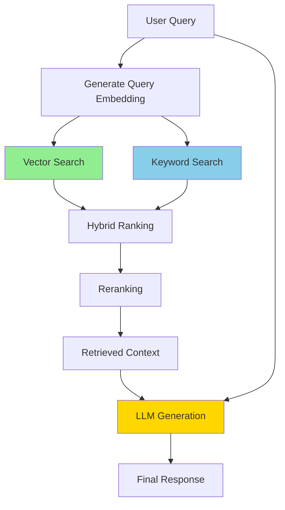

# Module 4: Knowledge Integration and Data Handling

**Exam Weight:** 10%  
**Estimated Study Time:** 6-8 hours  
**Prerequisites:** Module 1 (Agent Architecture), Module 2 (Agent Development), Basic understanding of databases

## Learning Objectives

By the end of this module, you will be able to:

1. **Implement retrieval pipelines** using RAG, embedded search, and hybrid approaches
2. **Configure and optimize vector databases** for production workloads
3. **Build ETL pipelines** for enterprise data integration
4. **Conduct data quality checks** and preprocessing for knowledge bases
5. **Enable real-time access** to structured and unstructured knowledge sources
6. **Select appropriate chunking strategies** for different document types

## Exam Objective Mapping

This module directly addresses the following NCP-AAI exam objectives:

- **4.1** - Implement retrieval pipelines (RAG, embedded search, hybrid)
- **4.2** - Configure and optimize vector databases
- **4.3** - Build ETL pipelines for enterprise data integration
- **4.4** - Conduct data quality checks, augmentation, preprocessing
- **4.5** - Enable real-time access to structured and unstructured knowledge

---

## 1. Introduction to Knowledge Integration

### 1.1 Why Knowledge Integration?

**Knowledge integration** enables agents to access external information beyond their training data.

**Key Benefits:**
- **Up-to-date Information**: Access current data without retraining
- **Domain Expertise**: Leverage specialized knowledge bases
- **Factual Grounding**: Reduce hallucinations with source attribution
- **Scalability**: Add knowledge without model fine-tuning
- **Privacy**: Keep sensitive data separate from model weights

### 1.2 Knowledge Integration Patterns

| Pattern | Description | Use Case | Latency |
|---------|-------------|----------|---------|
| **RAG** | Retrieve then generate | Q&A, summarization | Medium |
| **Semantic Search** | Vector similarity only | Document discovery | Low |
| **Hybrid Search** | Combine semantic + keyword | Precise retrieval | Medium |
| **Knowledge Graph** | Structured relationships | Complex reasoning | Low-Medium |
| **SQL/Database** | Structured queries | Analytics, reporting | Low |



> 📝 **EXAM TIP**
> 
> Understand when to use each pattern. RAG for generation tasks, semantic search for discovery, hybrid for precision, knowledge graphs for relationships.


---

## 2. RAG Pipelines

### 2.1 RAG Architecture

**Retrieval-Augmented Generation (RAG)** combines information retrieval with text generation.

**Core Components:**
1. **Document Loader**: Ingest documents
2. **Text Splitter**: Chunk documents
3. **Embedding Model**: Convert text to vectors
4. **Vector Store**: Store and search embeddings
5. **Retriever**: Find relevant chunks
6. **LLM**: Generate response with context

### 2.2 Implementing Basic RAG

```python
from langchain.document_loaders import PyPDFLoader, TextLoader
from langchain.text_splitter import RecursiveCharacterTextSplitter
from langchain.embeddings import NVIDIAEmbeddings
from langchain.vectorstores import FAISS
from langchain.chains import RetrievalQA
from langchain_nvidia_ai_endpoints import ChatNVIDIA

# 1. Load documents
loader = PyPDFLoader("knowledge_base.pdf")
documents = loader.load()

# 2. Split into chunks
text_splitter = RecursiveCharacterTextSplitter(
    chunk_size=1000,
    chunk_overlap=200,
    separators=["\n\n", "\n", " ", ""]
)
chunks = text_splitter.split_documents(documents)

# 3. Create embeddings with NVIDIA
embeddings = NVIDIAEmbeddings(
    model="nvidia/nv-embed-v1",
    nvidia_api_key="your-api-key"
)

# 4. Create vector store
vectorstore = FAISS.from_documents(chunks, embeddings)

# 5. Create retriever
retriever = vectorstore.as_retriever(
    search_type="similarity",
    search_kwargs={"k": 5}
)

# 6. Create RAG chain
llm = ChatNVIDIA(model="meta/llama-3.1-70b-instruct")

qa_chain = RetrievalQA.from_chain_type(
    llm=llm,
    chain_type="stuff",  # stuff, map_reduce, refine, map_rerank
    retriever=retriever,
    return_source_documents=True
)

# Query
result = qa_chain({"query": "What is RAG?"})
print(f"Answer: {result['result']}")
print(f"Sources: {len(result['source_documents'])} documents")
```

### 2.3 Advanced RAG Patterns

**Multi-Query RAG:**
```python
from langchain.retrievers.multi_query import MultiQueryRetriever

# Generate multiple query variations
multi_query_retriever = MultiQueryRetriever.from_llm(
    retriever=vectorstore.as_retriever(),
    llm=llm
)

# Retrieves using multiple query formulations
docs = multi_query_retriever.get_relevant_documents(
    "How does vector search work?"
)
```

**Parent Document Retriever:**
```python
from langchain.retrievers import ParentDocumentRetriever
from langchain.storage import InMemoryStore

# Store full documents separately
store = InMemoryStore()

# Retrieve small chunks but return full parent documents
parent_retriever = ParentDocumentRetriever(
    vectorstore=vectorstore,
    docstore=store,
    child_splitter=RecursiveCharacterTextSplitter(chunk_size=400),
    parent_splitter=RecursiveCharacterTextSplitter(chunk_size=2000)
)
```

> 📝 **EXAM TIP**
> 
> Know the four chain types: stuff (simple), map_reduce (parallel), refine (iterative), map_rerank (scored). Stuff is fastest but limited by context window.

---

## 3. Vector Databases

### 3.1 Vector Database Comparison

| Database | Type | Strengths | Use Case |
|----------|------|-----------|----------|
| **FAISS** | In-memory | Fast, simple | Development, small datasets |
| **Milvus** | Distributed | Scalable, production-ready | Large-scale production |
| **Chroma** | Embedded | Easy setup, persistent | Small-medium production |
| **Pinecone** | Cloud | Managed, scalable | Cloud-native apps |
| **Weaviate** | Hybrid | GraphQL, multimodal | Complex queries |

### 3.2 Milvus Configuration

```python
from pymilvus import connections, Collection, FieldSchema, CollectionSchema, DataType
from langchain.vectorstores import Milvus
from langchain.embeddings import NVIDIAEmbeddings

# Connect to Milvus
connections.connect(
    alias="default",
    host="localhost",
    port="19530"
)

# Define schema
fields = [
    FieldSchema(name="id", dtype=DataType.INT64, is_primary=True, auto_id=True),
    FieldSchema(name="embedding", dtype=DataType.FLOAT_VECTOR, dim=1024),
    FieldSchema(name="text", dtype=DataType.VARCHAR, max_length=65535)
]

schema = CollectionSchema(fields, description="Document embeddings")

# Create collection
collection = Collection(name="documents", schema=schema)

# Create index for fast search
index_params = {
    "metric_type": "L2",
    "index_type": "IVF_FLAT",
    "params": {"nlist": 1024}
}
collection.create_index(field_name="embedding", index_params=index_params)

# Use with LangChain
embeddings = NVIDIAEmbeddings(model="nvidia/nv-embed-v1")

vectorstore = Milvus(
    embedding_function=embeddings,
    collection_name="documents",
    connection_args={"host": "localhost", "port": "19530"}
)

# Add documents
vectorstore.add_texts(
    texts=["Document 1 text", "Document 2 text"],
    metadatas=[{"source": "doc1.pdf"}, {"source": "doc2.pdf"}]
)

# Search
results = vectorstore.similarity_search("query", k=5)
```

### 3.3 Optimization Strategies

**Indexing:**
- **IVF (Inverted File)**: Partition space, fast search
- **HNSW (Hierarchical NSW)**: Graph-based, high recall
- **PQ (Product Quantization)**: Compressed, memory-efficient

**Configuration:**
```python
# HNSW for high accuracy
hnsw_params = {
    "metric_type": "L2",
    "index_type": "HNSW",
    "params": {
        "M": 16,  # Number of connections
        "efConstruction": 200  # Build-time search depth
    }
}

# IVF_PQ for large scale
ivf_pq_params = {
    "metric_type": "L2",
    "index_type": "IVF_PQ",
    "params": {
        "nlist": 1024,  # Number of clusters
        "m": 8,  # Subquantizers
        "nbits": 8  # Bits per subquantizer
    }
}
```

> 📝 **EXAM TIP**
> 
> HNSW for accuracy, IVF for speed, PQ for memory. Understand trade-offs: accuracy vs. speed vs. memory.

---

## 4. Chunking Strategies

### 4.1 Chunking Methods

**Fixed-Size Chunking:**
```python
from langchain.text_splitter import CharacterTextSplitter

splitter = CharacterTextSplitter(
    chunk_size=1000,
    chunk_overlap=200,
    separator="\n"
)
chunks = splitter.split_text(text)
```

**Recursive Chunking (Recommended):**
```python
from langchain.text_splitter import RecursiveCharacterTextSplitter

splitter = RecursiveCharacterTextSplitter(
    chunk_size=1000,
    chunk_overlap=200,
    separators=["\n\n", "\n", ". ", " ", ""]  # Try in order
)
chunks = splitter.split_documents(documents)
```

**Semantic Chunking:**
```python
from langchain.text_splitter import SemanticChunker
from langchain.embeddings import NVIDIAEmbeddings

embeddings = NVIDIAEmbeddings(model="nvidia/nv-embed-v1")

splitter = SemanticChunker(
    embeddings=embeddings,
    breakpoint_threshold_type="percentile",  # or "standard_deviation"
    breakpoint_threshold_amount=95
)
chunks = splitter.split_text(text)
```

### 4.2 Chunking Best Practices

| Document Type | Chunk Size | Overlap | Strategy |
|---------------|------------|---------|----------|
| **Technical Docs** | 800-1200 | 200 | Recursive |
| **Legal** | 1500-2000 | 300 | Semantic |
| **Chat Logs** | 500-800 | 100 | Fixed |
| **Code** | 1000-1500 | 200 | Language-aware |
| **Tables** | Keep intact | 0 | Custom |

```python
def smart_chunking(document, doc_type):
    """Choose chunking strategy based on document type"""
    
    if doc_type == "code":
        from langchain.text_splitter import Language, RecursiveCharacterTextSplitter
        splitter = RecursiveCharacterTextSplitter.from_language(
            language=Language.PYTHON,
            chunk_size=1000,
            chunk_overlap=200
        )
    elif doc_type == "legal":
        splitter = SemanticChunker(embeddings, breakpoint_threshold_amount=90)
    else:
        splitter = RecursiveCharacterTextSplitter(
            chunk_size=1000,
            chunk_overlap=200
        )
    
    return splitter.split_documents([document])
```

> 📝 **EXAM TIP**
> 
> Chunk size affects retrieval quality. Too small = loss of context. Too large = irrelevant information. Overlap prevents information loss at boundaries.

---

## 5. Hybrid Search

### 5.1 Combining Semantic and Keyword Search

```python
from langchain.retrievers import BM25Retriever, EnsembleRetriever
from langchain.vectorstores import FAISS

# Semantic retriever (vector search)
vectorstore = FAISS.from_documents(documents, embeddings)
semantic_retriever = vectorstore.as_retriever(search_kwargs={"k": 5})

# Keyword retriever (BM25)
bm25_retriever = BM25Retriever.from_documents(documents)
bm25_retriever.k = 5

# Ensemble retriever (hybrid)
ensemble_retriever = EnsembleRetriever(
    retrievers=[semantic_retriever, bm25_retriever],
    weights=[0.7, 0.3]  # 70% semantic, 30% keyword
)

# Query
results = ensemble_retriever.get_relevant_documents(
    "NVIDIA TensorRT optimization"
)
```

### 5.2 Reranking

```python
from langchain.retrievers import ContextualCompressionRetriever
from langchain.retrievers.document_compressors import LLMChainExtractor

# Base retriever
base_retriever = vectorstore.as_retriever(search_kwargs={"k": 10})

# Reranker using LLM
compressor = LLMChainExtractor.from_llm(llm)

# Compression retriever
compression_retriever = ContextualCompressionRetriever(
    base_compressor=compressor,
    base_retriever=base_retriever
)

# Returns fewer, more relevant documents
compressed_docs = compression_retriever.get_relevant_documents(
    "How to optimize inference?"
)
```

> 📝 **EXAM TIP**
> 
> Hybrid search combines strengths: semantic for meaning, keyword for exact matches. Reranking improves precision by filtering initial results.

---

## 6. ETL Pipelines

### 6.1 Data Ingestion

```python
from langchain.document_loaders import (
    PyPDFLoader,
    UnstructuredWordDocumentLoader,
    CSVLoader,
    JSONLoader,
    WebBaseLoader
)

class DocumentIngestionPipeline:
    """ETL pipeline for document ingestion"""
    
    def __init__(self, vectorstore, embeddings):
        self.vectorstore = vectorstore
        self.embeddings = embeddings
        self.loaders = {
            ".pdf": PyPDFLoader,
            ".docx": UnstructuredWordDocumentLoader,
            ".csv": CSVLoader,
            ".json": JSONLoader
        }
    
    def ingest_file(self, filepath: str):
        """Ingest single file"""
        ext = os.path.splitext(filepath)[1]
        
        if ext not in self.loaders:
            raise ValueError(f"Unsupported file type: {ext}")
        
        # Load
        loader = self.loaders[ext](filepath)
        documents = loader.load()
        
        # Transform
        documents = self.clean_documents(documents)
        chunks = self.chunk_documents(documents)
        
        # Load to vector store
        self.vectorstore.add_documents(chunks)
        
        return len(chunks)
    
    def clean_documents(self, documents):
        """Clean and preprocess documents"""
        for doc in documents:
            # Remove extra whitespace
            doc.page_content = " ".join(doc.page_content.split())
            
            # Add metadata
            doc.metadata["ingestion_time"] = datetime.now().isoformat()
        
        return documents
    
    def chunk_documents(self, documents):
        """Chunk documents"""
        splitter = RecursiveCharacterTextSplitter(
            chunk_size=1000,
            chunk_overlap=200
        )
        return splitter.split_documents(documents)
```

### 6.2 Data Quality Checks

```python
class DataQualityChecker:
    """Validate data quality"""
    
    def check_document(self, document) -> Dict[str, Any]:
        """Run quality checks on document"""
        
        checks = {
            "has_content": len(document.page_content) > 0,
            "min_length": len(document.page_content) >= 100,
            "has_metadata": len(document.metadata) > 0,
            "encoding_valid": self._check_encoding(document.page_content),
            "no_excessive_whitespace": self._check_whitespace(document.page_content)
        }
        
        checks["passed"] = all(checks.values())
        
        return checks
    
    def _check_encoding(self, text: str) -> bool:
        """Check for encoding issues"""
        try:
            text.encode('utf-8')
            return True
        except UnicodeEncodeError:
            return False
    
    def _check_whitespace(self, text: str) -> bool:
        """Check for excessive whitespace"""
        whitespace_ratio = len([c for c in text if c.isspace()]) / len(text)
        return whitespace_ratio < 0.5
```

> 📝 **EXAM TIP**
> 
> ETL pipelines need error handling, data validation, and monitoring. Production systems should log ingestion metrics and handle failures gracefully.

---

## 7. Exam Focus Areas

### 7.1 Key Concepts

1. **RAG Pipeline Components**: Loader → Splitter → Embeddings → Vector Store → Retriever → LLM
2. **Vector Databases**: FAISS (dev), Milvus (production), trade-offs
3. **Chunking**: Recursive (general), Semantic (quality), size/overlap trade-offs
4. **Hybrid Search**: Semantic + keyword, reranking
5. **ETL**: Ingestion, transformation, quality checks

### 7.2 Scenario Examples

**Example 1: Chunking Strategy**
> You're building a RAG system for legal documents. Which chunking strategy is best?
> 
> A) Fixed 500-character chunks  
> B) Semantic chunking with high threshold  
> C) No chunking, use full documents  
> D) Split on every paragraph  
>
> **Answer: B** - Legal documents need semantic coherence. Semantic chunking preserves meaning better than fixed-size.

**Example 2: Vector Database Selection**
> You need to index 10M documents with real-time updates. Which vector database?
>
> A) FAISS (in-memory)  
> B) Milvus (distributed)  
> C) Simple list with linear search  
> D) SQL database  
>
> **Answer: B** - Milvus handles large scale and supports real-time updates. FAISS is in-memory only.

---

## 8. Summary

**Key Takeaways:**
1. RAG combines retrieval with generation for grounded responses
2. Vector databases enable semantic search at scale
3. Chunking strategy affects retrieval quality
4. Hybrid search combines semantic and keyword approaches
5. ETL pipelines need validation and error handling
6. NVIDIA embeddings (nv-embed-v1) optimize for accuracy and speed

**Next Steps:**
- Practice: Implement RAG pipeline with different chunking strategies
- Experiment: Compare vector databases on your data
- Study: Review NVIDIA embedding models documentation

**Related Modules:**
- Module 2: Agent Development (tool integration)
- Module 3: Evaluation (retrieval metrics)
- Module 6: NVIDIA Platform (NIM, optimization)

---

## References

1. **NVIDIA Documentation**
   - [NVIDIA Embeddings Guide](https://docs.nvidia.com/embeddings)
   - [NIM Deployment](https://docs.nvidia.com/nim)

2. **Vector Databases**
   - Milvus: https://milvus.io/docs
   - FAISS: https://github.com/facebookresearch/faiss

3. **Related Materials**
   - Notebook: `module-04/01-rag-fundamentals.ipynb`
   - Notebook: `module-04/02-embedding-models.ipynb`
   - Notebook: `module-04/03-vector-stores.ipynb`
   - Lab: `lab-01-basic-rag-agent`


---

## Related Materials

### Hands-On Practice

**Interactive Notebooks:**
- [01-rag-fundamentals.ipynb](../../notebooks/module-04/01-rag-fundamentals.ipynb)
- [02-embedding-models.ipynb](../../notebooks/module-04/02-embedding-models.ipynb)
- [03-vector-stores.ipynb](../../notebooks/module-04/03-vector-stores.ipynb)
- [04-retrieval-optimization.ipynb](../../notebooks/module-04/04-retrieval-optimization.ipynb)

**Practice Labs:**
- [Lab: Lab 01 Basic Rag Agent](../../labs/lab-01-basic-rag-agent/README.md)

### Assessment

**Exam Questions:**
- [Domain 04 Knowledge Integration](../../exam-questions/domain-04-knowledge-integration.md)
