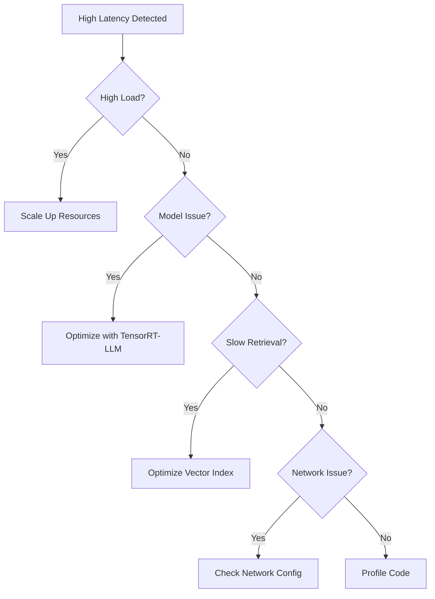
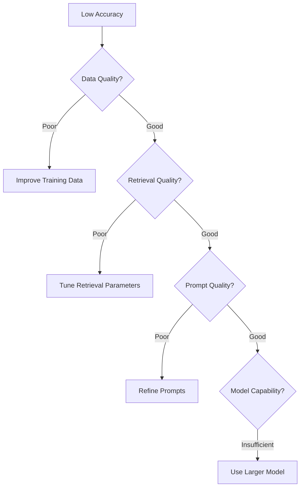

# Module 7: Run, Monitor, and Maintain

**Exam Weight:** 7%  
**Estimated Study Time:** 5-6 hours  
**Prerequisites:** Modules 1-6, Basic observability concepts

## Learning Objectives

1. **Define monitoring dashboards** and reliability metrics
2. **Track logs, errors, and anomalies** for root cause diagnosis
3. **Continuously benchmark** deployed agents
4. **Implement automated tuning** and retraining
5. **Ensure continuous uptime** and transparency

## Exam Objective Mapping

- **7.1** - Define monitoring dashboards and reliability metrics
- **7.2** - Track logs, errors, and anomalies for root cause diagnosis
- **7.3** - Continuously benchmark deployed agents
- **7.4** - Implement automated tuning, retraining, and versioning
- **7.5** - Ensure continuous uptime, transparency, and trust

---

## 1. Monitoring Dashboards

### 1.1 Key Metrics

| Category | Metrics | Target |
|----------|---------|--------|
| **Performance** | Latency (P50, P95, P99), Throughput | P95 < 2s |
| **Quality** | Accuracy, Faithfulness, User satisfaction | > 85% |
| **Reliability** | Uptime, Error rate, Success rate | 99.9% uptime |
| **Cost** | Tokens/query, Cost/query, GPU utilization | < $0.01/query |

### 1.2 Implementing Monitoring

```python
from prometheus_client import Counter, Histogram, Gauge, start_http_server
import time

# Define metrics
request_count = Counter('agent_requests_total', 'Total requests')
request_duration = Histogram('agent_request_duration_seconds', 'Request duration')
error_count = Counter('agent_errors_total', 'Total errors', ['error_type'])
active_users = Gauge('agent_active_users', 'Active users')

class MonitoredAgent:
    """Agent with monitoring"""
    
    def __init__(self, agent):
        self.agent = agent
    
    def invoke(self, query: str):
        """Invoke with monitoring"""
        request_count.inc()
        
        start_time = time.time()
        try:
            result = self.agent.invoke({"input": query})
            duration = time.time() - start_time
            request_duration.observe(duration)
            return result
        except Exception as e:
            error_count.labels(error_type=type(e).__name__).inc()
            raise

# Start metrics server
start_http_server(8000)
```

### 1.3 Grafana Dashboard

```yaml
# grafana-dashboard.json
{
  "dashboard": {
    "title": "Agent Monitoring",
    "panels": [
      {
        "title": "Request Rate",
        "targets": [{"expr": "rate(agent_requests_total[5m])"}]
      },
      {
        "title": "P95 Latency",
        "targets": [{"expr": "histogram_quantile(0.95, agent_request_duration_seconds)"}]
      },
      {
        "title": "Error Rate",
        "targets": [{"expr": "rate(agent_errors_total[5m])"}]
      }
    ]
  }
}
```

> 📝 **EXAM TIP**
> 
> Monitor performance (latency), quality (accuracy), reliability (uptime), and cost. Use P95/P99 for latency, not just average.

---

## 2. Logging and Tracing

### 2.1 Structured Logging

```python
import logging
import json
from datetime import datetime

class StructuredLogger:
    """Structured logging for agents"""
    
    def __init__(self, name: str):
        self.logger = logging.getLogger(name)
        self.logger.setLevel(logging.INFO)
        
        handler = logging.StreamHandler()
        handler.setFormatter(logging.Formatter('%(message)s'))
        self.logger.addHandler(handler)
    
    def log_request(self, query: str, user_id: str):
        """Log incoming request"""
        self.logger.info(json.dumps({
            "timestamp": datetime.now().isoformat(),
            "event": "request",
            "query": query,
            "user_id": user_id
        }))
    
    def log_response(self, query: str, response: str, latency_ms: float):
        """Log response"""
        self.logger.info(json.dumps({
            "timestamp": datetime.now().isoformat(),
            "event": "response",
            "query": query,
            "response": response,
            "latency_ms": latency_ms
        }))
    
    def log_error(self, query: str, error: str, stack_trace: str):
        """Log error"""
        self.logger.error(json.dumps({
            "timestamp": datetime.now().isoformat(),
            "event": "error",
            "query": query,
            "error": error,
            "stack_trace": stack_trace
        }))
```

### 2.2 Distributed Tracing with LangSmith

```python
from langsmith import Client
from langchain.callbacks import LangChainTracer

# Initialize LangSmith
client = Client()
tracer = LangChainTracer(project_name="agent-production")

# Use with agent
agent_executor = AgentExecutor(
    agent=agent,
    tools=tools,
    callbacks=[tracer]
)

# All executions are traced
result = agent_executor.invoke({"input": "What is RAG?"})

# View traces in LangSmith UI
```

> 📝 **EXAM TIP**
> 
> Structured logging enables analysis. Distributed tracing (LangSmith) shows execution flow across components.

---

## 3. Anomaly Detection

### 3.1 Statistical Anomaly Detection

```python
import numpy as np
from collections import deque

class AnomalyDetector:
    """Detect anomalies in metrics"""
    
    def __init__(self, window_size: int = 100, threshold: float = 3.0):
        self.window = deque(maxlen=window_size)
        self.threshold = threshold
    
    def is_anomaly(self, value: float) -> bool:
        """Check if value is anomalous"""
        if len(self.window) < 10:
            self.window.append(value)
            return False
        
        mean = np.mean(self.window)
        std = np.std(self.window)
        
        z_score = abs((value - mean) / std) if std > 0 else 0
        
        self.window.append(value)
        
        return z_score > self.threshold

# Usage
latency_detector = AnomalyDetector(threshold=3.0)

for latency in latencies:
    if latency_detector.is_anomaly(latency):
        alert(f"Anomalous latency: {latency}ms")
```

---

## 4. Automated Retraining

### 4.1 Continuous Evaluation

```python
class ContinuousEvaluator:
    """Continuously evaluate production agent"""
    
    def __init__(self, agent, test_set, alert_threshold: float = 0.80):
        self.agent = agent
        self.test_set = test_set
        self.alert_threshold = alert_threshold
        self.history = []
    
    def evaluate(self):
        """Run evaluation"""
        correct = 0
        for question, answer in self.test_set:
            result = self.agent.invoke({"input": question})
            if answer.lower() in result["output"].lower():
                correct += 1
        
        accuracy = correct / len(self.test_set)
        self.history.append(accuracy)
        
        if accuracy < self.alert_threshold:
            self.trigger_alert(accuracy)
        
        return accuracy
    
    def trigger_alert(self, accuracy: float):
        """Alert on degradation"""
        print(f"ALERT: Accuracy dropped to {accuracy:.2%}")
        # Trigger retraining pipeline
```

---

## 5. Troubleshooting Flowcharts

### 5.1 High Latency Diagnosis



### 5.2 Low Accuracy Diagnosis



---

## 6. Exam Focus Areas

### Key Concepts

1. **Metrics**: Performance, quality, reliability, cost
2. **Logging**: Structured logging, distributed tracing
3. **Anomaly Detection**: Statistical methods, alerting
4. **Continuous Evaluation**: Automated testing, degradation detection
5. **Troubleshooting**: Systematic diagnosis, flowcharts

### Scenario Example

**Example: Latency Spike**
> Your agent's P95 latency jumped from 1s to 5s. What do you check first?
>
> A) Model accuracy  
> B) Request volume and load  
> C) Training data quality  
> D) User feedback  
>
> **Answer: B** - Sudden latency spikes often indicate load issues. Check request volume, resource utilization, and scale if needed.

---

## 7. Summary

**Key Takeaways:**
1. Monitor multiple dimensions: performance, quality, reliability, cost
2. Use structured logging and distributed tracing
3. Detect anomalies early with statistical methods
4. Continuously evaluate production performance
5. Follow systematic troubleshooting flowcharts

**Related Modules:**
- Module 3: Evaluation (metrics)
- Module 6: NVIDIA Platform (optimization)
- Module 8: Deployment (production patterns)

---

## References

1. **Tools**
   - Prometheus: https://prometheus.io
   - Grafana: https://grafana.com
   - LangSmith: https://docs.smith.langchain.com

2. **Related Materials**
   - Notebook: `module-07/01-monitoring-dashboards.ipynb`
   - Notebook: `module-07/02-logging-tracing.ipynb`
   - Lab: `lab-03-production-deployment`


---

## Related Materials

### Hands-On Practice

**Interactive Notebooks:**
- [01-monitoring-dashboards.ipynb](../../notebooks/module-07/01-monitoring-dashboards.ipynb)
- [02-logging-tracing.ipynb](../../notebooks/module-07/02-logging-tracing.ipynb)
- [03-performance-profiling.ipynb](../../notebooks/module-07/03-performance-profiling.ipynb)

**Practice Labs:**
- [Lab: Lab 03 Production Deployment](../../labs/lab-03-production-deployment/README.md)

### Assessment

**Exam Questions:**
- [Domain 07 Monitoring](../../exam-questions/domain-07-monitoring.md)
