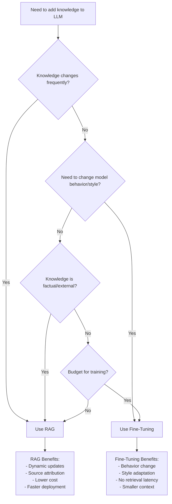
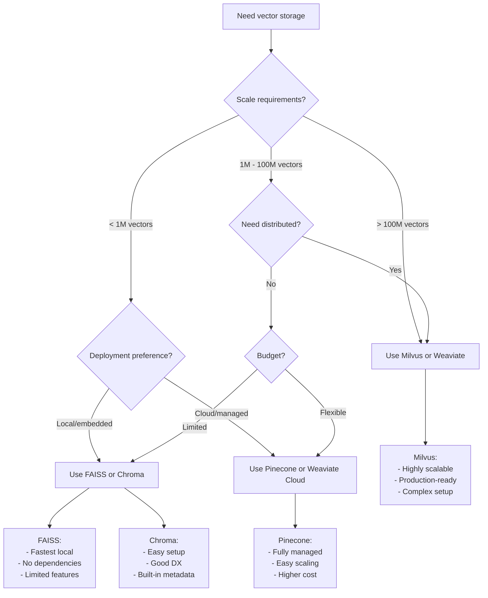
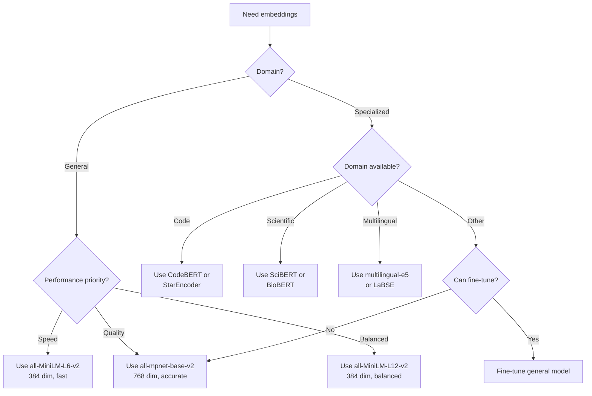
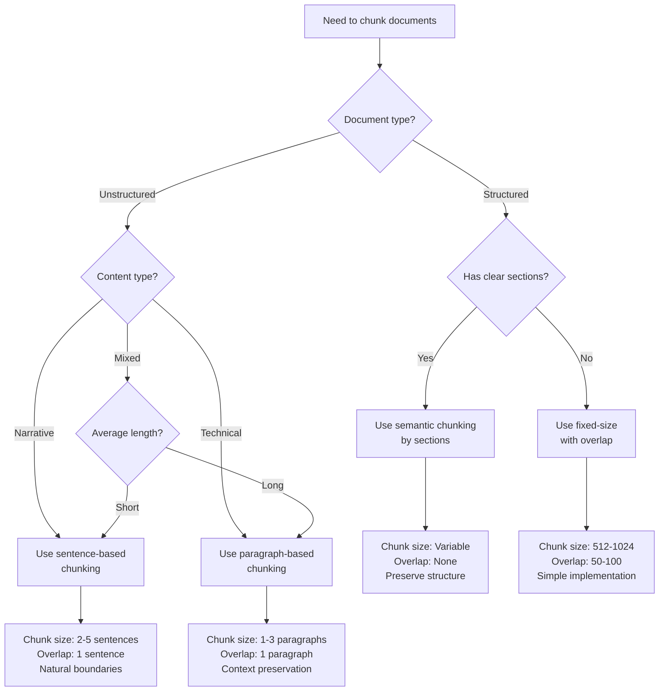
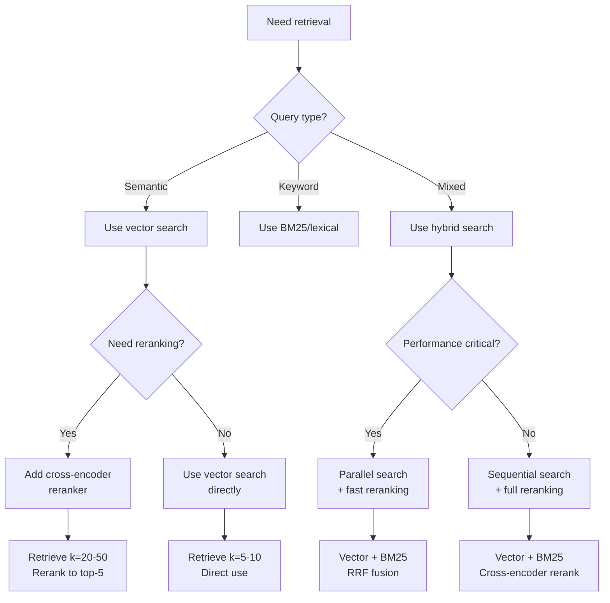

# Decision Trees

## Decision Tree 1: RAG vs Fine-Tuning



### Detailed Decision Criteria

**Choose RAG when**:
- ✓ Knowledge base updates frequently (daily/weekly)
- ✓ Need to cite sources for answers
- ✓ Working with large document collections
- ✓ Multiple knowledge domains
- ✓ Limited training budget
- ✓ Need to add/remove knowledge easily
- ✓ Factual accuracy is critical

**Choose Fine-Tuning when**:
- ✓ Need to change model's writing style
- ✓ Adapting to specific domain language
- ✓ Knowledge is relatively static
- ✓ Need consistent behavior patterns
- ✓ Retrieval latency is unacceptable
- ✓ Have sufficient training data and budget
- ✓ Want to reduce context window usage

**Consider Hybrid (RAG + Fine-Tuning) when**:
- ✓ Need both style adaptation AND dynamic knowledge
- ✓ Domain-specific language + factual grounding
- ✓ Have resources for both approaches

**Example Scenarios**:
- **Customer Support Bot**: RAG (frequently updated policies, need citations)
- **Creative Writing Assistant**: Fine-Tuning (style and tone adaptation)
- **Medical Q&A**: RAG (latest research, need source attribution)
- **Code Generation**: Fine-Tuning (language-specific patterns)
- **Legal Document Analysis**: Hybrid (legal language + case law database)

---

## Decision Tree 2: Vector Store Selection



### Detailed Selection Criteria

#### FAISS
**Use when**:
- ✓ < 1M vectors
- ✓ Local deployment
- ✓ Maximum speed needed
- ✓ Minimal dependencies
- ✓ Research/prototyping

**Avoid when**:
- ✗ Need distributed deployment
- ✗ Require complex metadata filtering
- ✗ Need built-in persistence
- ✗ Want managed service

**Typical Setup**:
```python
import faiss
index = faiss.IndexFlatL2(768)  # Exact search
# or
index = faiss.IndexIVFFlat(768, 100)  # Approximate search
```

---

#### Chroma
**Use when**:
- ✓ < 10M vectors
- ✓ Need easy setup
- ✓ Want good developer experience
- ✓ Metadata filtering important
- ✓ Prototyping to production

**Avoid when**:
- ✗ Need > 10M vectors
- ✗ Require high-performance distributed setup
- ✗ Need advanced indexing algorithms

**Typical Setup**:
```python
import chromadb
client = chromadb.Client()
collection = client.create_collection("docs")
```

---

#### Milvus
**Use when**:
- ✓ > 1M vectors
- ✓ Need horizontal scaling
- ✓ Production deployment
- ✓ Complex filtering requirements
- ✓ High availability needed

**Avoid when**:
- ✗ Small scale (< 1M vectors)
- ✗ Want simple setup
- ✗ Limited ops resources
- ✗ Prototyping phase

**Typical Setup**:
```python
from pymilvus import connections, Collection
connections.connect("default", host="localhost", port="19530")
collection = Collection("docs")
```

---

#### Pinecone
**Use when**:
- ✓ Want fully managed service
- ✓ Need easy scaling
- ✓ Limited ops resources
- ✓ Production deployment
- ✓ Budget for managed service

**Avoid when**:
- ✗ Cost is primary concern
- ✗ Need on-premise deployment
- ✗ Require full control
- ✗ Small scale doesn't justify cost

---

### Comparison Matrix

| Feature | FAISS | Chroma | Milvus | Pinecone |
|---------|-------|--------|--------|----------|
| **Scale** | < 1M | < 10M | > 100M | > 100M |
| **Setup** | Easy | Easy | Complex | Easiest |
| **Cost** | Free | Free | Infra | Service |
| **Speed** | Fastest | Fast | Fast | Fast |
| **Distributed** | No | No | Yes | Yes |
| **Managed** | No | No | No | Yes |
| **Metadata** | Limited | Good | Excellent | Good |
| **Best For** | Local/Fast | Dev/Small | Production | Managed |

---

## Decision Tree 3: Embedding Model Selection



### Detailed Selection Criteria

#### General Purpose Models

**all-MiniLM-L6-v2**
- **Dimensions**: 384
- **Speed**: Very Fast (5000+ sentences/sec on CPU)
- **Quality**: Good
- **Use when**: Speed is critical, quality acceptable
- **Example**: High-volume search, real-time applications

**all-mpnet-base-v2**
- **Dimensions**: 768
- **Speed**: Moderate (1000+ sentences/sec on CPU)
- **Quality**: Excellent
- **Use when**: Quality is critical, speed acceptable
- **Example**: High-stakes Q&A, legal/medical applications

**all-MiniLM-L12-v2**
- **Dimensions**: 384
- **Speed**: Fast (2000+ sentences/sec on CPU)
- **Quality**: Very Good
- **Use when**: Need balance of speed and quality
- **Example**: Most production applications

---

#### Domain-Specific Models

**Code Embeddings**
- **Models**: CodeBERT, StarEncoder, CodeT5
- **Use for**: Code search, documentation, bug detection
- **Dimensions**: 768
- **Example**: GitHub code search, IDE autocomplete

**Scientific/Medical**
- **Models**: SciBERT, BioBERT, PubMedBERT
- **Use for**: Research papers, medical documents
- **Dimensions**: 768
- **Example**: Medical literature search, drug discovery

**Multilingual**
- **Models**: multilingual-e5, LaBSE, mUSE
- **Use for**: Cross-language search, translation
- **Dimensions**: 768-1024
- **Example**: International customer support, global search

---

#### NVIDIA NeMo Embeddings
- **Models**: NV-Embed-v1, NV-Embed-v2
- **Dimensions**: 4096
- **Quality**: State-of-the-art
- **Speed**: Optimized for NVIDIA GPUs
- **Use when**: Have NVIDIA infrastructure, need best quality

---

### Selection Matrix

| Model | Dimensions | Speed | Quality | Best For |
|-------|-----------|-------|---------|----------|
| MiniLM-L6 | 384 | ⚡⚡⚡ | ⭐⭐⭐ | High volume |
| MiniLM-L12 | 384 | ⚡⚡ | ⭐⭐⭐⭐ | Balanced |
| MPNet | 768 | ⚡ | ⭐⭐⭐⭐⭐ | High quality |
| CodeBERT | 768 | ⚡ | ⭐⭐⭐⭐ | Code |
| SciBERT | 768 | ⚡ | ⭐⭐⭐⭐ | Science |
| NV-Embed | 4096 | ⚡⚡ | ⭐⭐⭐⭐⭐ | NVIDIA GPU |

---

## Decision Tree 4: Chunking Strategy



### Detailed Chunking Strategies

#### Fixed-Size Chunking
**Parameters**:
- Chunk size: 512-1024 tokens
- Overlap: 50-100 tokens (10-20%)

**Use when**:
- ✓ Simple implementation needed
- ✓ Uniform document structure
- ✓ No clear semantic boundaries
- ✓ Prototyping phase

**Pros**: Simple, predictable, fast
**Cons**: May split semantic units, arbitrary boundaries

**Implementation**:
```python
def fixed_chunk(text, size=512, overlap=50):
    chunks = []
    start = 0
    while start < len(text):
        end = start + size
        chunks.append(text[start:end])
        start = end - overlap
    return chunks
```

---

#### Sentence-Based Chunking
**Parameters**:
- Chunk size: 2-5 sentences
- Overlap: 1 sentence

**Use when**:
- ✓ Narrative or conversational text
- ✓ Need natural boundaries
- ✓ Questions span few sentences
- ✓ Context is sentence-level

**Pros**: Natural boundaries, good for Q&A
**Cons**: Variable chunk sizes, slower processing

**Implementation**:
```python
import nltk

def sentence_chunk(text, sentences_per_chunk=3):
    sentences = nltk.sent_tokenize(text)
    chunks = []
    for i in range(0, len(sentences), sentences_per_chunk-1):
        chunk = " ".join(sentences[i:i+sentences_per_chunk])
        chunks.append(chunk)
    return chunks
```

---

#### Paragraph-Based Chunking
**Parameters**:
- Chunk size: 1-3 paragraphs
- Overlap: 1 paragraph

**Use when**:
- ✓ Technical documentation
- ✓ Academic papers
- ✓ Long-form content
- ✓ Paragraphs are semantic units

**Pros**: Preserves context, semantic coherence
**Cons**: Large variance in chunk size

**Implementation**:
```python
def paragraph_chunk(text, paragraphs_per_chunk=2):
    paragraphs = text.split("\n\n")
    chunks = []
    for i in range(0, len(paragraphs), paragraphs_per_chunk-1):
        chunk = "\n\n".join(paragraphs[i:i+paragraphs_per_chunk])
        chunks.append(chunk)
    return chunks
```

---

#### Semantic Chunking
**Parameters**:
- Variable size based on content
- No overlap (natural boundaries)

**Use when**:
- ✓ Structured documents (sections, chapters)
- ✓ Code documentation
- ✓ API references
- ✓ Clear hierarchical structure

**Pros**: Preserves semantic structure, optimal boundaries
**Cons**: Complex implementation, document-specific

**Implementation**:
```python
def semantic_chunk(text):
    # Parse document structure
    sections = parse_sections(text)
    chunks = []
    for section in sections:
        if len(section) > max_size:
            # Recursively split large sections
            chunks.extend(split_section(section))
        else:
            chunks.append(section)
    return chunks
```

---

#### Recursive Chunking
**Parameters**:
- Start with large chunks
- Recursively split if too large
- Respect semantic boundaries

**Use when**:
- ✓ Mixed document types
- ✓ Need adaptive chunking
- ✓ Want to preserve structure when possible

**Pros**: Adaptive, preserves structure
**Cons**: More complex, slower

**Implementation**:
```python
def recursive_chunk(text, max_size=1024):
    if len(text) <= max_size:
        return [text]
    
    # Try to split on semantic boundaries
    for separator in ["\n\n", "\n", ". ", " "]:
        if separator in text:
            mid = len(text) // 2
            split_point = text.find(separator, mid)
            if split_point != -1:
                left = recursive_chunk(text[:split_point])
                right = recursive_chunk(text[split_point:])
                return left + right
    
    # Fallback to fixed split
    return [text[:max_size], text[max_size:]]
```

---

### Chunking Strategy Comparison

| Strategy | Chunk Size | Boundary | Complexity | Best For |
|----------|-----------|----------|------------|----------|
| Fixed | Uniform | Arbitrary | Low | Prototyping |
| Sentence | Variable | Natural | Medium | Q&A, Chat |
| Paragraph | Variable | Natural | Medium | Documents |
| Semantic | Variable | Structural | High | Structured docs |
| Recursive | Adaptive | Smart | High | Mixed content |

---

### Chunking Best Practices

**General Guidelines**:
1. **Chunk size**: 512-1024 tokens for most use cases
2. **Overlap**: 10-20% to preserve context across boundaries
3. **Metadata**: Include source, position, section info
4. **Testing**: Evaluate retrieval quality with different strategies

**Optimization Tips**:
- Start with simple fixed-size chunking
- Measure retrieval quality (precision, recall)
- Iterate to more sophisticated strategies if needed
- Consider document type and query patterns
- Balance chunk size with context window limits

**Common Pitfalls**:
- ❌ Chunks too small: Loss of context
- ❌ Chunks too large: Irrelevant information
- ❌ No overlap: Missing cross-boundary information
- ❌ Ignoring structure: Breaking semantic units
- ❌ One-size-fits-all: Different docs need different strategies

---

## Decision Tree 5: Retrieval Strategy



### Retrieval Strategy Details

#### Vector Search (Semantic)
**Use when**:
- ✓ Queries are natural language
- ✓ Need semantic similarity
- ✓ Synonyms and paraphrases important
- ✓ Conceptual matching needed

**Pros**: Semantic understanding, handles paraphrases
**Cons**: May miss exact matches, requires embeddings

**Implementation**:
```python
# Retrieve top-k by cosine similarity
results = vector_store.similarity_search(
    query,
    k=5,
    score_threshold=0.7
)
```

---

#### Keyword Search (Lexical)
**Use when**:
- ✓ Exact term matching needed
- ✓ Technical terms or codes
- ✓ Proper nouns important
- ✓ Query is keyword-based

**Pros**: Exact matches, fast, no embeddings needed
**Cons**: No semantic understanding, misses paraphrases

**Implementation**:
```python
# BM25 search
from rank_bm25 import BM25Okapi

bm25 = BM25Okapi(corpus)
scores = bm25.get_scores(query_tokens)
top_k = np.argsort(scores)[-5:]
```

---

#### Hybrid Search
**Use when**:
- ✓ Need both semantic and exact matching
- ✓ Diverse query types
- ✓ Want best of both worlds
- ✓ Production systems

**Pros**: Robust, handles diverse queries
**Cons**: More complex, higher latency

**Implementation**:
```python
# Hybrid search with RRF fusion
vector_results = vector_search(query, k=20)
bm25_results = bm25_search(query, k=20)

# Reciprocal Rank Fusion
fused_results = rrf_fusion(vector_results, bm25_results)
top_k = fused_results[:5]
```

---

#### Reranking
**Use when**:
- ✓ Initial retrieval returns many candidates
- ✓ Need highest quality top results
- ✓ Can afford additional latency
- ✓ Accuracy is critical

**Pros**: Improved relevance, better top-k
**Cons**: Additional latency, more compute

**Implementation**:
```python
# Two-stage retrieval with reranking
candidates = vector_store.search(query, k=50)

# Rerank with cross-encoder
reranker = CrossEncoder('cross-encoder/ms-marco-MiniLM-L-6-v2')
scores = reranker.predict([(query, doc) for doc in candidates])

# Return top-k after reranking
top_k = [candidates[i] for i in np.argsort(scores)[-5:]]
```

---

### Retrieval Strategy Comparison

| Strategy | Latency | Quality | Complexity | Best For |
|----------|---------|---------|------------|----------|
| Vector | Low | Good | Low | Semantic queries |
| Keyword | Very Low | Good | Low | Exact matching |
| Hybrid | Medium | Excellent | Medium | Production |
| + Reranking | High | Best | High | High-stakes |

---

## Exam Tips

**Decision Tree Usage**:
- Identify key decision points in scenarios
- Consider trade-offs at each branch
- Match requirements to recommendations
- Justify choices with specific criteria

**Common Scenarios**:
- "Frequently updated knowledge" → RAG
- "Need to change writing style" → Fine-tuning
- "< 1M vectors, local deployment" → FAISS
- "Production scale, managed service" → Pinecone
- "Technical documentation" → Paragraph chunking
- "Diverse query types" → Hybrid search

**Practice**:
- Work through each decision tree with example scenarios
- Understand the "why" behind each decision
- Know when to combine approaches (hybrid solutions)
- Consider cost, latency, and quality trade-offs
