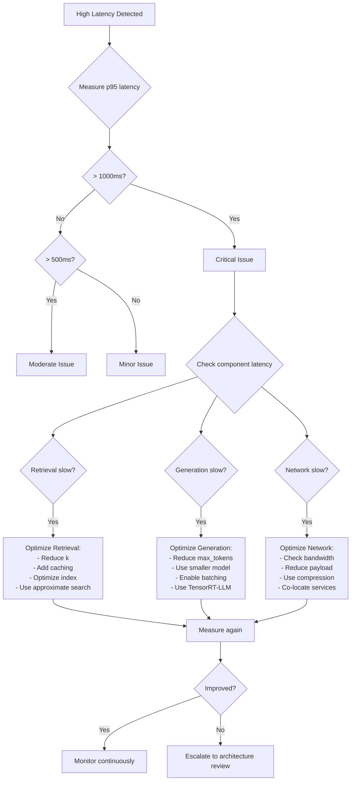
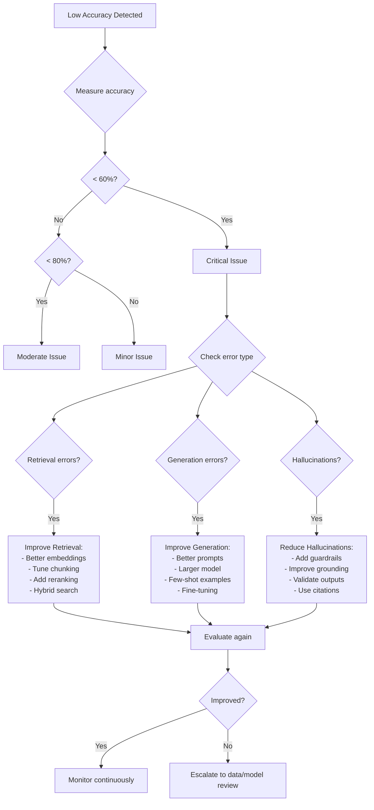
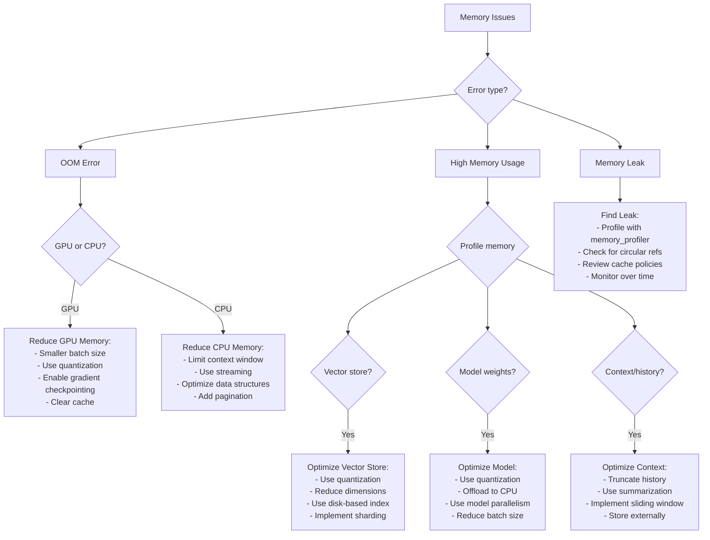
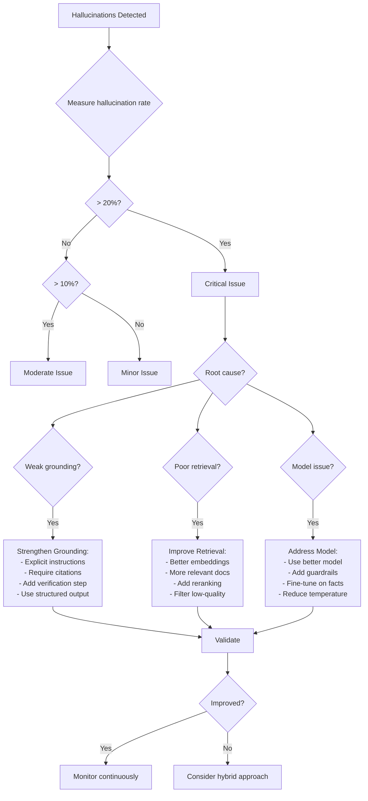

# Troubleshooting Flowcharts

## Flowchart 1: High Latency Diagnosis



### Detailed Troubleshooting Steps

#### Step 1: Measure Current Performance

```bash
# Measure latency distribution
curl -w "@curl-format.txt" -o /dev/null -s http://api/endpoint

# Use load testing tool
ab -n 1000 -c 10 http://api/endpoint

# Check metrics dashboard
# Look for: p50, p95, p99 latency
```

**Targets**:
- p50 < 200ms (interactive)
- p95 < 500ms (acceptable)
- p99 < 1000ms (tolerable)

---

#### Step 2: Identify Bottleneck

**Add instrumentation**:
```python
import time

def diagnose_latency(query):
    start = time.time()
    
    # Measure retrieval
    retrieval_start = time.time()
    docs = retrieve(query)
    retrieval_time = time.time() - retrieval_start
    
    # Measure generation
    generation_start = time.time()
    response = generate(query, docs)
    generation_time = time.time() - generation_start
    
    total_time = time.time() - start
    
    print(f"Retrieval: {retrieval_time:.2f}s ({retrieval_time/total_time*100:.1f}%)")
    print(f"Generation: {generation_time:.2f}s ({generation_time/total_time*100:.1f}%)")
    print(f"Total: {total_time:.2f}s")
    
    return response
```

---

#### Step 3: Optimize Retrieval (if bottleneck)

**Quick Wins**:
```python
# 1. Reduce k (number of retrieved docs)
docs = vector_store.search(query, k=3)  # Instead of k=10

# 2. Add caching
from functools import lru_cache

@lru_cache(maxsize=1000)
def cached_retrieve(query):
    return vector_store.search(query, k=5)

# 3. Use approximate search (FAISS)
index = faiss.IndexIVFFlat(quantizer, d, nlist)  # Instead of IndexFlatL2

# 4. Parallel retrieval
import asyncio

async def parallel_retrieve(queries):
    tasks = [retrieve_async(q) for q in queries]
    return await asyncio.gather(*tasks)
```

**Expected Improvements**:
- Reduce k: 30-50% faster
- Caching: 90%+ faster for repeated queries
- Approximate search: 10-100x faster for large datasets
- Parallel retrieval: 2-5x faster for batch queries

---

#### Step 4: Optimize Generation (if bottleneck)

**Quick Wins**:
```python
# 1. Reduce max_tokens
response = llm.generate(prompt, max_tokens=256)  # Instead of 1024

# 2. Use smaller model
llm = ChatNVIDIA(model="llama3-8b")  # Instead of llama3-70b

# 3. Enable batching (Triton)
# In config.pbtxt:
dynamic_batching {
    preferred_batch_size: [8, 16, 32]
    max_queue_delay_microseconds: 1000
}

# 4. Use TensorRT-LLM optimization
# Build optimized engine
trtllm-build --checkpoint_dir ./model --use_fp8
```

**Expected Improvements**:
- Reduce max_tokens: Proportional to reduction
- Smaller model: 2-10x faster
- Batching: 2-5x higher throughput
- TensorRT-LLM: 2-8x faster

---

#### Step 5: Optimize Network (if bottleneck)

**Quick Wins**:
```python
# 1. Reduce payload size
response = llm.generate(prompt, stream=True)  # Stream instead of waiting

# 2. Use compression
import gzip

def compress_response(data):
    return gzip.compress(data.encode())

# 3. Co-locate services
# Deploy retrieval and generation in same region/cluster

# 4. Use connection pooling
from requests.adapters import HTTPAdapter
from requests.packages.urllib3.util.retry import Retry

session = requests.Session()
adapter = HTTPAdapter(pool_connections=100, pool_maxsize=100)
session.mount('http://', adapter)
```

---

## Flowchart 2: Low Accuracy Diagnosis



### Detailed Troubleshooting Steps

#### Step 1: Measure Accuracy

```python
# Evaluate on test set
from ragas import evaluate
from ragas.metrics import faithfulness, answer_relevancy

results = evaluate(
    dataset=test_dataset,
    metrics=[faithfulness, answer_relevancy]
)

print(f"Faithfulness: {results['faithfulness']:.2f}")
print(f"Answer Relevancy: {results['answer_relevancy']:.2f}")
```

**Targets**:
- Faithfulness > 0.8 (80% claims supported)
- Answer Relevancy > 0.8 (80% relevant)
- Overall Accuracy > 0.8 (80% correct)

---

#### Step 2: Identify Error Type

**Analyze failures**:
```python
def analyze_errors(predictions, ground_truth):
    errors = {
        'retrieval': 0,  # Wrong docs retrieved
        'generation': 0,  # Wrong answer from correct docs
        'hallucination': 0,  # Unsupported claims
        'other': 0
    }
    
    for pred, truth in zip(predictions, ground_truth):
        if not has_relevant_docs(pred.docs, truth):
            errors['retrieval'] += 1
        elif not is_factual(pred.answer, pred.docs):
            errors['hallucination'] += 1
        elif pred.answer != truth.answer:
            errors['generation'] += 1
        else:
            errors['other'] += 1
    
    return errors
```

---

#### Step 3: Improve Retrieval (if error type)

**Quick Wins**:
```python
# 1. Use better embeddings
from sentence_transformers import SentenceTransformer
model = SentenceTransformer('all-mpnet-base-v2')  # Better quality

# 2. Optimize chunking
# Try different strategies (see decision-trees.md)
chunks = semantic_chunk(document)  # Instead of fixed-size

# 3. Add reranking
from sentence_transformers import CrossEncoder
reranker = CrossEncoder('cross-encoder/ms-marco-MiniLM-L-6-v2')

candidates = vector_store.search(query, k=20)
scores = reranker.predict([(query, doc) for doc in candidates])
top_docs = [candidates[i] for i in np.argsort(scores)[-5:]]

# 4. Use hybrid search
vector_results = vector_search(query, k=10)
bm25_results = bm25_search(query, k=10)
combined = rrf_fusion(vector_results, bm25_results)
```

**Expected Improvements**:
- Better embeddings: 5-15% accuracy gain
- Optimized chunking: 10-20% accuracy gain
- Reranking: 10-25% accuracy gain
- Hybrid search: 15-30% accuracy gain

---

#### Step 4: Improve Generation (if error type)

**Quick Wins**:
```python
# 1. Improve prompts
prompt = """
You are a helpful assistant. Answer based ONLY on the provided context.

Context:
{context}

Question: {question}

Instructions:
- Use only information from the context
- If the answer is not in the context, say "I don't have enough information"
- Cite specific parts of the context in your answer

Answer:
"""

# 2. Use larger/better model
llm = ChatNVIDIA(model="llama3-70b")  # Instead of llama3-8b

# 3. Add few-shot examples
prompt_with_examples = """
Here are some examples:

Example 1:
Context: {example1_context}
Question: {example1_question}
Answer: {example1_answer}

Example 2:
Context: {example2_context}
Question: {example2_question}
Answer: {example2_answer}

Now answer this:
Context: {context}
Question: {question}
Answer:
"""

# 4. Fine-tune model (if resources available)
# Train on domain-specific Q&A pairs
```

**Expected Improvements**:
- Better prompts: 10-20% accuracy gain
- Larger model: 5-15% accuracy gain
- Few-shot examples: 10-25% accuracy gain
- Fine-tuning: 20-40% accuracy gain

---

#### Step 5: Reduce Hallucinations (if error type)

**Quick Wins**:
```python
# 1. Add guardrails
from nemoguardrails import RailsConfig, LLMRails

config = RailsConfig.from_path("./config")
rails = LLMRails(config)

response = rails.generate(
    messages=[{"role": "user", "content": query}]
)

# 2. Improve grounding
prompt = """
Answer based ONLY on the context below. Do not use external knowledge.

Context:
{context}

Question: {question}

If the context doesn't contain the answer, respond with:
"I cannot answer this question based on the provided information."

Answer:
"""

# 3. Validate outputs
def validate_answer(answer, context):
    # Check if claims are supported
    claims = extract_claims(answer)
    for claim in claims:
        if not is_supported(claim, context):
            return False, f"Unsupported claim: {claim}"
    return True, "Valid"

# 4. Require citations
prompt = """
Answer the question and cite the specific parts of the context you used.

Format:
Answer: [Your answer]
Citations: [Relevant quotes from context]
"""
```

**Expected Improvements**:
- Guardrails: 20-40% reduction in hallucinations
- Better grounding: 30-50% reduction
- Output validation: 40-60% reduction
- Required citations: 50-70% reduction

---

## Flowchart 3: Memory Issues Diagnosis



### Detailed Troubleshooting Steps

#### Step 1: Identify Memory Issue Type

```python
# Monitor memory usage
import psutil
import GPUtil

def monitor_memory():
    # CPU memory
    cpu_mem = psutil.virtual_memory()
    print(f"CPU Memory: {cpu_mem.percent}% used")
    
    # GPU memory
    gpus = GPUtil.getGPUs()
    for gpu in gpus:
        print(f"GPU {gpu.id}: {gpu.memoryUtil*100:.1f}% used")

# Profile memory over time
from memory_profiler import profile

@profile
def process_query(query):
    # Your code here
    pass
```

---

#### Step 2: Handle OOM Errors

**GPU OOM**:
```python
# 1. Reduce batch size
batch_size = 8  # Instead of 32

# 2. Use quantization
from transformers import AutoModelForCausalLM

model = AutoModelForCausalLM.from_pretrained(
    "model_name",
    load_in_8bit=True,  # or load_in_4bit=True
    device_map="auto"
)

# 3. Clear GPU cache
import torch
torch.cuda.empty_cache()

# 4. Use gradient checkpointing (training)
model.gradient_checkpointing_enable()
```

**CPU OOM**:
```python
# 1. Limit context window
max_context_length = 2048  # Instead of 4096

# 2. Use streaming
def stream_process(large_file):
    with open(large_file, 'r') as f:
        for line in f:
            yield process_line(line)

# 3. Implement pagination
def paginated_search(query, page_size=100):
    offset = 0
    while True:
        results = search(query, limit=page_size, offset=offset)
        if not results:
            break
        yield results
        offset += page_size
```

---

#### Step 3: Optimize Vector Store Memory

```python
# 1. Use quantization
import faiss

# Product quantization
quantizer = faiss.IndexFlatL2(d)
index = faiss.IndexIVFPQ(quantizer, d, nlist, m, nbits)

# 2. Reduce dimensions with PCA
pca_matrix = faiss.PCAMatrix(d, d_reduced)
index = faiss.IndexPreTransform(pca_matrix, base_index)

# 3. Use disk-based index
index = faiss.read_index("index.faiss", faiss.IO_FLAG_MMAP)

# 4. Implement sharding
class ShardedVectorStore:
    def __init__(self, num_shards=4):
        self.shards = [create_index() for _ in range(num_shards)]
    
    def add(self, vectors):
        for i, vec in enumerate(vectors):
            shard_id = i % len(self.shards)
            self.shards[shard_id].add(vec)
    
    def search(self, query, k):
        # Search all shards in parallel
        results = [shard.search(query, k) for shard in self.shards]
        return merge_results(results, k)
```

---

#### Step 4: Optimize Model Memory

```python
# 1. Use INT8 quantization
from transformers import AutoModelForCausalLM, BitsAndBytesConfig

quantization_config = BitsAndBytesConfig(
    load_in_8bit=True,
    llm_int8_threshold=6.0
)

model = AutoModelForCausalLM.from_pretrained(
    "model_name",
    quantization_config=quantization_config
)

# 2. Offload to CPU
model = AutoModelForCausalLM.from_pretrained(
    "model_name",
    device_map="auto",  # Automatically distribute
    offload_folder="offload"
)

# 3. Use model parallelism
model = AutoModelForCausalLM.from_pretrained(
    "model_name",
    device_map="balanced"  # Distribute across GPUs
)

# 4. Reduce batch size
# Process one at a time if necessary
for item in batch:
    result = model.generate(item)
```

---

#### Step 5: Optimize Context Memory

```python
# 1. Truncate history
class ContextManager:
    def __init__(self, max_turns=10):
        self.history = []
        self.max_turns = max_turns
    
    def add(self, message):
        self.history.append(message)
        if len(self.history) > self.max_turns:
            self.history = self.history[-self.max_turns:]

# 2. Use summarization
def summarize_history(history):
    if len(history) > 10:
        old_history = history[:-5]
        summary = llm.generate(f"Summarize: {old_history}")
        return [summary] + history[-5:]
    return history

# 3. Sliding window
def sliding_window_context(messages, window_size=5):
    return messages[-window_size:]

# 4. Store externally
import redis

class ExternalMemory:
    def __init__(self):
        self.redis = redis.Redis()
    
    def store(self, session_id, message):
        self.redis.lpush(f"session:{session_id}", message)
        self.redis.ltrim(f"session:{session_id}", 0, 99)  # Keep last 100
    
    def retrieve(self, session_id, n=10):
        return self.redis.lrange(f"session:{session_id}", 0, n-1)
```

---

## Flowchart 4: Hallucination Mitigation



### Detailed Troubleshooting Steps

#### Step 1: Measure Hallucination Rate

```python
from ragas.metrics import faithfulness

# Evaluate faithfulness
results = evaluate(
    dataset=test_dataset,
    metrics=[faithfulness]
)

hallucination_rate = 1 - results['faithfulness']
print(f"Hallucination Rate: {hallucination_rate*100:.1f}%")

# Manual verification
def check_hallucinations(answer, context):
    claims = extract_claims(answer)
    unsupported = []
    for claim in claims:
        if not is_supported_by(claim, context):
            unsupported.append(claim)
    return unsupported
```

**Targets**:
- Hallucination rate < 10% (acceptable)
- Hallucination rate < 5% (good)
- Hallucination rate < 2% (excellent)

---

#### Step 2: Strengthen Grounding

```python
# 1. Explicit instructions
prompt = """
CRITICAL: Answer ONLY using information from the context below.
Do NOT use any external knowledge or make assumptions.

Context:
{context}

Question: {question}

If the context doesn't contain enough information, respond:
"I cannot answer this based on the provided information."

Answer:
"""

# 2. Require citations
prompt = """
Answer the question using ONLY the context below.
For each statement, cite the specific part of the context.

Context:
{context}

Question: {question}

Format your answer as:
Statement 1 [Citation: "exact quote from context"]
Statement 2 [Citation: "exact quote from context"]

Answer:
"""

# 3. Add verification step
def verify_answer(answer, context):
    verification_prompt = f"""
    Check if this answer is fully supported by the context.
    
    Context: {context}
    Answer: {answer}
    
    Is every claim in the answer supported by the context?
    Respond with: YES or NO
    If NO, list the unsupported claims.
    """
    
    verification = llm.generate(verification_prompt)
    return "YES" in verification

# 4. Use structured output
from pydantic import BaseModel

class GroundedAnswer(BaseModel):
    answer: str
    citations: List[str]
    confidence: float

response = llm.generate(prompt, response_format=GroundedAnswer)
```

---

#### Step 3: Improve Retrieval Quality

```python
# 1. Filter low-quality documents
def filter_docs(docs, min_score=0.7):
    return [doc for doc in docs if doc.score >= min_score]

# 2. Add reranking
from sentence_transformers import CrossEncoder

reranker = CrossEncoder('cross-encoder/ms-marco-MiniLM-L-6-v2')
candidates = vector_store.search(query, k=20)
scores = reranker.predict([(query, doc.content) for doc in candidates])
top_docs = [candidates[i] for i in np.argsort(scores)[-5:]]

# 3. Verify document relevance
def verify_relevance(query, doc):
    prompt = f"""
    Is this document relevant to answering the question?
    
    Question: {query}
    Document: {doc}
    
    Respond: RELEVANT or NOT_RELEVANT
    """
    result = llm.generate(prompt)
    return "RELEVANT" in result

relevant_docs = [doc for doc in docs if verify_relevance(query, doc)]

# 4. Use multiple retrieval strategies
vector_docs = vector_search(query, k=5)
keyword_docs = bm25_search(query, k=5)
combined = deduplicate(vector_docs + keyword_docs)
```

---

#### Step 4: Address Model Issues

```python
# 1. Use better model
llm = ChatNVIDIA(model="llama3-70b")  # More capable model

# 2. Add guardrails
from nemoguardrails import RailsConfig, LLMRails

config = RailsConfig.from_path("./config")
config.rails.output.flows.append("check_hallucination")

rails = LLMRails(config)
response = rails.generate(messages=[{"role": "user", "content": query}])

# 3. Reduce temperature
response = llm.generate(
    prompt,
    temperature=0.1  # More deterministic, less creative
)

# 4. Fine-tune on factual data
# Train model on high-quality Q&A pairs with verified facts
```

---

## Quick Troubleshooting Reference

| Issue | First Check | Quick Fix | Long-term Solution |
|-------|------------|-----------|-------------------|
| High Latency | Component timing | Reduce k, add cache | Optimize architecture |
| Low Accuracy | Error type | Better prompts | Improve retrieval + model |
| OOM Error | GPU/CPU usage | Reduce batch size | Quantization, optimization |
| Hallucinations | Faithfulness score | Explicit grounding | Guardrails + verification |
| Poor Retrieval | Relevance scores | Add reranking | Better embeddings + hybrid |
| Context Overflow | Token count | Truncate history | Summarization + external storage |

## Exam Tips

**Systematic Approach**:
1. Measure the problem (metrics)
2. Identify root cause (profiling)
3. Apply targeted fix (optimization)
4. Validate improvement (re-measure)
5. Monitor continuously (observability)

**Common Patterns**:
- High latency → Profile components → Optimize bottleneck
- Low accuracy → Analyze errors → Improve weak component
- Memory issues → Profile usage → Optimize largest consumer
- Hallucinations → Measure faithfulness → Strengthen grounding

**Practice**:
- Work through each flowchart with example scenarios
- Understand diagnostic steps and expected improvements
- Know when to escalate vs. optimize
- Consider trade-offs of each solution
